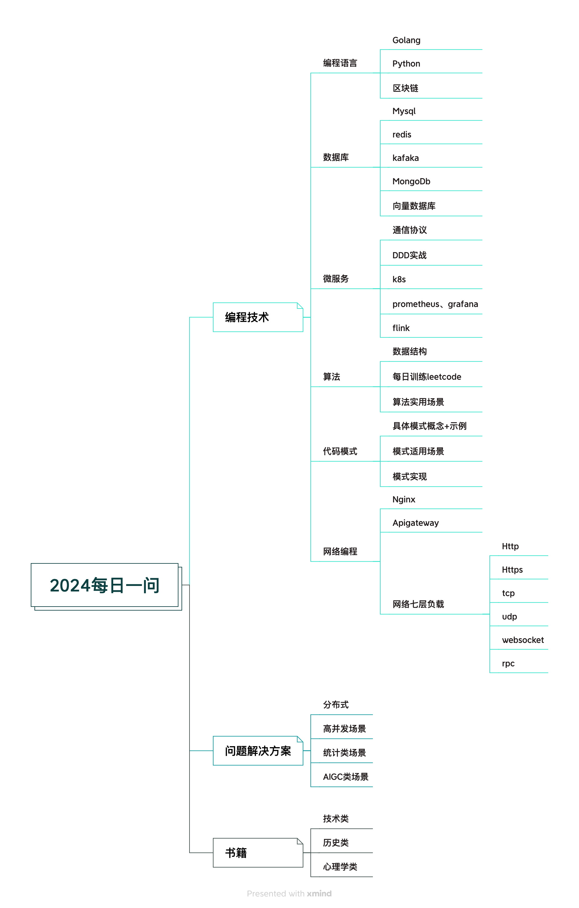

### Learn-go

回想过去一年，接触到很多新东西（AIGC领域、获得Web3空投、使用新框架、学习底层数据结构等等）。到年底找工作的时候，却发现自己对日常使用的代码库，框架，数据库，缓存，消息队列，微服务知之甚少。同时也到了而立之年，就很迷茫和担忧之后的发展方向。迷茫的时候就观察周围的人（向上的榜样，技术大牛，创业者等），发现他们有一个共同的特点，阅读量惊人，并有自己总结的一套方法论。再次审视自己在的代码之路，多了一些好奇，少了很多沉淀，所以在24年里我的计划是每天写或抄一篇有意义的文章，去看，去沉淀，去总结，找到自己想做的事情，砥砺前行。

**别让这个世界对我们完全的手。__梅赐琪**

> 后端工程师（Golang、Python）  
> 本项目主要记录面试过程中的参考过的文章以及自己的理解，希望在整理的过程中加深记忆。   
> 预计会从这几个模块入手：Golang、Python、Mysql、Redis、算法、网络编程库   
> PS：项目主要是为面试准备，实际使用时请验证后应用哦！  

### 导航

- ### [GOLANG](golang/readme.md)
- ### [数据库](database/readme.md)
- ### [Redis](redis/readme.md)
- ### [网络相关](network/readme.md)
- ### [算法相关](alg/readme.md)
- ### [常见问题](test/readme.md)

#### 2024计划（不断完善中）

