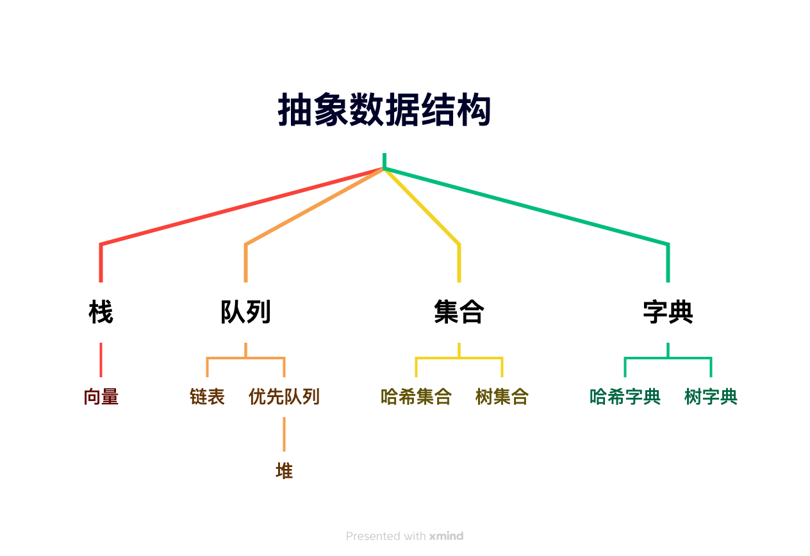
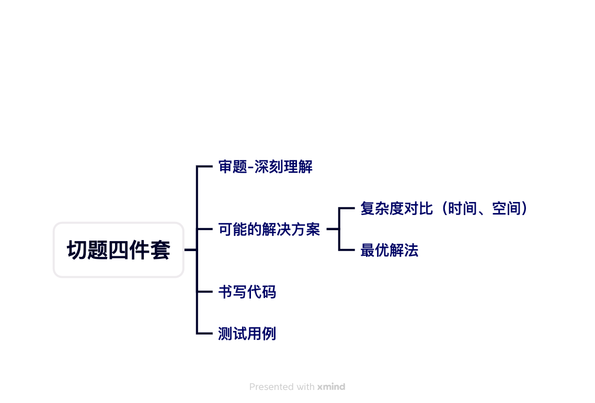

## 算法学习

**算法这个东西就需要经常练，长期坚持的课题，快速掌握是挺难的，不过我整理出知识图谱和一些常见的解题思路以及代码。验证自己是否掌握可以去leetcode检测下**
- 根据数据结构特点，练习特定问题的算法

- 切题四件套

### 导航
- **链表**
	- [两两交换](docs/link-swap.md)
	- [删除倒数第N个节点](docs/link-delete-n.md)
	- [右移N个节点]