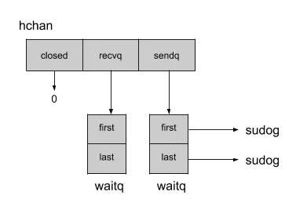

### Go：有缓冲和无缓冲通道

Go重点通道机制非常强大，但理念内部概念甚至可以使其更加强大。事实上，选择缓冲或无缓冲通道将改变应用程序的行为和性能。

#### Unbuffered Channel 无缓冲通道  
无缓冲通道是指在向通道发出消息后立即需要接收方的通道。需要声明无缓冲通道，只要不声明容量即可。下面是一个示例：  
```go
func unbufferedChannel() {
	c := make(chan string)

	var wg sync.WaitGroup
	wg.Add(2)

	go func() {
		defer wg.Done()
		c <- `foo`
	}()

	go func() {
		defer wg.Done()
		time.Sleep(time.Second)
		println(`Message: ` + <-c)
	}()

	wg.Wait()
}
```  
第一个goroutine在发送消息foo被阻止，因为接收方还没准备好。此行为在规范中得到很好的解释：  
> *如果容量为零或不存在，则通道是无缓冲的，只有当发送方和接收方都准备就绪，通信才会成功*。

有个文档[《effective go》](https://go.dev/doc/effective_go#channels)清楚的讲了这一点：  

> *如果通道没有缓存，则发送方将阻塞，知道接收方收到值*。

通道的内部结构可以提供有关此行为更多有趣的细节。  

- **内部结构**  

通道结构`hchan`可以从`runtime`包中获得`chain.go`。 该结构包含与通道缓冲区相关属性，但为了说明无缓冲通道，我将省略我们稍后看到的那些属性。以下是无缓冲通道的表示：  

  

通道保留只想接收方recvq和发送方列表的指针sendq，由链表waitq表示。sudog包含只想next和previous元素的指针，以及与处理接收方/发送方的goroutine相关的信息。有了这些信息，Go就很容易知道如果发送着丢失，通道合适应该阻止接收者，反之亦然。  


- 下面是我们上一个示例的工作流程
	- 使用接收方和发送方的空列表创建通道。 
	- 我们的第一个goroutine将值`foo`发送到通道，即第16行。  
	- 通道`sudog`从表示发送方的池中获取结构。此结构将保留对goroutine和值foo的引用。  
	- 此发件人现在已在sendq属性中排队。  
	- goroutie进入等待状态，因为“chan send”
	- 我们对第二个goroutine将读取来自通道的消息
	- 通道将取消sendq列表的队列，以获取由步骤3中看到的结构表示的等待发送方。
	- 通道将使用memove方法将发送方发送的值（包装在结构中sudog），复制到读取通道的表两种
	- 我们在步骤5中停放点第一个goroutine现在可以恢复，并将释放在步骤3中获取的sudog goroutine。

正如我们在工作流中在此看到的那正言该，goroutine必须切换到等待，知道接收器可用。但是，如果需要，由于缓冲通道，可以避免这种阻塞行为。


### 缓冲通道(Buffered Channel)  
我们将稍微修改前面的示例添加缓冲区：  

```go
func bufferedChannel() {
	c := make(chan string, 2)

	var wg sync.WaitGroup
	wg.Add(2)

	go func() {
		defer wg.Done()
		c <- `foo`
		c <- `bar`
	}()

	go func() {
		defer wg.Done()
		time.Sleep(time.Second)
		println(`buffered Message: ` + <-c)
		println(`buffered Message: ` + <-c)
	}()

	wg.Wait()
}
```  
现在，让我们根据以下示例分析hchan包含与缓冲区相关的字段的结构体：  
  

缓冲区由五个属性组成：  
- qcount在缓冲区中存储当前元素的数量
- dataqsiz在缓冲区中存储最大元素的数量
- buf指向一个内存段，该内存段包含缓冲区中最大元素树的空间
- sendx将位置存储在缓冲区中，一边通道接收下一个元素
- recvx将位置存储在缓冲区中，一边通道返回下一个元素  

多亏了sendx和recvx缓冲区的工作方式就像一个循环队列  
    

循环队列允许我们在缓冲区中保持顺序，而无需在其中一个元素从缓冲区中弹出时不断移动元素。   

一旦达到缓冲区的限制，尝试在缓冲区中推送元素的goroutine将 被移动到发送着列表中，并切换到等待状态，正如我们在上一届中看到的那样。然后一旦程序读取缓冲区，缓冲区位置recvx的元素将被返回，等待的goroutine将恢复，其值将被推送到缓冲区中。这些优先级允许通道保持先进先出行为。  


#### **缓冲区大小过小导致延迟**  
我们在创建通道时定义的缓冲区大小可能会极大地影响性能。这将使用密集使用通道的扇出模式，一查看不同缓冲区大小的影响。以下是一些基准测试


```go
func BenchmarkWithNoBuffer(b *testing.B) {
	benchmarkWithBuffer(b, 0)
}

func BenchmarkWithBufferSizeOf1(b *testing.B) {
	benchmarkWithBuffer(b, 1)
}

func BenchmarkWithBufferSizeEqualsToNumberOfWorker(b *testing.B) {
	benchmarkWithBuffer(b, 5)
}

func BenchmarkWithBufferSizeExceedsNumberOfWorker(b *testing.B) {
	benchmarkWithBuffer(b, 25)
}

func benchmarkWithBuffer(b *testing.B, size int) {
	for i := 0; i < b.N; i++ {
		c := make(chan uint32, size)
		var wg sync.WaitGroup
		wg.Add(1)

		go func() {
			defer wg.Done()

			for i := uint32(0); i < 1000; i++ {
				c <- i % 2
			}
			close(c)
		}()

		var total uint32
		for w := 0; w < 5; w++ {
			wg.Add(1)
			go func() {
				defer wg.Done()

				for {
					v, ok := <-c
					if !ok {
						break
					}
					atomic.AddUint32(&total, v)
				}
			}()
		}

		wg.Wait()

	}
}
```  

```bash
goos: darwin
goarch: amd64
pkg: lear-go/golang/example/ch
cpu: Intel(R) Core(TM) i5-1038NG7 CPU @ 2.00GHz
BenchmarkWithNoBuffer-8                                     3985            285856 ns/op
BenchmarkWithBufferSizeOf1-8                                5101            226478 ns/op
BenchmarkWithBufferSizeEqualsToNumberOfWorker-8             7932            154999 ns/op
BenchmarkWithBufferSizeExceedsNumberOfWorker-8             10000            113334 ns/op
PASS
ok      lear-go/golang/example/ch       4.889s

```  

一个大小合适的缓冲区真的可以是你的应用程序更快！让我们分析基准测试的痕迹，已确认延迟在哪里。  


#### 跟踪延迟(Tracing the latency)  

跟踪基准测试将使您能够访问同步阻塞配置文件，该配置文件显示goroutines阻塞等待同步原语的位置。goroutines在同步中话费9浩渺的事件等待来自无缓冲通道的值，而50大小的缓冲区只等待1.9毫秒：  
  
多亏了缓冲区，这里的延迟除以5:  
  

ps：（简单说上面两张图追踪了延迟的具体时间）

我们现在确实证实了我们以前的一缕。缓冲区的大小在我们的应用程序性能中起着重要作用。  


#### 原文地址：https://medium.com/a-journey-with-go/go-buffered-and-unbuffered-channels-29a107c00268


