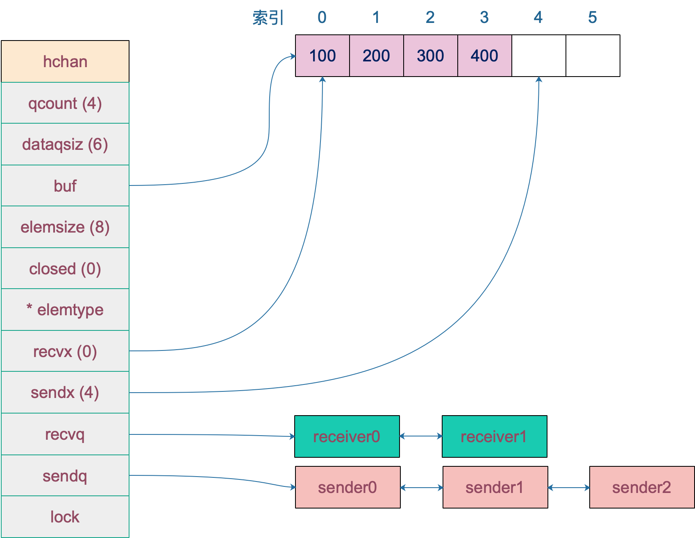

#### channel的底层数据结构是什么

channel底层源码(src/runtime/chan.go)：
```go 
type hchan struct {
	// chan 元素数量
	qcount   uint
	dataqsiz uint
	// 指向底层循环数组的指针
	//只针对有缓冲的 channel
	buf unsafe.Pointer
	//chan 中元素大小
	elemsize uint16
	// chan 是否被关闭的标志
	closed uint32
	// chan中的元素类型
	elemtype *_type // element type
	// 已发送元素在循环数组中的索引
	sendx uint// send index
	// 已接收元素在循环数组中的索引
	recvx uint // receive index
	// 等待接收的goroutine 队列
	recvq waitq // list of recv waiters
	// 等待发送的goroutine队列
	sendq waitq // list of send waiters
	
	// 保护hchan中所有字段 
	lock mutex
}

```

来看几个重要的字段：
- `buf` 指向底层循环数组，只有缓冲类型的channel才有
- `sendx, recvx` 均指向底层循环数组，表示当前可以发送和接收的元素位置索引值（相对于底层数组）
- `sendq,recvq` 分别表示被阻塞的goroutine，这些goroutine由于尝试读取 channel或向channel发送数据而被阻塞
- `waitq`是`sudog` 的一个双向链表，而`sudog` 实际上是对goroutine的一个封装：  
```go
type waitq struct {
	first *sudog
	last *sudog
}
```
- `lock` 用来保证每个读channel或写channel的操作都是原子的。
创建切片后每个字段具体值，来看一个容量为6，元素类型为int的channel数据结构如下：
  


#### 创建一个channel源码

通过汇编可以知道，最终创建chan的函数是`makechan`:  
```go
func makechan(t *chantype, size int64) *hchan {}
```
从函数原型来看，创建的chan是一个指针，所以我们能在函数间志杰传递channel，而不用传递channel的指针  

代码如下：  
```go
const hchanSize = unsafe.Sizeof(hchan{}) + uintptr(-int(unsafe.Sizeof(hchan{}))&(maxAlign-1))

func makechan(t *chantype, size int64) *hchan {
	elem := t.elem

	// 省略了检查 channel size，align 的代码
	// ……

	var c *hchan
	// 如果元素类型不含指针 或者 size 大小为 0（无缓冲类型）
	// 只进行一次内存分配
	if elem.kind&kindNoPointers != 0 || size == 0 {
		// 如果 hchan 结构体中不含指针，GC 就不会扫描 chan 中的元素
		// 只分配 "hchan 结构体大小 + 元素大小*个数" 的内存
		c = (*hchan)(mallocgc(hchanSize+uintptr(size)*elem.size, nil, true))
		// 如果是缓冲型 channel 且元素大小不等于 0（大小等于 0的元素类型：struct{}）
		if size > 0 && elem.size != 0 {
			c.buf = add(unsafe.Pointer(c), hchanSize)
		} else {
			// race detector uses this location for synchronization
			// Also prevents us from pointing beyond the allocation (see issue 9401).
			// 1. 非缓冲型的，buf 没用，直接指向 chan 起始地址处
			// 2. 缓冲型的，能进入到这里，说明元素无指针且元素类型为 struct{}，也无影响
			// 因为只会用到接收和发送游标，不会真正拷贝东西到 c.buf 处（这会覆盖 chan的内容）
			c.buf = unsafe.Pointer(c)
		}
	} else {
		// 进行两次内存分配操作
		c = new(hchan)
		c.buf = newarray(elem, int(size))
	}
	c.elemsize = uint16(elem.size)
	c.elemtype = elem
	// 循环数组长度
	c.dataqsiz = uint(size)

	// 返回 hchan 指针
	return c
}

```
新建 chan 后，内存在堆上分配，大概长这样:  


#### 参考文章：(https://golang.design/go-questions/channel/struct/)


