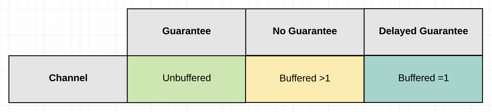
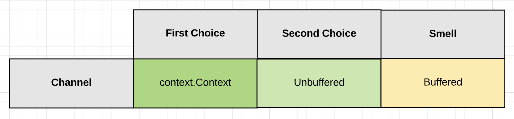

### 通道行为

#### 简介  
当我第一次开始使用GO的通道时，我犯了一个错误，将通道视为一种数据结构。我把通道看作一个队列，它提供了goroutine之间的自动同步访问。这种对结构的理解导致我们编写了很多糟糕而复杂的并发代码。  

随着时间的流逝，我了解到，最好忘记通道的结构，并专注于它们的行为方式。所以现在说到通道，我想到一件事：信号。通道允许一个goroutine向另一个goroutine发出有关特定事件的信号。信令是您应该对通道执行的所有操作的核心。将通道视为一种信令机制允许您编写具有定义明确且行为更精确的更好的代码。  

要了解信令的工作原理，我们必须了解它三个属性：
  - 交货保障（Guarantee of Delivery）  
  - 状态(state)
  - 有没有数据（with or without data）。
这三个属性共同作用，围绕信令创造了一种设计理念。在讨论完这些属性之后，我们将提供一些代码示例来源是应用这些属性的信令。  

#### 交货保障(Guarantee of Delivery)  
交付保障基于一个问题： 我是否需要保证特定goroutine发送的信号已被接收？  

换言之，清单1中的示例：  
**清单1**  
```go
func listing1(){
	ch := make(chan string)
	go func() {
		p := <- ch // Receive
		fmt.Println(p)
	}()
	
	ch <- "paper" // Send
}
```  
发送goroutine是否需要保证在继续之前，通道发送的`paper`是否被变量`p`收到？   

根据这个问题的答案，您将知道使用两种类型的通道中的哪一种：无缓冲或缓冲。每个渠道围绕交付保证提供不同的行为。  
  

交付保证很重要，如果你不这么认为，我有很多东西想卖给你！当然，我是想开个玩笑，但是当你生活中没有保障时，你不会感到紧张吗？在编写并发软件时，对是否需要保证有深刻的理解直观重要。随着我们的继续，您将学习如何做决定。  

#### 状态  

通道的行为直接手其当前状态的影响。通道的状态可以是nil、open或closed。

下面的清单2显示了如何声明通道或将通道放入这三种状态中的每一种状态。  

**清单2**  
```go
// channel state
func listing2() {
	// A channel is in a nil state when it is declared to its zero value
	var ch chan string

	// A channel can be placed in a nil state by explicitly setting it to nil.
	ch = nil

	// ** open channel
	// A channel is in a open state when it's made using the built-in function make.
	ch = make(chan string)

	// ** closed channel

	// A channel is in a closed state when it's closed using the build-in function close.
	close(ch)
}
```
状态决定了发送和接收操作的行为方式。  

信号通过通道发送和接收。不要说读/写，因为通道不执行I/O。  

图2， 三种状态下针对发送和接收行为图（**通道关闭时，不可发送**）：   

  

当通道处于**nil**状态时，在通道上尝试的任何发送或接收都将被阻止。当通道处于**打开**状态时，-*可以发送和接收信号*-。当通道进入**关闭**状态时，-*无法再发送信号*-，但仍然可以接收信号。   

这些状态将针对您遇到的不同情况提供所需要的不同行为。当将状态与交付保证结合时，您可以开始分析由于您的设计选择而产生的成本/收益。在许多情况下，您还可以通过阅读代码快速发现错误，因为您了解通道的行为方式。  

#### **有数据和无数据**  

需要考虑的最后一个信令属性是是否需要使用数据发送信号。  

你可以通过在通道上执行发送来发出数据信号。  
**清单3**
```go
ch <- "paper"
```   
当您使用数据发出信号时，通常是因为：  
  - 正在要求goroutine开始一个新任务。 
  - goroutine报告一个结果。 

您可以通过关闭通道来发出没有数据的信号。  

**清单4**   
```go
close(ch)
```  
当您没有数据的情况下发出信号时，通常是因为：  
  - 一个goroutine被告知停止它们正在做的事情。  
  - 一个goroutine报告它们已经完成，但没有结果。  
  - goroutine报告它已经完成处理并关闭。 

这些规则也有例外，但这些是主要的用例，也是我们将这篇文章中重点介绍的用例。我认为这些规则的例外是厨师代码异味。  

没有数据的信令的一个好处是，单个goroutine可以同时向多个goroutine发出信号。数据信令始终是goroutines之间1对1交换。   

#### **使用数据发送信令**  
当您要用数据发出信号时，您可以根据需要的保障类型选择三个通道配置选项。  

*图3:有数据的信令*

  

三个通道选项是 Unbuffered、Buffered>1或Buffered = 1.  
- 交付**保证**(Guarantee): 
	- **无缓冲**通道可保证已接收到正在发送的信号。  
		- 因为信号的接收再信号发送完成之前。  
- **不保证**(No Guarantee):  
	- 大小为 >1 的缓冲通道不能保证已接收到正在发送的信号。
		- 因为信号的发送在信号接受完成之前。  
- **延迟保证**  
	- 大小 =1 的缓冲通道为您提供延迟保证。它可以保证已收到之前发送的信号
		- 因为第一个信号的接收发生在第二个信号的发送完成之前。  

> **缓冲区的大小绝不能是随机数，必须始终针对某些明确定义的约束进行计算。计算中没有无线，一切都必须有一些明确定义的约束，无论是事件还是空间**  

#### 无数据信令  
没有数据的信令诸药保留用于取消。它允许一个goroutine向另一个goroutine发出信号，以取消它们正在做的事情并继续前进。可以使用Unbuffered和Buffered通道实现取消，但是没有发送数据时使用Buffered通道是一种代码味道。  

**图4:无数据的信令**

  

内置功能close用于没有 数据的情况下发出信号。如上文状态部分所述，您可以在关闭的通道上接收信号。事实上，封闭通道上的任何接收都不会阻塞，并且接受操作始终返回。  

在大多数情况下，您希望使用标准库context包来实现没有**数据的信令**。该context封装使用下方的unbuffered通道进行信号传输，并使用内置功能close在没有数据的情况下发出信号。  

如果您选择使用自己的通道（而不是上下文包）进行取消，您的通道应该为chan struct{},它是零空间的惯用方式，用于指示仅用于信令的信道。   


#### 场景（Scenarios）   

有了这些属性，进一步了解它们在实践中如何工作的最佳方式是运行一系列代码方案。我喜欢在阅读和编写基于通道的代码时将goroutine视为人。这种可视化确实很有帮助，我将在下面使用它作为辅助工具。  

#### **带数据的信号-保证-无缓冲通道**  

当您需要知道已收到正在发送的信号时，有两种情况会发挥作用。他们是“等待任务”和“等待结果”。  

**方案1 - 等待任务**  
考虑成为一名经理并雇佣一名新员工。在这种情况下，您希望新员工执行任务，但他们需要等到您准备就绪。这是因为您需要在他们开始之前传递给他们一张纸条。  

**清单5:**
```go
func waitForTask() {
	ch := make(chan string)

	go func() {
		p := <-ch
		// Employee performs work here.

		// Employee is done and free to go.

		fmt.Println(p)
	}()

	time.Sleep(time.Duration(rand.Intn(500)) * time.Microsecond)

	ch <- "paper"
}
```  
在清单5的第二行创建了一个Unbuffered通道，其属性是string数据将与信号一起发送。然后在第4行，雇用了一名员工，并被告知在第5行上等待您的信号，然后再开始工作。第5行是接收通道消息，导致员工在等待您发送的那张纸条时被阻塞。一旦员工收到纸条，员工就会执行工作，然后完成并自由离开。  

作为经理，您正在与新员工同时工作。因此，在雇佣员工后，您会发现自己（在第13行）正在做您需要做的事情来解锁向员工发出信号。请注意，目前尚不清楚您要发送这张纸条需要多长时间。  

最终，您已准备好向员工发出信号。在第15行，您用数据执行信号，数据就是那张纸条。由于使用的是Unbuffered通道，因此可以保证再发送操作完成后，员工已收到纸条。接收发送在发送完成之前。  

从技术上讲，您所知道的是，在您的频道发送操作完成时，员工已经拥有了这张纸条。在两个通道操作之后，调度程序可以选择执行它想要的任何语句。由您或员工执行的下一行代码都是不确定的。这意味着用print语句可能会欺骗您事物执行顺序。  

- **方案2: 等待结果**

在下一个场景中，情况正好相反。这一次，您希望您的新员工录用时立即执行任务，您需要等待他们的工作结果。您需要等待，因为您需要从他们那里获得论文才能继续。  

**清单6**
```go
func waitForResult(){
	ch := make(chan string)
	
	go func() {
		time.Sleep(time.Duration(rand.Intn(500)) * time.Microsecond)
		
		ch <- "paper"
		
		// Employee is done and free to go.
	}()
	
	p := <- ch
	fmt.Println(p)
}
```  
在清单6的第二行，创建了一个无缓冲通道，其属性是string数据将于信号一起发送。然后在第4行，雇佣一名员工并立即投入工作。在第4行雇佣员工后，您发现在第12行等待纸质报告。  

一旦员工在第5行完成工作，他们就会通过执行包含数据的通道发送，在第7行将结果发送给您。由于这是一个无缓冲通道，因此接收发生在发送之前，并且可以保证员工已收到结果。一旦员工有了这个保证，他们就完成了，可以自由离开。这种情况下，您不知道员工需要多长时间才能完成任务。  

**成本/收益**。
无缓冲通道可以保证接收到正在发送的信号。这很好，但是没有什么是免费的。这种保证的代价就是未知的延迟。在“等待任务”方案过程中，员工不知道您发送该论文需要多长时间。在“等待结果”方案中，您不知道员工需要多长时间才能向您发送该结果。  

这两种情况下，这种未知的延迟都是我们必须忍受的，因为需要保证。如果没有这种保证的行为，逻辑就不起作用了。  

#### **带数据的信号 - 不保证 - 缓冲通道 > 1**  
当您不需要知道已收到正在发送的信号时，以下两种情况就会发挥作用：扇出和丢弃。  

缓冲通道具有定义明确的空间，可用于存储正在发送的数据。那么，如何决定需要多少空间呢？回答一下问题：  
  - 我是否有明确定义的工作量要完成？  
  	- 有多少工作？
  - 如果我的员工跟不上，我可以放弃任何新工作吗？
  	- 有多出色的工作让我满负荷工作？
  - 如果我的计划以外终止，我愿意接受什么程度的风险？
  	- 缓冲区中等待的任何内容豆浆丢失。    

如果这些问题对你正在建模的行为没有意义，那么使用任何大于1的Buffered通道都可能是错误的。  

#### **场景1:扇出(Fan out)**
删除模式允许您明确定义的多个员工抛出并发工作的问题。由于每个人物都有一名员工，因此您确切地知道您将收到多少份报告。您可以确保装箱中有足够的空间来接收所有这些报告。这样做的好处是您的员工无需等待您提交报告。但是，如果他们同时货几乎同时到达箱子，他们确实需要轮流讲报告放入箱子中。  

想象一下，你又是经历，但这次你雇佣了一个员工团队。您有意向希望每个员工执行的单独任务。当每个员工完成他们的任务时，他们需要为您提供一份纸质报告，该报告必须放在您办公桌上的盒子里。  

**清单7**
```go
func fanOut(){
	emps := 20
	ch := make(chan string, emps)

	for e := 0; e < emps; e++ {
		go func() {
			time.Sleep(time.Duration(rand.Intn(200)) * time.Microsecond)
			ch <- "paper"
		}()
	}
	
	for emps > 0 {
		p := <- ch
		fmt.Println(p)
		emps --
	}
}
```  

在清单7的第3行，创建了一个Buffered通道，其属性是string数据将与信号一起发送。这一次，由于第2行生命的emps变量，通道创建了20个缓冲区。  

在第5到10行之间，雇用了20名员工，他们立即开始工作。您不知道每个员工将在7行上花费多长时间。然后，第8行，员工发送纸质报告，但这次发送不会阻止等待接收。由于狂吼着那个有空间供每个员工使用，因此频道上的发送仅与可能希望同时货几乎同时发送报告的其他员工竞争。  

在第12行到16行之间的代码就是你。在这里，您可以等待所有20名员工完成工作并发送报告。在第12行，您处于循环中，在第13行，您将被阻塞在等待报告的通道接收中。收到报告后，将报告打印在14行，并且本地计数器变量递减以指示员工已完成。  

#### 方案2: 丢弃  

下降模式允许您在员工满负荷工作时扔掉工作。这样做的好处是可以继续接受客户的工作，并且在接受该工作时永远不会施加被压力或延迟。这里的关键是知道你什么时候真正满负荷运转，这样你就不会对你要完成的工作量投入不足或过度投入。通常，您需要集成测试或指标来帮助您识别这个数字。  

想象一下，你在此成为经理，你雇佣一名员工来完成工作。您有意向希望员工执行的个人任务。当员工完成他们的任务时，你并不关心他们完成了。重要的是你是否可以将新作品放入盒子里。如果您无法执行发送，那么您就知道您的箱子已满，员工已满员。在这一点上，需要丢弃新工作，一边事情可以继续进行。  

**清单8**

```go
func selectDrop() {
	const cp = 5
	ch := make(chan string, cp)

	go func() {
		for p := range ch {
			fmt.Println("employee: received: ", p)
		}
	}()

	const work = 20
	for w := 0; w < work; w++ {
		select {
		case ch <- "paper":
			fmt.Println("manager: send ack")
		default:
			fmt.Println("manager : drop")

		}
	}

	close(ch)
}
```

在清单8的第3行，创建了一个Buffered通道，其属性是string数据将与您的信号一起发送。这一次由于第2行声明的cp敞亮，通道创建了5个缓冲区见。  

在第5到9行之间，雇佣一名员工来处理工作。通过for range循环接收信号。每次收到一张纸时，都会在第7行进行处理。  

在第11行到19行之间，您尝试向员工发送20张纸。这一次，语句select用于第14行到第一个case内执行发送。由于该default子句在第16行中使用select，如果发送将因缓冲区没有更多空间而阻塞，则通过执行第17行放弃发送。

最后，第21行，针对通道内置函数close。浙江在没有数据的情况下向员工发出信号，他们已经完成，一旦他们完成分配的工作，就可以自由离开了。  

**成本收益**  
大于1缓冲通道将不能保证发送的信号永远不会被接收。放弃这种保证的好处是，两个goroutine之间的通信延迟减少或没有延迟。在删除方案中，每个发送爆表的员工都有一个缓冲区。在丢弃方案中，将测量缓冲区的容量，如果打到容量，则会丢弃工作，一边事情可以继续移动。  

在这两种选择中，这种缺乏保证是我们必须忍受的，因为减少延迟更为重要。零到最小延迟到要求不会对系统的整体逻辑造成问题。  

#### **带数据的信号 - 延迟保证 - 缓冲通道 = 1**  
当有必要发送新信号之前知道是否已收到之前发送的信号时，“等待任务”方案将发挥作用。  

- **方案1- 等待任务**  
在这种情况下，您有一名新员工，但他们要做的不仅仅是一项任务。您将一个接一个地想他们提供许多任务。但是他们必须先完成每项任务，然后才能开始新任务。由于他们一次只能处理一项任务，因此工作交接之间可能存在延迟问题。如果可以减少延迟，而不会失去员工正在处理下一个任务的保证，它可能会有帮助。  

这就是1的缓冲通道优势所在。如果一切都在你和员工之间以预期的速度允信该，你们中的任何一方都不需要等待对方。每次发送一张纸时，缓冲区都是空的。每当您的员工完成更多工作时，缓冲区就会满。这是工作流程的完美对称。  

最好的部分是这个。如果您在任何时候尝试发送一张纸，但由于缓冲区已满而无法发送，则您知道您的员工遇到了问题，因此您停止了。这就是延迟保证的用武之地。当缓冲区为空切您执行发送时，您可以保证您的员工已经完成了您发送的最后一项工作。如果您执行发送但不能，则可以保证他们没有。  

**清单9**  

```go
func waitForTasks(){
	ch := make(chan string, 1)
	
	go func() {
		for p := range ch{
			fmt.Println("employee: working: ", p)
		}
	}()
	
	const work = 10

	for w := 0; w < work; w++ {
		ch <- "paper"
	}
	
	close(ch)
}
```  
在清单 9 的第 02 行，创建了一个大小为 1 的 Buffered 通道，其属性是 string 数据将与信号一起发送。在 04 到 08 行之间，雇用一名员工来处理工作。A for range 用于通道接收。每次收到一张纸时，都会在第 06 行进行处理。  


在第 10 行到第 13 行之间，您开始将任务发送给员工。如果你的员工可以像你发送一样快地运行，那么你们两个之间的延迟就会减少。但是，每次成功发送时，您都可以保证您提交的最后一件工作正在处理中。  


最后，在第 15 行，针对通道调用内置函数 close 。这将在没有数据的情况下向员工发出信号，他们已经完成并可以自由离开。但是，您提交的最后一件作品将在终止之前 for range 收到（刷新）。

#### **没有数据的信号 - 上下文**  
在最后一个场景中，您将看到如何使用包中的 Context 值取消正在运行的 context goroutine。这一切都是通过利用一个关闭的无缓冲通道来执行没有数据的信号来实现的。  

您最后一次担任经理，并雇用一名员工来完成工作。这一次，您不愿意等待员工完成未知的时间。你正处于一个离散的最后期限，如果员工没有及时完成，你就不愿意等待。  

**清单10**  

```go
func withTimeout() {
	duration := 50 * time.Millisecond

	ctx, cancel := context.WithTimeout(context.Background(), duration)
	defer cancel()

	ch := make(chan string, 1)

	go func() {
		time.Sleep(time.Duration(rand.Intn(100)) * time.Millisecond)
		ch <- "paper"
	}()

	select {
	case p := <-ch:
		fmt.Println("work complete", p)

	case <-ctx.Done():
		fmt.Println("moving on")
	}
}
```

在清单 10 的第 02 行，声明了一个持续时间值，该值表示员工完成任务所需的时间。此值在第 04 行用于创建超时为 50 毫秒 context.Context 的值。 context 包中的函数返回一个 Context 值和一个取消 WithTimeout 函数。  

该 context 包创建一个 goroutine，一旦达到持续时间，该 goroutine 将关闭与该 Context 值关联的 Unbuffered 通道。无论结果如何，您都有责任调用该 cancel 函数。这将清理为 Context .可以多次调用该 cancel 函数。  


在第 05 行，该 cancel 函数将延迟到此函数终止后执行。在第 07 行，将创建一个 1 的缓冲通道，员工将使用该通道向您发送他们的工作结果。然后在第 09 行到 12 行，员工被雇用并立即投入工作。您不知道员工需要多长时间才能完成。  

在第 14 行到第 20 行之间，您可以使用语句 select 在两个通道上接收。第 15 行的接收，您等待员工向您发送他们的结果。在第 18 行接收时，您等待查看 context 包裹是否会发出 50 毫秒已结束的信号。无论您先收到哪个信号，都将是处理的信号。  

该算法的一个重要方面是使用 1 的 Buffered 通道。如果员工没有及时完成，您将在没有通知员工的情况下继续前进。从员工的角度来看，他们总是会在第 11 行向您发送报告，无论您是否在那里收到报告，他们都是瞎子。如果您使用 Unbuffered 渠道，如果您继续前进，员工将永远阻止尝试向您发送报告。**这将造成 goroutine 泄漏。因此，使用 1 的缓冲通道来防止这种情况发生。**  


### 结论(Conclusion)  

- 在使用通道（或并发）时，了解和理解有关**保证、通道状态和发送的信令属性**非常重要。它们将帮助指导您实现您正在编写的并发程序和算法所需的最佳行为。它们将帮助您发现错误并嗅出潜在的错误代码。

- 在这篇文章中，我分享了一些示例程序，这些程序展示了信令属性在不同场景中的工作方式。每条规则都有例外，但这些模式是开始的良好基础。  

查看这些大纲，作为何时以及如何有效思考和使用渠道的摘要：  

-  语言力学
	- 使用通道来编排和协调 goroutines。
		- 关注信令属性，而不是数据共享。
		- 带数据或不带数据的信令
		- 质疑它们用于同步对共享状态的访问。
			- 在某些情况下，通道可以更简单，但最初是问题。

	- 无缓冲通道：
		- 接收发生在发送之前。
		- 好处：100%保证信号已被接收。
		- 成本：接收信号的未知延迟。
	- 缓冲通道：
		- 发送发生在接收之前。
		- 优点：减少信令之间的阻塞延迟。
		- 成本：不能保证何时接收到信号
			- 缓冲区越大，保证越少。
			- 缓冲区 1 可以为您提供一次延迟发送保证。
	- 关闭通道：
		- 关闭发生在接收之前（如缓冲）。
		- 没有数据的信令。
		- 非常适合发出取消和截止日期的信号。
	- NIL通道：
		- 发送和接收块。
		- 关闭信令
		- 非常适合速率限制或短期停机。
- 设计理念
	- 如果通道上的任何给定 Send 都可能导致发送 goroutine 阻塞：
		- 不允许使用大于 1 的 Buffered 通道。
			- 大于 1 的缓冲区必须具有原因/测量值。
		- 必须知道当发送 goroutine 阻塞时会发生什么。
	- 如果通道上的任何给定 Send 不会导致发送 goroutine 阻塞：
		- 您有每次发送的确切缓冲区数。
			- 扇出模式 fanout
		- 您测量了缓冲区的最大容量。
			- 丢弃模式

	- 使用缓冲区，少即是多。
		- 在考虑缓冲区时，不要考虑性能。
		- 缓冲区有助于减少信令之间的阻塞延迟  
			- 将阻塞延迟降低到零并不一定意味着更高的吞吐量。
			- 如果缓冲区为 1 可提供足够好的吞吐量，则保留它。
			- 大于 1 并测量大小的问题缓冲区。
			- 找到尽可能小的缓冲区，以提供足够好的吞吐量。


#### 参考文章：https://www.ardanlabs.com/blog/2017/10/the-behavior-of-channels.html

