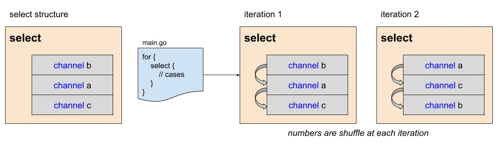
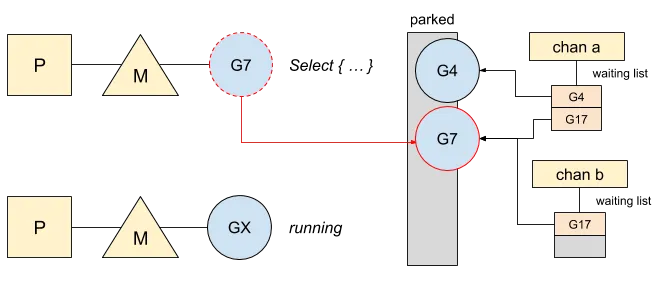
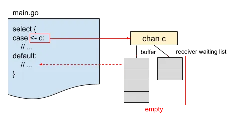

### GO：在select语句中排序

select语句让一个goroutine对多个通道进行操作。然而，当所有这些都准备好进行通信时，Go必须在其中进行选择。Go还需要处理没有准备好的情况。让我们从准备好的通道开始。  

### order
选择一个渠道当它到达一个select声明时，并不遵循任何特定的规则或优先级。Go标准库在每次访问时都会对它们重新洗牌，这意味着它不保证任何挑选顺序。  

让我们举一个准备好进行通信的三个通道的示例：  
```go
func orderingInSelect() {
	a := make(chan bool, 10)
	b := make(chan bool, 10)
	c := make(chan bool, 10)

	for i := 0; i < 10; i++ {
		a <- true
		b <- true
		c <- true
	}

	for i := 0; i < 10; i++ {
		select {
		case <-a:
			fmt.Print(" < a")
		case <-b:
			fmt.Print(" < b")
		case <-c:
			fmt.Print(" < c")
		default:
			fmt.Print(" < default")

		}
	}
}
```  
这三个通道有一个完整的缓冲区，使它们准备好被选择。这是程序的输出：  

```bash
< c < c < a < c < b < a < a < c < c < a
```

在语句每次迭代中select，案例顺序都会被打乱：  



由于Go不会删除重复的通道，因此可以通过多次添加案例来影响选择。这是一个例子：  
```go
func orderingInSelect2() {
	a := make(chan bool, 10)
	b := make(chan bool, 10)
	c := make(chan bool, 10)

	for i := 0; i < 10; i++ {
		a <- true
		b <- true
		c <- true
	}

	for i := 0; i < 10; i++ {
		select {
		case <-a:
			fmt.Print(" < a")
		case <-a:
			fmt.Print(" < a")
		case <-a:
			fmt.Print(" < a")
		case <-a:
			fmt.Print(" < a")
		case <-a:
			fmt.Print(" < a")
		case <-a:
			fmt.Print(" < a")
		case <-a:
			fmt.Print(" < a")
		case <-a:
			fmt.Print(" < a")
		case <-a:
			fmt.Print(" < a")
		case <-b:
			fmt.Print(" < b")
		case <-c:
			fmt.Print(" < c")
		default:
			fmt.Print(" < default")

		}
	}
}

```  
这是新配置的输出：  
```bash
< a < a < a < a < a < a < a < a < b < a
```
a当所有通道同时准备好时，该通道由80%的机会被选中。现在让我们讨论通道未准备好通信的情况。  

#### **未就绪通道**  

当代码命中指令select时，通道可能尚未准备好。如果没有一个准备好，则将default被选中。*但是如果案例不提供任何默认分支，go将等待收到通知。*让我们以未就绪通道为例：  

```go
func selectWaiting() {
	a := make(chan bool, 10)
	b := make(chan bool, 10)

	go func() {
		time.Sleep(time.Minute)
		for i := 0; i < 10; i++ {
			a <- true
			b <- true
		}
	}()

	for i := 0; i < 10; i++ {
		select {
		case <-a:
			fmt.Print("< a ")
		case <-b:
			fmt.Print("< b ")
		}
	}
}
```  

在此示例中，第一条消息将在一分钟后发送到通道，从而使指令select在通道上被阻塞。在这种情况下，处理该select语句的函数将订阅每个通道并将停放。 #7下面是一个goroutine在select中等待的图示，其中另一个goroutien也在等待通道：  
  
Goroutine订阅所有通道并在列尾等待。如果在通道上发送消息，它将通知已在其上等待的其他goroutine。一旦收到通知，它将取消订阅每个通道并返回代码。  

有关通道和等待队列的更多信息，推荐文章[《Go：缓冲和非缓冲通道》](../ch/ch_buffer_unbuffer.md)  


之前介绍的所有逻辑仅对于至少有两个活动通道的选择有效。事实上，由于活动通道较少，GO能够简化select语句。  

#### 简化：  
select如果示例（case）不超过1(默认1)，则语句会自动简化。这是一个例子：  
```go
func selectOneCase() {
	t := time.NewTicker(time.Minute)
	select {
	case <-t.C:
		fmt.Print("1 minute later...")
	default:
		fmt.Print("default branch")
	}
}
```  

在这种情况下，Go知识将select语句替换为以非阻塞模式读取通道的操作。  
如果通道的缓冲区中不包含任何值，或者发送方没有准备好发送消息，则它只会进入默认情况。这是图标：  

  

如果代码没提供default case，Go会通过阻塞通道操作重新select语句。  


- *参考文章链接：https://medium.com/a-journey-with-go/go-ordering-in-select-statements-fd0ff80fd8d6*


