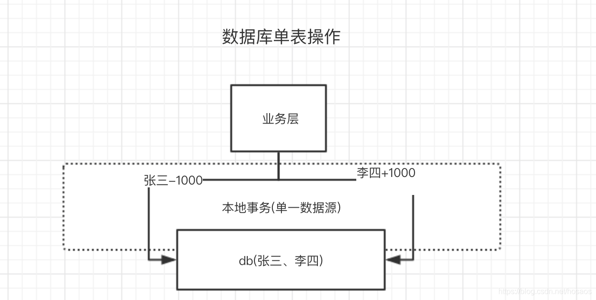

### Seata实战-分布式事务简介及demo上手

#### Seata简介([github项目连接](https://github.com/seata))  
Seata(Simple Extensible Autonomous Transaction Architecture)是阿里巴巴开源的分布式事务中间件，以高效并且对业务0侵入对方式，解决微服务场景下面临的分布式事务问题。  

目前seata处于不断开源升级中，并不建议在线使用，生产环境可以考虑使用阿里云商用的GTS，附上seata目前的升级计划，可以考虑v1.0，即服务端HA集群版本进行线上使用。  
   

先来看下为什么会产生分布式事务问题

#### 分布式事务产生背景  
讲到事务，又得搬出经典的银行转账问题了，下面以实例说明  

假设银行中有两个客户(name)张三和李四  
我们需要将张三的1000元存款（sal）转到李四的账户上。  

目标就是张三的账户减1000元，李四账户加1000，不能出现中间步骤（张三减1000，李四没加）。

   

假设dao层代码如下：  
```java
public interface BankMapper {
	/*
	* @param username 用户名
	* @param changeSal 余额变动值
	*/ 
	public void updateSal(String userName, int changeSal);
}
```  

对应xml中sql如下：  
```xml
<update id = "updateSal">
	update bank set sal = sal+#{changeSal} where name = #{userName}
</update>
```  
如果两个用户对应的银行存款数据在一个数据源中，即一个数据库中，那么service层代码可以如下编写：  
```java
/**
	* @param fromUserName 转账人
	* @param toUserName 被转账人
	* @param changeSal 转账额度

*/
@Transactional(rollbackFor=Exception.class)
public void changeSal(string fromUserName, String toUserName, int changeSal){
	bankMapper.updateSal(fromUserName, -1 * changeSal);
	bankMapper.updateSal(toUserName, changeSal);
}

```  
通过spring框架下的@Transactional注释来保证单一数据源增删改查的一致性。

但是随着业务的扩大，用户数的增多，几百万几千万的用户数据可以存一个库一个表，假设有10亿用户呢？  

#### 数据看的水平分割  

为了解决数据库上的瓶颈，分库是很常见的解决方案，不同用户就可能落在不同的数据库里，原来一个库里的食物操作，现在变成了跨数据库的食物操作。  

   
此时 @Transactional注解就失效了，这就是**跨数据库分布式事务的问题**  

#### 微服务化  
当然更多的清醒锁着业务的不断增长，将业务中不同模块服务拆分成微服务后，同时调用多个微服务产生的微服务化的银行转账情景往往是这样的：  
  - 调用交易系统服务创建交易订单。  
  - 调用支付系统记录支付明细。  
  - 调用账务系统执行A扣钱
  - 调用账务系统执行B加钱


   

如图所示，每个系统都对应一个独立的数据源，且可能位于不同的机房，同时调用多个系统很难保证同时成功，这就是**跨服务分布式事务的问题**。  

#### 分布式事务理论基础  
- **两阶段提交(2pc)**  
两阶段提交协议(Two Phase Commitment Protocol)中，设计两种角色  

一个事物协调者（coordinator）: 负责协调多个参与者进行事物投票及提交（回滚）  
多个事物参与者(participants): 即本地事物执行者。  

总共处理步骤有两个：  
  - 投票阶段(voting phase): 协调者将通知事物参与者准备提交或取消事物，然后进入表决过程。参与者将告知协调者自己的决策：同意（事物参与者本地事物执行成功，但未提交）或取消（本地事物执行故障）。  
  - 提交阶段（commit phase）: 收到参与者的通知后，协调者再向参与者发出通知，根据反馈情况决定各参与者是否要提交还是回滚。  

如图所示1-2为第一阶段， 2-3位第二阶段  
如果任一资源管理器在第一阶段返回准备失败，那么事物管理器会要求所有资源管理器在第二阶段执行回滚操作。通过事物管理器的两阶段协调，最终所有资源管理器要么全部提交，要么全部回滚，最终状态都是一致的。  

   

#### TCC 基本原理  
TCC将事物提交分为Try-confirm-cancel3个操作。其和两阶段提交有点类似，Try为第一阶段，confirm-cancel为第二阶段，是一种应用层面侵入业务的两阶段提交。  

| 操作方法 | 含义|
| ---- | ---- |
| Try | 预留业务资源/数据校验 |
| Confirm | 确认执行业务操作，实际提交数据，不做任何业务检查，try成功，confirm必定成功，需保证幂等 |
| cancel | 取消执行业务操作，实际回滚数据，需保证幂等性 |

其核心在于将业务分为两个操作步骤完成。不依赖RM对分布式事物的支持，而是通过对业务逻辑的分解来实现分布式事务。  

下面还是以银行转账例子来说：  
假设用户User表中有两个字段：可用余额(available_money)、冻结余额(frozen_money)
A扣钱对应服务A(ServiceA)
B加钱对应服务B(ServiceB)
转账订单服务(OrderService)
业务转账方法服务(BusinessService)

ServiceA，ServiceB，OrderService都需分别实现try()，confirm()，cancle()方法，方法对应业务逻辑如下

|  | ServiceA | ServiceB | OrderService |
| ---- | ---- | ---- | ---- |
| try() | 校验余额(并发控制) \n 冻结余额+1000 \n 余额-1000 | 冻结金额+1000 | 创建转账订单，状态：待转账 |
| confirm() | 冻结余额 -1000 | 余额+1000 \n 冻结金额-1000 | 状态变为转账成功 |
| cancel() | 冻结金额-1000 \n 余额 +1000 | 冻结余额 -1000 | 状态变为转账失败 |

其中业务调用方BusinessService中就需要调用  
ServiceA.try()  
ServiceB.try()  
OrderService.try()  

1、当所有try()方法均执行成功时，对全局事物进行提交，即由事物管理器调用每个微服务的confirm()方法  
2、 当任意一个方法try()失败(预留资源不足，抑或网络异常，代码异常等任何异常)，由事物管理器调用每个微服务的cancle()方法对全局事务进行回滚

引用网上一张TCC原理的参考图片  
   

#### 幂等控制  
使用TCC时要注意Try-Confirm-Cancel3个操作的**幂等控制**，网络原因，或者重试操作都有可能导致这几个操作的重复执行。  


   

业务实现过程中需要重点关注幂等实现，降到幂等，以上述TCC转账例子中confirm()方法来说明：  
在confirm()方法中，余额-1000，冻结余额+1000，这一步时实现迷瞪行的关键，你会怎么做？  

大家在自己系统里操作资金账户时，为了防止并发情况下数据不一致的出现，肯定会避免出现这种代码
```java
//根据userId查到账户
Account account = accountMapper.selectById(userId);
//取出当前资金
int availableMoney = account.getAvailableMoney();
account.setAvailableMoney(availableMoney-1000);
//更新剩余资金
accountMapper.update(account);
```  

因为这本质上是一个 读-改-写的过程，不是原子的，在并发情况下会出现数据不一致问题  
所以最简单的做法是：  
```SQL
update account set avaiable_money = available_money-1000 where user_id=#{userId}
```  
这里用了数据库锁特性解决了并发情况下的数据不一致问题，但是TCC中，淡出使用这个方法使用么？  
答案是不行的，该方法能解决**并发单次操作下扣减余额问题，但不能解决多次操作带来的多次扣减问题，假设我执行了两次**，假设我执行了两次，按这种方案，账户就减少了2000元。  

那么具体怎么做呢？上述转账例子中，可以引入转账订单状态来做判断，若订单状态为已支付，则直接返回。  
```java
if ( order != null && order.getStatus().equals("转账成功")){
	return;
}
	
```  
当然，新建一张去重表，用订单ID作唯一键，若插入报错返回也是可以的，不管怎么样，**核心就是保证操作幂等性**。  

#### *空回滚*   
如下图所示，事物协调器在调用TCC服务的一阶段Try操作时，可能会出现因为丢包而导致的网络超时，此时事物协调器会出发二阶段回滚，调用TCC服务的Cancel操作；  

TCC服务在未收到Try请求的情况下收到了Cancel请求，这种场景被称为空回滚；TCC服务在实现时应当允许空回滚的执行；  

   

那么具体代码里怎么做呢？
分析下，如果try()方法没执行，那么订单一定没创建，所以cancel方法里可以加一个判断，如果上下文中订单标号orderNo不存在或者订单不存在，直接return。  
```java
if(orderNo == null || order==null) {
	return;
}
```  

核心思想就是：**回滚请求处理时，如果对应的具体业务数据为空，则返回成功**。  

当然这种问题也可以通过中间件层面来实现，如，在第一阶段try()执行完后，向一张事务表中插入一条数据(包含事务id，分支id)，cancle()执行时，判断如果没有事务记录则直接返回，但是现在还不支持  

#### 放悬挂  

如下图所示，事务协调器在调用TCC服务的一阶段Try操作时，可能会出现因网络拥堵而导致的超时，此时事务协调器会触发二阶段回滚，调用TCC服务的Cancel操作；在此之后，拥堵在网络上的一阶段Try数据包被TCC服务收到，出现了二阶段Cancel请求比一阶段Try请求先执行的情况；  

用户在实现TCC服务时，应当允许空回滚，但是**要拒绝执行空回滚之后到来的一阶段Try请求**；  

   

这里又怎么做呢？  

可以在二阶段执行时插入一条事务控制记录，状态为已回滚，这样当一阶段执行时，先读取该记录，如果记录存在，就认为二阶段回滚操作已经执行，不再执行try方法；  

#### 事务消息  

事务消息更倾向于达成分布式事务的**最终一致性**，适用于分布式事务的提交或回滚只取决于事务发起方的业务需求，如A给B打了款并且成功了，那么下游业务B一定需要加钱这种场景，或许下了单，用户积分一定得增加这种场景。RocketMQ4.3中已经开源了事务消息，具体设计思路分析及demo演示，大家有兴趣可以看下我写的这篇文章

- *事务方案优缺点比较*

| 事务方案 | 优点 | 缺点 |
| ---- | ---- | ---- |
| 2PC | 实现简单  | 需要数据库（一般是XA支持），锁粒度大 性能差  |
| TCC  | 锁粒度小，性能好  | 需要侵入业务，实现较为复杂，复杂业务实现幂等性有难度  |
| 消息事务  | 业务侵入小，无需编写业务回滚补偿逻辑  | 事务消息实现难度大，强依赖第三方中间件可靠性 |  


#### Seata 解决方案
解决分布式事务问题，有两个设计初衷  
  - 对业务无侵入：即减少技术架构上的微服务化所带来的分布式事务问题对业务的侵入。  
  - 高性能：减少分布式事务解决方案所带来的性能消耗。  

seata中有两种分布式事务实现方案，AT和TCC  
  - AT模式主要关注多DB访问的数据一致性，当然也包含多服务下的多DB数据访问一致性问题。
  - TCC模式主要关注业务拆分，在按照业务横向扩展资源时，解决微服务间调用的一致性问题。  

#### AT模式（业务侵入小）  
Seata AT模式是基于XA事务演进而来的一个分布式事务中间件，XA是一个基于数据库实现的分布式事务协议，本质上和两阶段提交一样，需要数据库支持，Mysql5.6以上版本支持XA协议，其他数据库如Oracle，DB2也实现了XA接口  

   

- 角色如下   
	- Transaction Coordinator (TC)： 事务协调器，维护全局事务的运行状态，负责协调并驱动全局事务的提交或回滚
	- Transaction Manager ™： 控制全局事务的边界，负责开启一个全局事务，并最终发起全局提交或全局回滚的决议
	- Resource Manager (RM)： 控制分支事务，负责分支注册、状态汇报，并接收事务协调器的指令，驱动分支（本地）事务的提交和回滚

  

Branch就是指的分布式事务中每个独立的本地局部事务

#### 第一阶段  
Seata 的 JDBC 数据源代理通过对业务 SQL 的解析，把业务数据在更新前后的数据镜像组织成回滚日志，利用 本地事务 的 ACID 特性，将业务数据的更新和回滚日志的写入在同一个 本地事务 中提交。  

这样，可以保证：**任何提交的业务数据的更新一定有相应的回滚日志存在**。  

   
基于这样的机制，分支的本地事务便可以在全局事务的第一阶段提交，并马上释放本地事务锁定的资源  

这也是Seata和XA事务的不同之处，两阶段提交往往对资源的锁定需要持续到第二阶段实际的提交或者回滚操作，而有了回滚日志之后，可以在第一阶段释放对资源的锁定，降低了锁范围，提高效率，即使第二阶段发生异常需要回滚，只需找对undolog中对应数据并反解析成sql来达到回滚目的  

同时Seata通过代理数据源将业务sql的执行解析成undolog来与业务数据的更新同时入库，达到了对业务无侵入的效果  

#### 第二阶段  

如果决议是全局提交，此时分支事务此时已经完成提交，不需要同步协调处理（只需要异步清理回滚日志），Phase2 可以非常快速地完成

   

如果决议是全局回滚，RM 收到协调器发来的回滚请求，通过 XID 和 Branch ID 找到相应的回滚日志记录，**通过回滚记录生成反向的更新 SQL 并执行**，以完成分支的回滚

   

#### TCC（高性能）
seata也针对TCC做了适配兼容，支持TCC事务方案，原理前面已经介绍过了，基本思路就是使用侵入业务上的补偿师傅管理器多协调来达到全局食物多一起提交及回滚，详情参考demo回滚。  

   


- 原文连接：https://blog.csdn.net/hosaos/article/details/89136666


