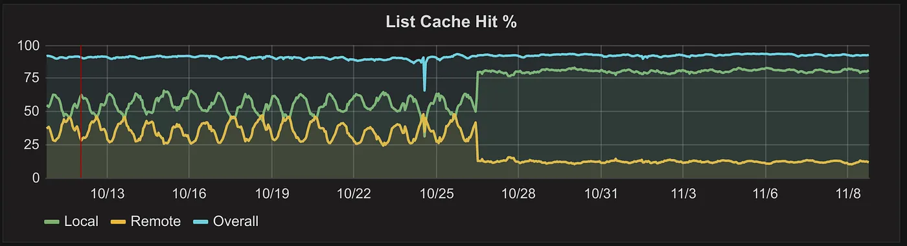
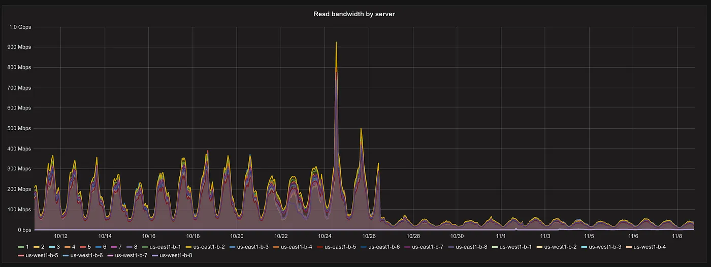

#### 使用新一致性哈希算法改进负载均衡  

我们在云端运行Vimeo的动态视频打包程序Skyfire，每天为近十亿个Dash和HLS请求提供服务。多好啊！我们对齐性能非常满意，但将其扩展到当今的流量甚至更高一直是一个有趣的挑战。今天我想谈谈一种新的算法开发，**有界负载一致性哈希**,以及它如何消除我们视频传输中的瓶颈。  

#### 动态包  

Vimeo的视频文件存储为MP4文件，与浏览器中下载或“渐进”播放的歌是相同。然而，DASH和HLS不使用单个文件--它们使用单独传送的短视频片段。当玩家请求片段时，Skyfire会即时处理该请求。它仅获取MP4文件的必要部分，对DASH和HLS格式进行一些调整，然后将结果发送回用户。  

但是，当玩家请求（例如）文件的第37段时，Skyfire如何知道需要获取哪些字节？它需要查看一个*索引*，该索引知道文件中所有关键帧和所有数据包的文职。在它可以查看它之前，它必须生成它。这至少需要一个HTTP请求和一点CPU实践，或者，对于很长的视频，需要大量的CPU时间。由于我们收到对同一视频文件的许多请求，因此缓存索引在以后重新使用它是有意义的。  

当我们第一次开始在现实世界中测试Skyfire时，我们采用了一种简单的缓存方法：我们将索引缓存在生成索引的云服务器上的内存中，并在[HAProxy](http://www.haproxy.org/)中使用一致性哈希将对同一视频文件的请求发送到同一个云服务器。这样缓存数据就可以再次使用。

#### 了解一致性哈希  

再继续之前，让我们探究一下一致性哈希，这是一种在多个服务器之间分配负载对技术。如果您已经熟悉一致性哈希，请随意跳到下一节。  

为了使用一致性的哈希在服务器之间分发请求，HAProxy获取部分请求的哈希（在我们的例子中，失败含视频ID的URL部分），并使用该哈希来选择可用的后端服务器。使用传统的“摸哈希”，您只需要将请求哈希是为一个非常大的数字。如果将该数字对可用服务器的数量取模，您将获得要是用的服务器的索引。这很简单，只要服务器列表稳定就可以很好地工作。但是当添加或删除服务器时，就会出现一个问题：大多数请求将散列到与以前不同的服务器。如果您有九台服务器，并且添加了十分之一，那么只有十分之一的请求（幸运的是）会像以前一样散列到同一台服务器。

然后是一致性哈希。**一致性哈希**使用更复杂的方案，其中每个服务器根据其名称或ID分配多个哈希值，并且每个请求都分配给具有“最近”哈希值的服务器。*这种增加的复杂性的好处是，当添加或删除服务器时，大多数请求将映射到它们之前所做的同一服务器。*因此如果您有九台服务器并添加十分之一，则大约1/10的请求的哈希值将接近*添加的服务器*的哈希值，而其它9/10将具有与之前相同的最接近的服务器。好多了！因此，一致的哈希允许我们添加和删除服务器，而不会完全干扰每个服务器保存的缓存项集。当这些服务器在运行时，这是一个非常重要的属性。  

#### 一致的散列--对于负载均衡来说不太理想  

然而，一致性哈希也有其自身的问题：请求分布不均匀。由于其数学特性，当请求分布相等时，一致性哈希仅平衡负载并为每个请求选择随机服务器。但如果某些内容比其他内容更受欢迎（就像互联网上的情况一样），情况可能会更糟。一致的散列会对该流行内容的所有请求发送到同一服务器子集，这将不幸收到比其他服务器更多的流量。这可能会导致服务器超载、视频播放效果不佳以及用户不满意。  

到2015年11月，当Vimeo准备像超过一组精心挑选的成员推出Skyfire时，我们认为这个超载问题太严重，不容忽视，并改变了我们的缓存方法。我们**在HAProxy中使用“最少连接”负载平衡策略，而不是基于一致性哈希的平衡，以便负载在服务器之间的均匀分布**。我们使用memcached添加了二级缓存，在服务器之间共享，以便一台服务器生成的索引可以由两一台服务器检索。共享缓存需要的一些额外的带宽，使服务器之间的负载均衡更加均匀。这就是我们明年快乐奔跑的方式。  

#### 但两者兼得不是很好嘛？  

为什么没有办法说“使用一致的哈希，但请不要使任何服务器超载”？早在2015年8月，我就试图提出一种基于[两个随机选择的力量的](https://www.eecs.harvard.edu/~michaelm/postscripts/handbook2001.pdf)算法来实现这一点，但一些模拟表明它不起作用。太多的请求被发送到不理想的服务器，这是不值得的。我很失望但我们没有浪费时间挽救它，而是继续采用上面的最少连接和共享缓存法。  

[时间快进到2016年8月。我注意到不可估量的Damian Gryski](https://twitter.com/dgryski)  在推特上发布了一篇名为[Consistent hashing with bounded loads](https://arxiv.org/abs/1608.01350)的arXiv论文的URL。我读了摘要，他似乎正是我想要的：一种将一致哈希与任何一台服务器负载相对于整个池的平均负载的上线相结合的算法。我读了这篇论文，算法非常简单。  

> 虽然一致散列和转发以满足容量限制的想法似乎非常明显，但以前似乎没有考虑过。  

#### 有界负载算法  

这是该算法的简化草图。一些细节被遗漏了，如果打算自己实现一定应该去原论文中获取信息。  

首先，定义一个大于1的平衡因子c。c控制服务器之间允许的不平衡程度。例如，如果c=1.25，则任何服务器都不应超过平均负载的125%，在极限范围内，当c增加到无穷大时，该算法变得等小雨普通一致性哈希，没有平衡；当c减小到接近1时，它变得更像最少连接策略，并且哈希变的不那么重要。根据我的经验，1.25和2之间的值适合实际使用。  

当请求到达时，计算平均负载（未完成请求的数量m，包括刚刚到达的请求，除以可用服务器的数量n）。平均负载乘以c即可得到“目标负载”t。*在原始论文中，将容量分配给服务器，以便每个服务器获得⌊ t ⌋ 或 ⌈ t ⌉的容量*，总容量为⌈ cm ⌉。因此，服务器的最大容量为 ⌈ cm / n ⌉，大于c倍平均负载且小于 1 个请求。为了支持为服务器提供不同的“权重”，就像 HAProxy 所做的那样，算法必须稍微改变，但精神是相同的 - 任何服务器都不能超过其负载的公平份额超过 1 个请求。  

要分派请求，情像往常一样计算其哈希值和最近的服务器。如果该服务器低于其容量，则将请求分配给该服务器。否则，转到哈希环节中的下一个服务器并检查其容量，继续下去，知道找到有剩余容量的服务器。必须有一个，因为最高容量高于平均负载，不可能每台服务器的负载都高于平均负载。这些保证了一些好事情：  
  - 不允许服务器负载超过c➕1倍的请求。  
  - 只要服务器不过载，请求的分配就与一致性哈希相同。  
  - 如果服务器过载，则对于相同的请求哈希，选择的后备服务器列表将是相同的---即，同一服务器将始终是流行内容的“第二选择”。这有利于缓存。  
  - 如果服务器过载，则对于不同的请求哈希值，回退服务器的列表通常会有所不同，即国在服务器的益处负载将分布在可用服务器之间，而不是全部登录到单个服务器上。这取决于每个服务器在一致性哈希环境中分配了多少个点。  

#### 真实世界的结果  
在模拟器中测试算法并获得比简单算法更积极的结果后，我开始研究如何将其坡街道HAProxy中。向HAProxy添加代码并不算太糟糕。代码非常干净且组织良好，经过几天的工作，我得到了一些运行良好的东西，我可以通过它重放一些流量并查看算法的运行情况。它成功了，数学证明和模拟很好，但在看到真实流量达到真实服务器之间很难真正相信。  

凭借这一成功，我在9月份向HAProxy发送了一个概念验证补丁。HAProxy维护者Willy Tarreau与他合作非常愉快。他也认识到该算法的价值，但没有告诉我我的布丁有多糟糕。他进行了彻底的审查并提供了一些非常有价值的反馈。我花了一些时间来处理这些建议并使事情变得顺利，但后记中我有了一个完善的版本，准备发送到列表。在进行一些小的调整，它就被及时接受。11月25日，HAProxy1.7.0被指定为稳定版本，因此有界负载一致性哈希现已普遍可用。  

但我确信您想知道的是，我们实际上从这一切中获得了什么？  

这是更改HAProxy配置之间和之后的缓存行为图。  

每日变化是由自动缩放引起的：白天流量较多，因此我们启动更多服务器来处理流量，本地缓存可以处理的请求较少。到了晚上，流量较少，所以我们关闭了服务器，本地缓存性能有所提高。切换到有限负载算法后，无论有多少服务器正在运行，都有更大比例的请求命中本地缓存。

下面是同一时间共享缓存带宽的图表：

  

变更前，每台memcached服务器在高峰时段的传出带宽高达400或500Mbit/s（总计约8Gbit/s）。之后，变化就会减少，并且每台服务器的速度都会舒适地保持在 100 Mbit/s 以下  

绘制图表的是响应时间方面的性能。为什么？因为他们保持着完全相同的状态。最少连接策略可以很好地防止服务器过载，并且从 memcached 获取内容的速度足够快，不会对响应时间产生可测量的影响。但现在请求的一小部分依赖于共享缓存，并且由于该部分不依赖于我们运行的服务器数量，因此我们可以期待在不使 memcached 服务器饱和的情况下处理更多流量。此外，如果 Memcached 服务器出现故障，它对 Skyfire 的总体影响将会小得多。

总而言之，我很高兴看到一点点算法工作如何将单点故障变得更好

