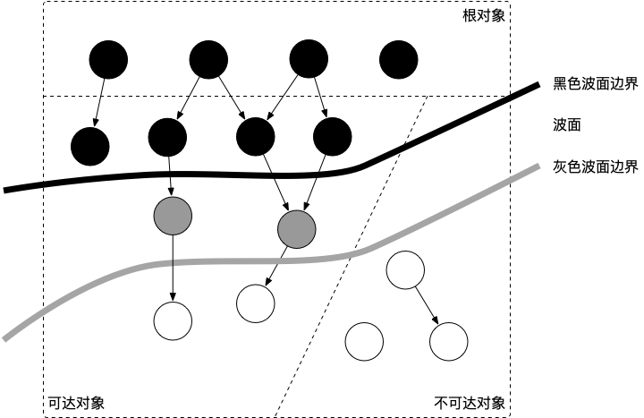

### GC垃圾回收认知

### 介绍
GC，全称 Garbage Collection, 即垃圾回收，是一种自动的垃圾回收机制  
通常垃圾回收的执行过程被分为两个半独立的组件：
  - 赋值器：本质上是指代用户态的代码。因为对垃圾回收器而言，用户态的代码仅仅只是在修改对象之间的引用关系，也就是在对象图（对象之间饮用关系的一个有向图）上进行操作
  - 回收器：负责执行垃圾回收的代码

### 常见的GC实现方式有哪些？
- 追踪式GC
	- 标记清扫：从根对象出发，将确定存活的对象进行标记，并清扫可以回收的对象
	- 标记整理：为了解决内存碎片问题而提出的，在标记过程中，将对象尽可能整理到一块连续的内存上
	- 增量式：将标记与清扫的过程分批执行，每次执行很小的一部分，从而锃亮的推进垃圾回收，达到近似实时、几乎无停顿的目的
	- 增量整理：在增量式的基础上，增加对对象的整理过程
	- 分代式：将对象根据存活时间的长短进行分类（年轻代、老年代、永久代）
- 引用计数式GC
	- 引用计数：根据对象自身的引用计数来回收，当引用计数归零立即回收。

#### GO GC算法是什么？

- 目前使用的是无分代、不整理、并发的三色标记清扫算法
- 分析：
	- 对象整理：
		- 优势：解决内存碎片问题以及允许使用顺序内存分配器。但**GO运行时的分配算法tcmalloc，基本上没有碎片问题**。
		- 并且顺序内存分配器再多线程的场景并不适用。Go使用的是基于tcmalloc的现代内存分配算法，对对象进行整理不会带来实质性的性能提升
	- 分代GC依赖分代假设
		- GC将猪腰的回收目标放在心创建的对象上（存活时间短，更像相遇被回收），而非频繁查找所有对象。
		- Go的编译器会通过**逃逸分析**将大部分新生对象存储在栈上(栈直接被回收)，只有那些需要长期存在对象才会被分配到需要进行垃圾回收的堆中。
		- 也就是说，分代GC回收的那些存活时间短的对象在Go中是直接分配在栈上，当goroutine死后栈也会被直接回收，不需要GC的参与，近而分代假设并没有带来直接优势。
		- go的垃圾回收器与用户代码并发执行，使得STW的时间与对象的分际、对象的size没有关系
		- go团队更关注于如何更好的让GC与用户代码并发执行（使用适当的CPU来执行垃圾回收），而非减少停顿时间这一单一目标

#### **三色标记法是什么**
理解**三色标记法**的关键是理解对象的三色抽象以及波面推进这两个概念。三色抽象是一种描述追踪式回收器的方法，在实践中并没有实际的含义，它的重要作用在于从逻辑上严密推导标记清理这种垃圾回收方法的正确性。也就是说，当我们谈及三色标记法时，通常指标记清扫的垃圾回收。从垃圾回收的视角来看，三色抽象规定了三种不同类型的对象，并用不同颜色相称。

- 白色对象（可能死亡）：未被回收器访问到的对象。在回收开始阶段，所有对象均为白色，当回收结束后，白色对象均不可达。
- 灰色对象（波面）：已被回收器访问到的对象，但回收器需要对其中一个或多个指针进行扫描，因为他们可能还指向白色对象。
- 黑色对象（确定存活）：已被回收器访问到的对象，其中所有子段已被扫描，黑色对象中任何一个指针都不能直接指向白色对象。

这三种不变性所定义的回收过程其实是一个波面不断前进的过程，这个波面同时也是黑色对象和白色对象的边界，灰色对象就是这个波面。

#### **STW是什么意思**
STW是可以Stop the world的缩写。STW在垃圾回收过程中为了保证实现的正确性、放置无止境的内存增长问题而不可避免的需要停止赋值器进一步操作对象的一段过程。  
在这个过程中整个用户代码被停止或者放缓执行，STW越长，对用户代码造成的影响就越大，早起Go对垃圾回收器的实现中STW长达几百号秒，对时间敏感的试试通讯等应用程序会造成巨大影响。

参考文章：https://golang.design/go-questions/memgc/principal/

