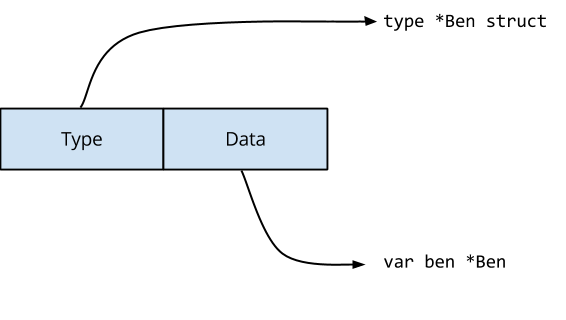

### 冰激淋制造商和数据竞争

这是一段关于数据竞争的帖子，这篇文章代码位于github.com/davecheney/benandjerry的github上  

- 该示例程序模拟了两个冰淇淋制造商Ben和Jerry，它们随机向顾客打招呼。 
```go
package main

import "fmt"

type IceCreamMaker interface {
	// Helo greets a customer
	Hello()
}

type Ben struct {
	name string
}

func (b *Ben) Hello() {
	fmt.Printf("Ben says, \"Hello my name is %s \" \n", b.name)
}

type Jerry struct {
	name string
}

func (j *Jerry) Hello() {
	fmt.Printf("Jerry says, \"Hello my name is %s \" \n", j.name)
}

func loop() {
	var ben = &Ben{"Ben"}
	var jerry = &Jerry{"Jerry"}
	var maker IceCreamMaker = ben

	var loop0, loop1 func()

	loop0 = func() {
		maker = ben
		go loop1()
	}

	loop1 = func() {
		maker = jerry
		go loop0()
	}

	go loop0()

	for {
		maker.Hello()
	}

}

func main() {
	loop()
}

```
- **这是一场数据竞争，愚蠢**

大多数程序猿应该很容易发现这个程序中的数据竞争。  

这些loop函数不使用锁的情况下更改的值marker，因此当main函数中的for循环执行时，maker.Hello(), 调用跟那个Hello实现是不确定的。

一些程序员似乎对这种数据竞赛感到满意；Ben或Jerry都会想客户打招呼，不管是哪一个。
让我门看看这段代码运行结果，以及发生了什么。


```bash
env GOMAXPROCS=2 go run main.go
...
Jerry says, "Hello my name is Jerry " 
Ben says, "Hello my name is Jerry " 
Jerry says, "Hello my name is Jerry " 
Ben says, "Hello my name is Ben " 
Jerry says, "Hello my name is Jerry " 
...
```
很奇怪吧， Ben竟然说自己是Jerry，这怎么可能？

#### **interface 的值**

理解这种竞争的关键是了解接口在内存中的表示方式。    

从概念上讲， struct接口是具有两个字段的接口。  
  

如果我们要描述GO中的接口， 它看起来像这样：  
```go
type interface struct{
	Type uintptr // points to the types of the interface implementation
	Data uintptr // holds the data for the interface's receiver
}

```
Type 只想一个结构，该结构描述实现此接口的值类型。Data指向实际值本身。这些内容和Data作为通过接口调用的任何方法的接收者传递。  

对于语句var maker IceCreamMaker = ben, 编译器将生成执行一下代码操作。  
  

接口的字段设置为之乡\*Ben类型的定义，并且该Data Type字段包含ben的副本，即只想Ben的value值。  

当执行Loop1()， maker = jerry必须更新接口值的两个字段。  
  
Type实现只想的定义\*Jerry, 并把Data指向包含Jerry实例。  

Go内存模型表示，写入单个机器字将是原子的，但接口是两个字段。另一个goroutine可能会在更改接口值时观察该值的内容。这种情况下，它可能会看到类似这样的内容：  

   
所以Jerry Hello()的函数被调用ben为接收者。  

### **结论**  
不存在安全的数据竞争。程序要么没有数据争用，要么其操作未定义。  

在此示例中，Ben和Jerry结构的布局在内存中饰相同的，因此它们在某种意义上是兼容的。想象一下，如果他们有不同的记忆表征，会发生什么混乱（这石榴给读者的练习）。  

Go竞争检测器将发现此错误以及许多其他错误，并且使用起来分厂简单，只需将-race标志添加到go test、build或install命令中即可。  


### Bonus Question

在示例代码中，该Hello方法在Ben或Jerry的接收指针上声明，如果将其声明在Ben或Jerry方法上，这会解决数据争用吗？

#### 延伸阅读：
- RUSS Cox关于Go接口的原创[文章](https://research.swtch.com/interfaces)，当你在哪里是，你应该阅读Russ写的解释这个问题的[文章](https://research.swtch.com/gorace)   
- Go 竞赛检测器博客[文章](https://go.dev/blog/race-detector)   


#### 参考文章：
[原文](https://dave.cheney.net/2014/06/27/ice-cream-makers-and-data-races)  


