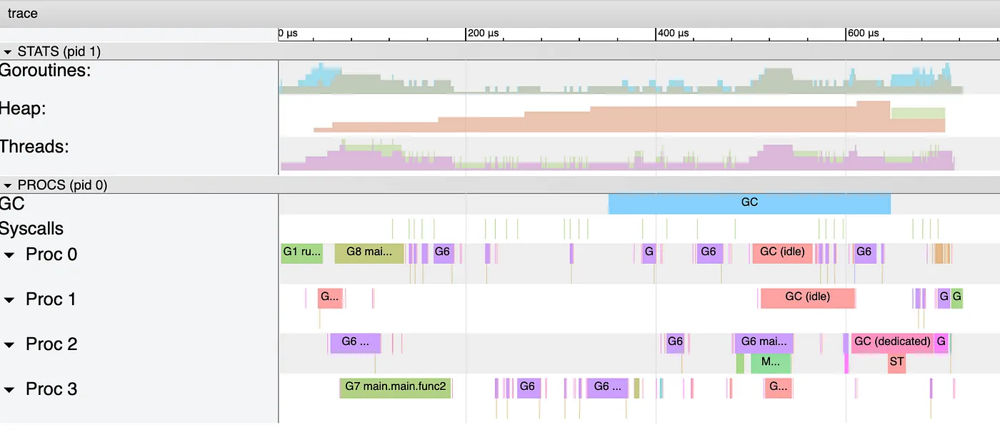
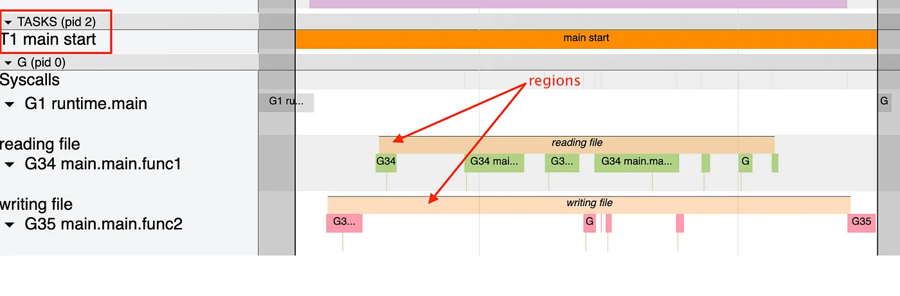

### Go发现跟踪包

> 本文基于Go1.19  

Go为我们提供了一个工具，可以在运行时启用跟踪，并详细了解我们的程序的执行情况。由于包，trace可以通过带有测试标志,`-trace`、`pprof`获取试试跟踪我们代码中的任何位置启用此工具。这个工具可以更强大，因为你可以用自己的痕迹来增强它。让我们回顾一下它如何工作。  

#### Flow

该工具流程非常简单。每个事件，例如内存分配；垃圾收集器的所有阶段；goroutines在运行时、暂停等时由Go标准库静态记录，并格式化做为以后显示。但是，在录制开始之前，Go首先“停止世界”并记录当前goroutine及其状态快照。  

你可以在文章[“Go： How Does Go Stop the World？”](https://medium.com/a-journey-with-go/go-how-does-go-stop-the-world-1ffab8bc8846)，中找到有关此阶段的更多信息。(ps: Stops the world)

允许Go正确地构建每个goroutine的生命周期循环。流程如下：  
  

然后，手机的事件被推送到缓冲区，该缓冲区稍后再打到最大容量时刷新到已满缓冲列表。流程如下：  

  

跟踪器现在需要一种方法将这些跟踪转存储到输出中。为此，Go会在跟踪开始时生成一个专用于此的goroutine。这个goroutine将在可用时转储数据，并将goroutine停放到下一个。下面是它的流程图：  

  

流程现在非常清晰，因此让我们回顾一下记录的跟踪。  

#### 痕迹（Traces）
生成跟踪后，可以通过运行命令`go tool trace my-output.out`来完成可视化。让我们以一些跟踪为例：  

  

它们中大多数都非常简单。与垃圾回收器相关的跟踪位于蓝色跟踪下`GC`:  

  

- **以下是快速回顾**  
	- `STW`时垃圾回收器中的两个“Stop the World”阶段。在这两个阶段goroutine被停止。  
	- GC(idea)是当它们(GC or goroutine?)没有工作要做时标记内存的goroutines. 
	- `MARK ASSIST`RE再分配过程中帮助标记内存的goroutine。
	- `GXX runtime.bgsweep`是垃圾回收器完成后的内存扫描阶段。  
	- `GXX runtime.gcBgMarkWorker`是帮助标记内存的专用后台goroutine。  

您可以在文章["Go How Does the Garbage Collector Watch Your Application?"(Go: 垃圾回收器如何监视您的应用程序？)](https://medium.com/a-journey-with-go/go-how-does-the-garbage-collector-watch-your-application-dbef99be2c35)中找到有关这些跟踪的更多信息。  

- 但是，有些**痕迹**并不容易理解。让我们回顾一下它们以更好的理解：  
	- `proc start` 当处理器与线程关联时调用。当启动新县城或从系统调用恢复是，就会发生这种情况  
  
	- `proc stop` 当线程与当前处理器断开关联时调用。当线程在系统调用中被阻塞或线程退出时，就会发生这种情况。  
  
	- `syscall` 当goroutine进行系统调用时调用：  
  
	- `unblock`当goroutine从系统调用中解封时被调用--在这种情况下，标签（sysexit）将显示在被阻塞的通道中，等等：  
  

跟踪可以得到增强，因为Go允许您定义和可视化自己的跟踪以及标准库中的跟踪。  

#### 用户跟踪（User traces）
- 我们可以定义的跟踪有两个层次结构级别：  
	- 在人物的顶层，又开始和结束  
	- 在与区域的子级别。

下面是它们的简单示例：  
```go
package main

import (
	"context"
	"io/ioutil"
	"runtime/trace"
	"sync"
)

func userTrace() {
	ctx, task := trace.NewTask(context.Background(), "main start")

	var wg sync.WaitGroup
	wg.Add(2)

	go func() {
		defer wg.Done()
		r := trace.StartRegion(ctx, "reading file")
		defer r.End()

		ioutil.ReadFile("n1.txt")
	}()

	go func() {
		defer wg.Done()
		r := trace.StartRegion(ctx, "writing file")
		defer r.End()

		ioutil.WriteFile(`n2.txt`, []byte(`42`), 0644)
	}()

	wg.Wait()

	defer task.End()
}

```   
这些新的跟踪可以通过菜单用户定义的任务直接从工具中可视化。  

  

也可以讲一些任务日志记录到任务重：
```go
ctx, task := trace.NewTask(context.Background(), "main start")
trace.Log(ctx, "category", "I/O file")
trace.Log(ctx, "goroutine", "2")
```

这些日志将在设置任务的goroutine下找到：  
  

还可以通过派生父任务的上下文中等待任务嵌入到其他任务中。  
但是，在收集这些事件时，从生产`pprof`中实时跟踪所有这些事件可能会略微降低性能。  


#### 性能影响(preformance impact)  
一个简单的基准测试可以帮助理解跟踪的影响。一个将带气质运行，一个则没有旗帜 -trace。 以下是生成大量事件的函数`ioutil.ReadFile()`基准测试结果：  
```bash
name         time/op
ReadFiles-8  48.1µs ± 0%
name         time/op
ReadFiles-8  63.5µs ± 0%  // with tracing
```  

在这种情况下，影响约为35%，并且可能因应用而异。 但是，一些工具(如StackDriver)允许对生产环境进行连续分析，同时保持应用程序的开销较小。  


- [原文](https://medium.com/a-journey-with-go/go-discovery-of-the-trace-package-e5a821743c3c)