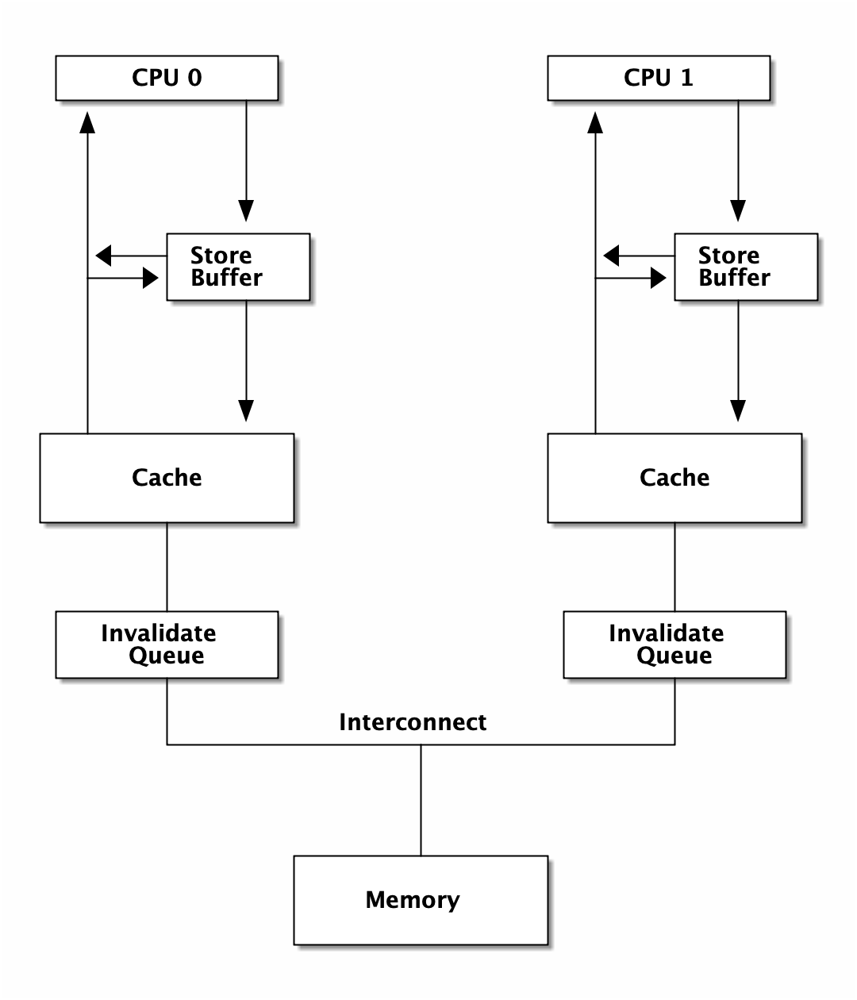
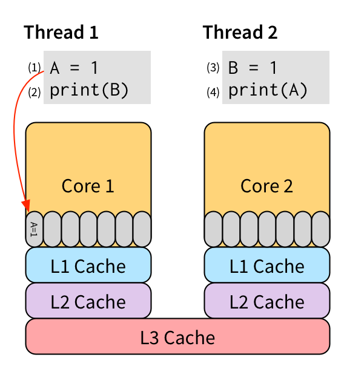
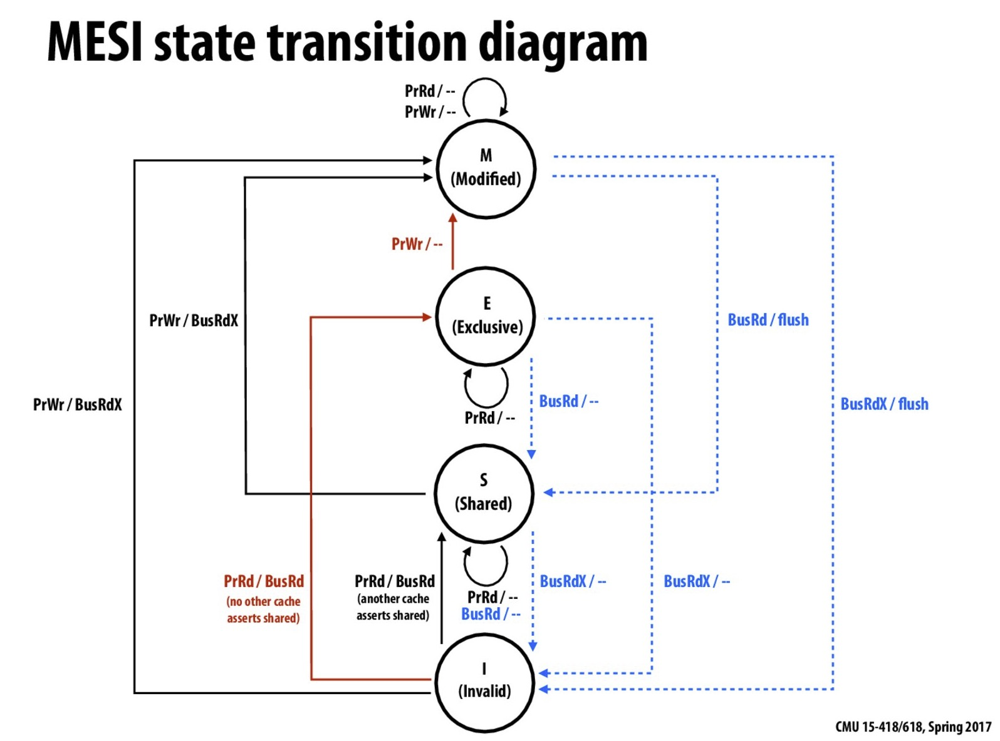
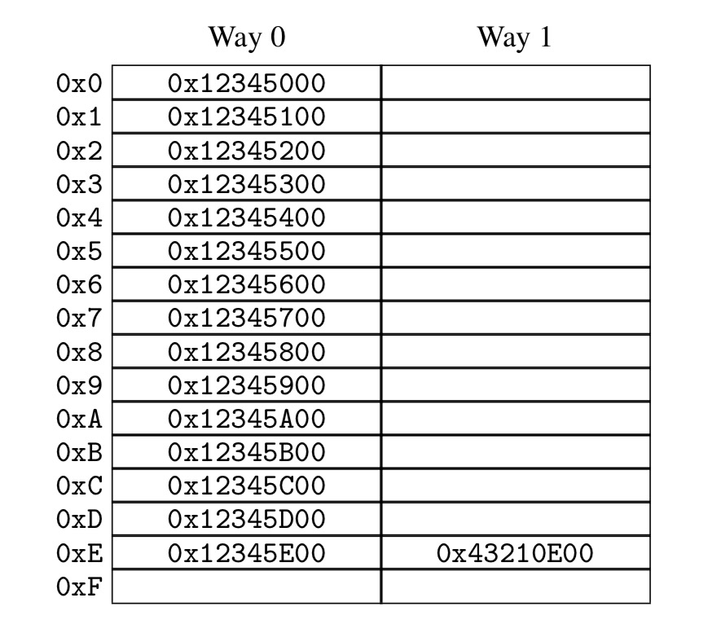

### 从Memory Reordering说起
- 下面这段代码会怎么输出？
```go
package main

import (
	"fmt"
	"runtime"
	"sync"
)

func reordering() {
	var wg sync.WaitGroup
	wg.Add(2)

	var x, y int

	go func() {
		defer wg.Done()
		x = 1
		fmt.Print("y:", y, " ")
	}()
	go func() {
		defer wg.Done()
		y = 1
		fmt.Print("x:", x, " ")
	}()

	wg.Wait()

}

func main() {
	runtime.GOMAXPROCS(2)
	for i := 0; i < 10000; i++ {
		reordering()
		fmt.Print("\n")
	}

}

```
* 显而易见的结果：  
```text
y:0 x:1
x:0 y:1
x:1 y:1
y:1 x:1
```

* 令人意外的结果：  
```text
y:0 x:0
x:0 y:0

```  
- 这种令人意外的结果被称为内存重排：Memory Reordering  

### **什么是内存重排**
> **“内存重排指的是内存的读/写指令重排 ——Xargin”**  
软件(编译器)或硬件(CPU)系统可以根据其对代码分析结果，一定程度上打乱代码的执行顺序，以达到其不可告人的目的。  

### **为什么会发生内存重排**

#### 编译器重排。
- 清单1
```python
x = 0
for i in range(100):
	x = 1
	print(x)
```
- 清单2
```python
x = 0
for i in range(100):
	print(x)
```

* `清单1`和`清单2`是等价的。  
如果这时候，假设有另一个线程同时在执行一条指令：
```text
x = 0
```

P2(线程2)中的指令和`清单1`交错执行，可能产生的结果是：11111011111...  
P2(线程2)中的指令和`清单2`交错执行，可能产生的结果是：11111000000...   
<br>
有人说这个例子不够有说服力，我们看看参考资料中的例子：  

```C++
int a, b;
int foo()
{
	a = b + 1;
	b = 0;
	return 1;
}
```   
<br>
输出汇编结果：  

```text
mov eax, DWORD PTR b[rip]
add eax, 1
mov DWORD PTR a[rip], eax    // --> store to a
mov DWORD PTR b[rip], 0      // --> store to b
```
<br>  
开启O2优化后，输出汇编结果：  

```text
mov eax, DWORD PTR b[rip]
mov DWORD PTR b[rip], 0      // --> store to b
add eax, 1
mov DWORD PTR a[rip], eax    // --> store to a
```  

给a和b的赋值顺序被修改了，可见compiler也是可能会修改赋值顺序的。  
> Tip: **在多核心场景下，没有办法轻易判断两段程序是“等价”的**。

### **CPU重排**。
- **litmus验证**
```litmus
cat sb.litmux

x86 SB
{ x=0; y=0; }
 P0          | P1          ;
 MOV [x],$1  | MOV [y],$1  ;
 MOV EAX,[y] | MOV EAX,[x] ;
locations [x;y;]
exists (0:EAX=0 /\ 1:EAX=0)
```    
===>
```text
~ ❯❯❯ bin/litmus7 ./sb.litmus
%%%%%%%%%%%%%%%%%%%%%%%%%%%
% Results for ./sb.litmus %
%%%%%%%%%%%%%%%%%%%%%%%%%%%
X86 SB

{x=0; y=0;}

 P0          | P1          ;
 MOV [x],$1  | MOV [y],$1  ;
 MOV EAX,[y] | MOV EAX,[x] ;

locations [x; y;]
exists (0:EAX=0 /\ 1:EAX=0)
Generated assembler
	##START _litmus_P0
	movl	$1, -4(%rbx,%rcx,4)
	movl	-4(%rsi,%rcx,4), %eax
	##START _litmus_P1
	movl	$1, -4(%rsi,%rcx,4)
	movl	-4(%rbx,%rcx,4), %eax

Test SB Allowed
Histogram (4 states)
96    *>0:EAX=0; 1:EAX=0; x=1; y=1;
499878:>0:EAX=1; 1:EAX=0; x=1; y=1;
499862:>0:EAX=0; 1:EAX=1; x=1; y=1;
164   :>0:EAX=1; 1:EAX=1; x=1; y=1;
Ok

Witnesses
Positive: 96, Negative: 999904
Condition exists (0:EAX=0 /\ 1:EAX=0) is validated
Hash=2d53e83cd627ba17ab11c875525e078b
Observation SB Sometimes 96 999904
Time SB 0.11
```

### **CPU架构**
    
<br>  

- **Figure1. CPU Architecture**  
    

- **Figure2. Store Buffer**   
这里的Invalidate Queue实际上稍微有一些简化，真实世界的CPU在做invalidate操作时还是挺麻烦的：  
    

- **Figure3. MESI Protocol**   
    

- **Figure4. CPU Cache Structure** 

---  

### **内存重排的目的**。
> Tip: **当然是为了优化啊。这还用说嘛**。
- 减少读写等待导致的性能降低。
- 最大化提高CPU利用率。

<h2><span style="color:red;"> **当我们需要顺序的时候，我们在讨论些什么**</span></h2>
<h3 style="color: red;">memory barrier</h3>

/***“A memory barrier, also known as a membar, memory fence or fence instruction, is a type of barrier instruction that causes a central processing unit(CPU) or compiler to enforce an ordering constraint on memory operations issued before and after the barrier instruction.
																			--wikipedia***/

有了memory barrier,才能实现应用层的各种同步原语。如atomic, 而aotmic又是各种更上层lock的基础。  


<h3 style="color: red;">atomic原子</h3>

/***“On X86, it will turn into a lock prefixed assembly instruction, like LOCK XADD. Being a single instruction, it is non-interruptible. As an added "feature", the lock prefix results in a full memory barrier.
																			--stackoverflow***/

  
  /***“...locked operations serialize all outstanding load and store operations (that is, wait for them to complete)." ...."Locked Operations are atomic with respect to all other memory operations and all externally visible events. Only instruction fetch and page table accesses can pass locked instructions. Locked instructions can be used to synchronize data written by one processor and read by another processor.
						--Intel®64 and IA-32 Architectures Software Developer's Manual***/


<h3 style="color:red;"> **atomic应用实例：双buffer**</h3>

```go
var doublebuffer struct {
	buffer [2]option
	idx int64
}

atomic.Load(&doublebuffer.idx)

atomic.CompareAndSwapInt64(&doublebuffer.idx, doublebuffer.idx, 1-doublebuffer.idx)

```

option可以是任意的自定义数据结构。  

<h3 style="color:red;"> **lock**</h3>
概念和用法就不讲了，你们应该都用过。没有免费的午餐，有锁冲突就会大幅度降低性能。    
<br>  
为了减小对性能的影响，锁应尽量较小粒度，并且不在互斥区内放入耗时操作，但总是有一些悲伤的故事：  

<h3 style="color:red;"> **sync.Pool中的锁**</h3>。

```go
var (
	allPoolsMu Mutex
	allPools []*Pool
)

func(p *Pool) pinSlow() *PoolLocal {
	allPoolsMu.Lock()
	defer allPoolsMu.Unlock()

	pid := runtime_procPin()

	if p.PoolLocal == nil {
		allPools = append(allPools, PoolLocal)
	}

	// .......

	return &local[pid]
}

```

<h3 style="color:red;"> **udp WriteTo锁**</h3>。

```go
func(fd *FD) WriteTo(p []byte, sa syscall.Sockaddr)(int, error) {
	if err := fd.writeLock(); err != nil {
		return 0, err
	}

	defer fd.writeUnlock()

	if err := fd.pd.preparewrite(fd.isFile); err != nil {
		return 0, err
	}

	for {
		err := syscall.Sendto(fd.Sysfd, p, 0, sa)
		if err == syscall.EAGAIN && fd.pd.poolable() {
			err = fd.pd.waitWrite(fd.isFile); err != nil {
				continue
			}

			if err != nil {
				return 0, err
			}
			return len(p), nil
		}
	}
}
```

<h3 style="color:red;"> **Tcp上也有锁**</h3>。  

```go
type Transport struct {
	idleMu     sync.Mutex
	wantIdle   bool                                // user has requested to close all idle conns
	idleConn   map[connectMethodKey][]*persistConn // most recently used at end
	idleConnCh map[connectMethodKey]chan *persistConn
	idleLRU    connLRU

	reqMu       sync.Mutex
	reqCanceler map[*Request]func(error)

	altMu    sync.Mutex   // guards changing altProto only
	altProto atomic.Value // of nil or map[string]RoundTripper, key is URI scheme

	connCountMu          sync.Mutex
	connPerHostCount     map[connectMethodKey]int
	connPerHostAvailable map[connectMethodKey]chan struct{}

    //......
}
```

会不会碰上锁平静要随缘。


<h3 style="color:red;"> **你的系统在锁上出问题的最明显特征**</h3>。 

- 压测过不了几千级别的QPS（丢人！
- Goroutine一开始很稳定，超过一定QPS之后暴涨
- 可以通过压测方便地发现问题。  

lock contention的本质问题是需要进入互斥区的g需要等待独占g退出后才能进入互斥区，并行-->串行  

---  

<h3 style="color:red;"> **cache contention**</h3>。 

cache contention那也是contention，使用atomic，或者 false sharing就会导致 cache contention.  
atomic操作可以理解成“true sharing”。
症状： 在核心数增多时，单词操作的成本上升，导致程序整体性能下降。  

<h4 style="color:red;"> **true sharing**</h4>。 

例子：  
RWMutex的RLock:  
```go
func(rw *RWMutex) Rlock(){
	// ......
	if atomic.AddInt32(&rw.readerCount, 1) < 1 {
		// A Writer is pending, wait for it.
		runtime_SemacquireMutex(&rw.readerSem, false)
	}

	// else 获取RLock成功
	// ........ 
}
```  
true sharing带来的问题：  
/***“所以内存： RWMutex scales poorly with CPU count
																		-- issue 17973***/

至今还没有解决这个问题，如果解决了的话，根本不需要sync.Map出现了。  


<h4 style="color:red;"> **false sharing**</h4>。

runtime/sema.go
```go
var semtable [semTabSize]struct{
	root semaRoot
	pad [cpu.CacheLinePadSize - unsafe.Sizeof(semaRoot{})]byte
}
```

runtime/time.go
```go
var timers [timersLen]struct {
	timersBucket

	// the padding should eliminate false sharing
	// between timersBucket values.
	pad [cpu.CacheLinePadSize - unsafe.Sizeof(timersBucket{}) % cpu.CacheLinePadSize]byte
}
```

本来每个核心（在Go里的GPM中的P概念）独享数据，如果发生了false sharing了会怎么样？  

- 思考题：
	- 二维数组求和，横着遍历和竖着遍历那种更快，为什么？
	- 为什么Go官方坚持不在sync.Map上增加Len方法？  


- 参考文章： https://cch123.github.io/ooo/
