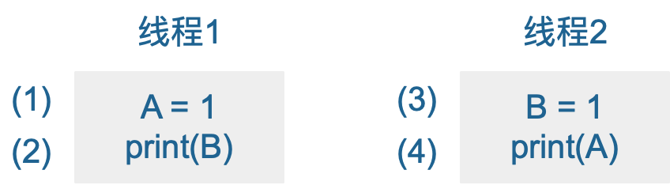
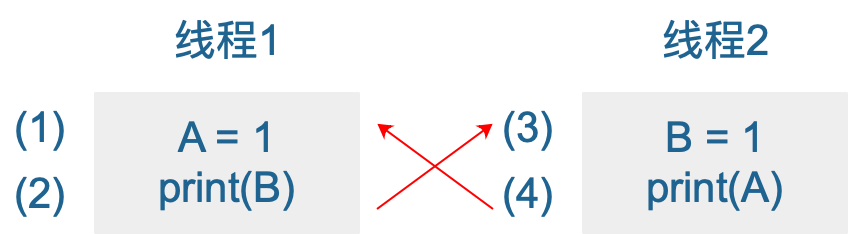
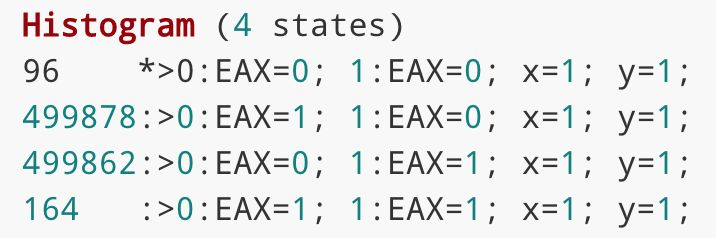
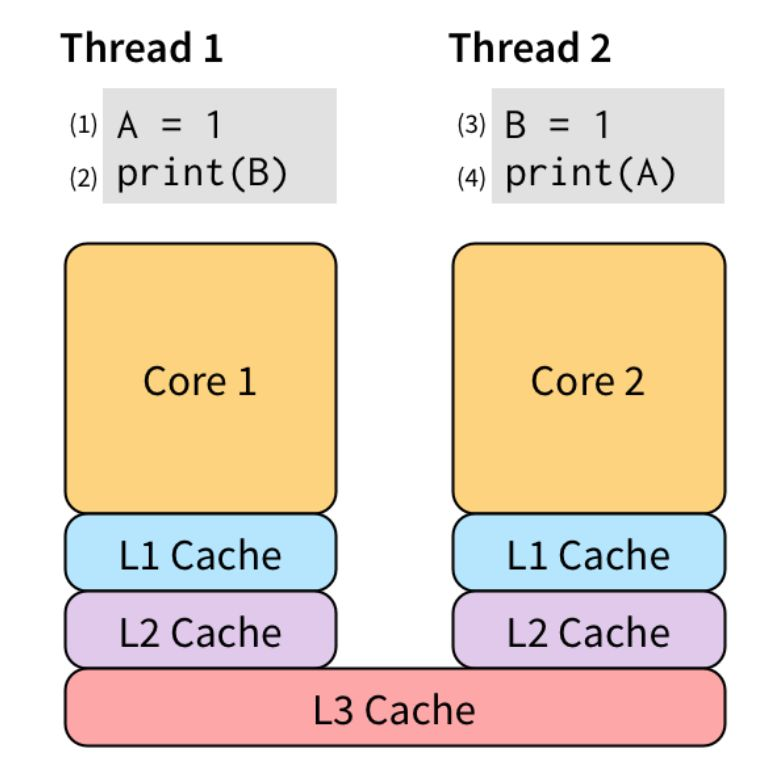
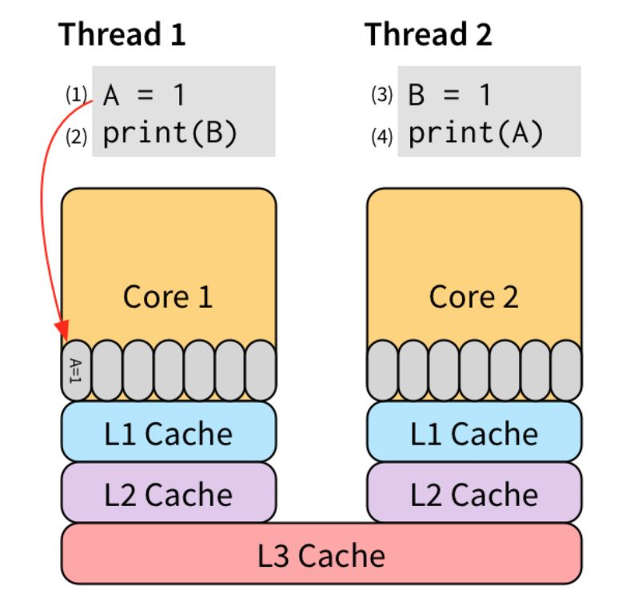
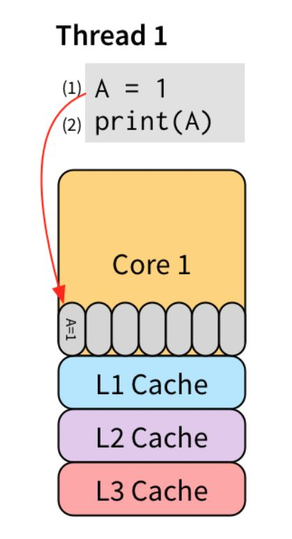
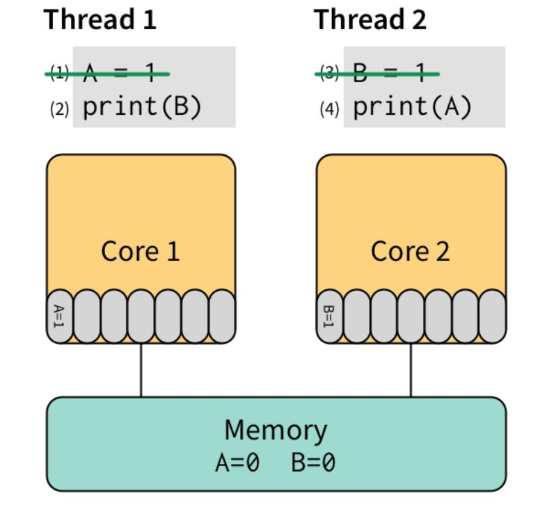

## 内存重排
### 简介
本文是抄写曹大谈内存重排的文章，抄写以便加深自己的理解，底部有原文连接。其中有一点讲，在阅读中英文参考资料时，发现英文的我能读懂，读中文却很费劲。经过对比，其实英文文章通常是由一个个例子引入，循序渐进，逐步深入。跟着坐着的脚步探索，非常有意思。而中文的博客上来就直奔主题，对新接触者很不友好。

- 什么是内存重排
	- CPU重排
	- 编译器重排
- 为什么要内存重排
- 内存重排的底层原理
- 总结
- 参考资料

#### 什么是内存重排  
分为两种，硬件和软件层面的，包括CPU重排、编译器重排。

#### CPU重排
引用参考资料【内存一直模型】里的例子：  

在两个线程里同时执行上面的代码，A和B初始化值都是0，那最终的输出是什么呢？

| 执行顺序 | 输出结果 |
|----------|----------|
| 1-2-3-4   | 01   |
| 3-4-1-2   | 01   |
| 1-3-2-4   | 11   |
| 1-3-4-2   | 11   |

从01的排列组合来看，总共有4种：00、01、10、11.表格中还差两种：10、00. 我们来重点分析下这两种结果究竟会不会出现。  
首先10，假设（2）输出1，（4）输出0.那么首先给2，3排个序（3）->(2),因为要将b赋值为1，（2）才能打印出1；同理（4）->(1). 另外，因为先打印1，所以(2)要在(4)前面，结合起来(3)->(2)->(4)->(1). （2）竟然在（1）前面执行了，不可能的！  
那我们再分析下00，想要打印00，打印语句必须在响应变量赋值前执行
。

图中箭头表示先后顺序。这就尴尬了形成一个环。如果先从（1）开始，那么顺序就是(1)->(2)->(3)->(4)->(1),(1)要执行两次，怎么可能？所以00这种情形也是不可能出现的。

但是上面说的两种情况在真实世界有可能发生的。曹大的讲义里有验证的方法，感兴趣的同学可以自己尝试下。总共测试了100万次，测试结果如下：  
  
非常反直觉，但是在多线程的世界，各种诡异的问题，只有你想不到，没有计算机做不到的。  
我们知道，用户写下的代码，先要编译成汇编代码，也就是各种指令，包括读写内存的指令。CPU的设计者们，为了榨干CPU的性能，无所不用其极，各种手段都用上了，你可能听过不少，像流水线、分支预测等等。  

其中为了提高读写内存的效率，会对读写指令进行重新排列，这就是所谓的`内存重排`, 英文为MemoryReordering  
<br>

这一部分说的是CPU重排，起始还有编译器重排。  

#### 编译器重排
来看一段代码：
```python
x = 0
for i in range(100):
	x = 1
	print x
```
这段代码执行的结果是打印100个1.一个聪明的编译器会分析道循环里对x的赋值 x=1是多余的，每次都要给它赋上1，完全没必要。因此会把代码优化一下：  
```python
x = 1
for i in range(100):
	print x

```
优化后的运行结果完全和之前的一样，完美！  
但是，如果这是另外一个线程同时干了这么一件事：  
```python
x = 0
```
由于这两个线程并行执行，优化前的代码运行的结果可能是这样的：11111111011111....。出现了1个0，但是下次循环中，又会被重新赋值为1，而且之后一直都是1.

但是优化后的代码呢：111110000000.....。由于把x=1这一条赋值语句给优化掉了，某个时刻x变成0之后，再也没有编绘原来的1了。  
> **在多核场景下，没有办法轻易地判断两段程序是“等价”的**  
可见编译器的重排也是基于运行效率考虑的，但以多线程运行时，就会出现各种问题。

####。为什么要内存重排
引用曹大的一句话：  
> 软件或硬件系统可以根据对其代码的分析结果，一定程度上打乱代码的执行顺序，以达到其不可告人的目的。  
软件指的是编译器，硬件是CPU。 不可告人的目的就是：`减少程序指令数 最大化提高CPU利用率`

#### 内存重排的底层原理。
CPU重排的例子里提到的两种不可能出现的情况，并不是那么显而易见，甚至是难以理解。 原因何在？  
<br>
因为我们相信多线程的程序里，虽然是并行执行，但是访问的是同一块内存，所以没有语句，准确说是指令，能“真正”同时执行的。 对同一个内存地址的写，一定是有先后，先写的结果一定是被后来的操作看到。  
<br>
当我们的代码以单线程运行的时候，语句会按照我们的本来意图`顺序`地执行。一旦单线程变成多线程，情况就变了。  
<br>
想象一个场景，有两个线程在运行，操作系统会在他们之间进行调度。每个线程在运行的时候，都会顺序地执行它的代码。由于对同一个变量的读写，会访问内存的同一地址，所以同一时刻只能有一个线程在运行，既是CPU有多个核心：前一个指令操作的结果要让后一个指令看到。  
这样带来的后果就是效率低下。两个线程没法做到并行，因为一个线程所做的修改会影响到另一个线程，那后者只能在前者的修改所造成的影响“可见”之后，才能运行，变成了串行。  

重新来思考前面的例子：  
  

考虑一个问题，为什么(2)要等待(1)执行完成之后才能执行呢？它们之间有没有什么联系，影响不到彼此，完全可以并行去做啊！  
由于(1)是写语句，所以比(2)更耗时，从`a single view of memory`这个视角来看，(2)应该等(1)的`效果`对其他所有线程可见了之后才可以执行。但是，在一个现代CPU里，这需要花费上百个CPU周期。  
现代CPU为了“抚平”内核、内存、硬盘之间的速度差异，搞出了各种策略，例如三级缓存等。  
    
为了让(2)不必等待(1)的执行“效果”可见之后才能执行，我们可以把(1)的效果保存到`store buffer`:  
   
当（1）的“效果”写到了`store buffer`后，（2）就可以开始执行了，不必等到`A=1`到达L3 cache。因为store buffer在内核里完成的，所以速度非常快。在这之后的某个时刻，`A=1`会被逐级写到L3 cache，从而被其他所有线程看到。 `store buffer`相当于把写的耗时隐藏了起来。  
`store buffer`对单线程是完美的，例如：  
   

将（1）存入`store buffer`后，（2）开始执行。注意，由于是同一个线程，所以语句的执行顺序还是要保持的。  
（2）直接从`store buffer`里读出了`A=1`, 不必从L3 cache或内存读取，简直完美！  
有了`store buffer`的概念，我们再来研究前面的那个例子：  
  

先执行（1）和（3），将它们志杰写入`store buffer`，接着执行（2）和（4）。奇迹要发生了：（2）看了下`store buffer`，并没有发现B的值，于是从Memory读出了0，（4）同样从Memory读出了0. 最后打印出了`00`。  
<br>
所有的现代CPU支持`store buffer`，这导致了很多对程序员来说是难以理解的线程。从某种角度来说，不等`A=1`扩散到Memory，就去执行`print(B)`语句，可以看成**`读写指令重排`**。有些CPU甚至优化得更多，几乎所有的操作都可以重排，简直是噩梦。  

因此，对于多线程的程序，所有的CPU都会提供`锁`支持，称之为 `barrier`,或者`fence`。 它要求：  
```text
A barrier instruction forces all memory operations before it to complete before any memory operation after it can begin.
```
barrier指令要求所有对内存的操作都必须要“扩散”到memory之后次啊能继续执行其他对memory的操作。  
<br>
barrier指令要耗费几百个CPU周期，而且容易出错。因此，我们可以用高级点的`atomic compare-and-swap`,或者直接使用高级的锁，通常是标准库提供。  

```text
正是CPU提供的barrier指令，我们才能实现应用层面的各种同步原语，如atomic,而atomic又是各种更上层的lock的基础。
```
以上说的是CPU重排的原理。编译器重排主要是依据语言自己的“内存模型”， 不深入了。

- 出现前面描述的诡异现象的根源在于程序存在`data race`,也就是说多个线程会同时访问内存的同一个地方，并且至少有一个是写，而且导致了内存重排。所以最重要的是当我们在写并发程序的时候，要是用一些“同步”的标准库，简单理解就是各种锁，来避免由于内存重排而带来的一些不可预知的结果。

### **总结**
内存重排是指程序在实际运行时对内存的访问顺序和代码编写时的顺序不一致，主要是为了提高运行效率。分别是硬件层面`CPU重排`和软件层面`编译器重排`。  
单线程的程序一般不会有太大的问题；多线程情况下，有时会出现诡异的现象，解决办法就是使用标准库里的锁。锁会带来性能问题，为了降低影响，锁应该尽量减小粒度，并且不要在互斥区（锁住的代码）放入耗时较长的操作。
> lock connection的本质问题是需要进入互斥区的goroutine需要等待独占goroutine推出后才能进入交互区，并行-->串行  
#### 参考资料：
原文：https://blog.csdn.net/qcrao/article/details/92759907
【曹大 github】https://github.com/cch123/golang-notes/blob/master/memory_barrier.md

【曹大讲义】https://cch123.github.io/ooo/

【内存一致模型】https://homes.cs.washington.edu/~bornholt/post/memory-models.html

【掘金咔叽咔叽，译】https://juejin.im/post/5d0519e05188257a78764d5d#comment 


