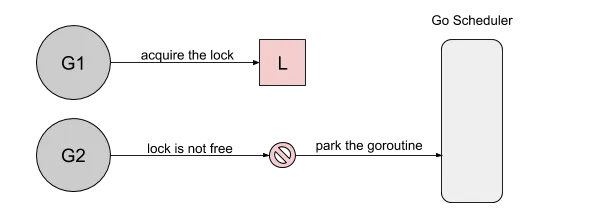
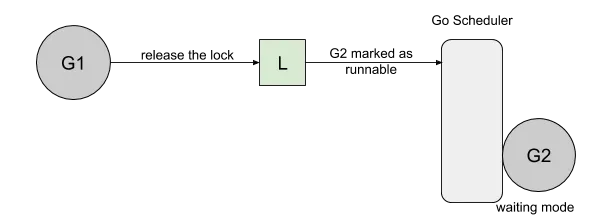
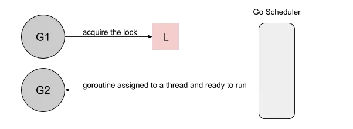
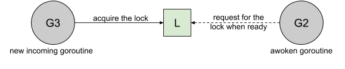
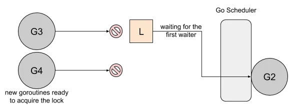
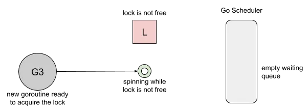
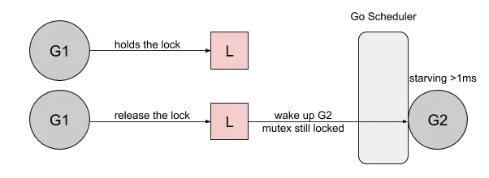

### Go: 互斥和饥饿

> 本于基于GO1.13

在Golang中开发时，互斥锁是种尝试获取它永远无法获取的锁时，它可能会遇到饥饿问题。在本文中，我们探讨一个影响Go1.8的饥饿问题，该问题已在Go1.9中得到解决。  

#### 饥饿(starvation)

为了说明互斥锁的饥饿情况，我将以RUSS Cox关于它们讨论互斥锁改进的问题为例：  
```go
package main

import (
	"sync"
	"time"
)

func mutexStarvation() {
	done := make(chan bool, 1)
	var mu sync.Mutex

	// goroutine 1
	go func() {
		for {
			select {
			case <-done:
				return
			default:
				mu.Lock()
				time.Sleep(100 * time.Microsecond)
				mu.Unlock()
			}
		}
	}()

	// goroutine 2
	for i := 0; i < 10; i++ {
		time.Sleep(100 * time.Microsecond)
		mu.Lock()
		mu.Unlock()
	}
	done <- true
}
```  
- 此示例基于两个goroutines：  
	- goroutine 1长时间按住锁并短暂释放它。
	- goroutine 2短暂按住锁并长时间释放它。 

两者都有100微妙的周期，但是由于goroutine 1 不断请求锁，我们可以预期它会更频繁地获得锁。  

下面是一个使用go1.8完成的示例，其中包含10次迭代的循环：  
```bash
Lock acquired per goroutine:
g1: 7200216
g2: 10
```
互斥锁已经被第二个goroutine持有了10次，而第一个goroutine获得超过700万次。让我们分析一下整理发生了什么。  

首先，goroutine 1将会获得锁并持有100微秒，当goroutine 2尝试获取锁时，它将被添加到锁的队列中（FIFO顺序），并且goroutine将进入等待状态。   

  

然后，当goroutine 1完成其工作，它将释放锁。此版本通过通知队列唤醒goroutine 2. goroutine 2将被标记为可运行，并等待go调度器在县城上运行：  

  

然而，当goroutine 2等待运行时， goroutine 1将在此请求锁：

  

当goroutine 2尝试加锁时，它将会看到已经处于保留状态，并将进入等待模式：  


  

goroutine 2对锁的获取取决于它在县城上运行所需的时间。  
现在已经确定了问题，让我们回顾一下可能的解决方案。  


#### 驳船VS交接VS旋转
处理互斥锁的方法有很多种，例如：  
- 闯入，这是为了提高吞吐量。当锁被释放时，它将唤醒第一个服务员，并将锁交给第一个传入请求或多个环形的服务员：  

  

这就是go1.8的设计方式，反映了我们之前所看到的。  

- 切换。松开后，互斥锁将保持锁，知道第一个服务员准备好拿到它。它将降低了这里的吞吐量，因为即使另一个goroutine准备好获取它，锁也会被保留：  

  

我们可以在[linux内核的互斥锁](https://git.kernel.org/pub/scm/linux/kernel/git/stable/linux.git/commit/?id=9d659ae14b545c4296e812c70493bfdc999b5c1c)中找到这个逻辑： 

> 锁匮乏时可能的，因为Mutex_lock()允许窃取锁，其中正在运行（或乐观锁旋转）的任务会击败醒来的服务员进行获取。  
> 锁窃取是一项重要的性能优化，因为等待服务员醒来并获取运行时间可能需要很长时间，在此期间，每个男孩都会在锁上停滞不前。  
> 这种心引起了一些等待时间，因为一旦我们进行交接，我们就必须等待服务员再次醒来。  

我们的例子中，互斥锁切换完美地平衡了两个goroutine之间的锁分布，但会降低性能，因为它会强制第一个goroutine等待锁，即使它没有被持有。   
- 纺纱(Spinning)。如果互斥锁不同于自选锁，它可以结合一些逻辑。当服务员的队列为空或应用程序大量使用互斥锁时，旋转可能很有用。停车和取消停车的goroutines是有成本的，并且可能比仅仅旋转等待下一次锁获取要慢：  


  

Go1.8也使用了这种策略。当尝试获取已经持有的锁时，如果本地队列是空的，并且处理器的数量大于1，则goroutine将旋转几次-使用一个处理器旋转只会阻塞程序。旋转后，goroutine将停放。它允许当快速路径，以防止程序大量使用锁。  

有关如何设计的更多信息-barging，切换，spinlock一般来说Filip Pizlo写了一篇必须的文章[Locking in WebKit](https://webkit.org/blog/6161/locking-in-webkit/)


#### **饥饿模式**(Starvation mode)  
在Go1.9之前，Go结合了驳船和旋转模式。 在1.9版本中，Go通过添加新的饥饿模式解决了之前的问题，该模式将导致在解锁模式期间切换。  

所有等待锁超过一毫秒的goroutine（也称为有界等待）都被标记为饥饿模式。当标记为饥饿模式时，解锁方法现在回将锁直接交给第一个服务员。工作流程如下：  

  

在饥饿模式下，旋转也会被停用，因为传入的goroutines将没有任何机会获得为下一个服务员保留的锁。  

让我们使用Go1.9和新的饥饿模式运行前面的示例：  
```bash
Lock acquired per goroutine:
g1: 57
g2: 10
```
结果现在更加公平。仙子啊，我们可能想知道，互斥锁有没有处于饥饿状态时，这个新的控制层是否会对其他情况产生影响。正如我们在该软件包的基准测试(Go1.8和Go1.9)中看到的那样，其他情况下的性能并没有下降（性能会锁着处理器数量的不同而略有变化）：  
```bash
Cond32-6                10.9µs ± 2%   10.9µs ± 2%     ~
MutexUncontended-6      2.97ns ± 0%   2.97ns ± 0%     ~
Mutex-6                  122ns ± 6%    122ns ± 2%     ~
MutexSlack-6             149ns ± 3%    142ns ± 3%   -4.63%
MutexWork-6              136ns ± 3%    140ns ± 5%     ~
MutexWorkSlack-6         152ns ± 0%    138ns ± 2%   -9.21%
MutexNoSpin-6            150ns ± 1%    152ns ± 0%   +1.50%
MutexSpin-6              726ns ± 0%    730ns ± 1%     ~
RWMutexWrite100-6       40.6ns ± 1%   40.9ns ± 1%   +0.91%
RWMutexWrite10-6        37.1ns ± 0%   37.0ns ± 1%     ~
RWMutexWorkWrite100-6    133ns ± 1%    134ns ± 1%   +1.01%
RWMutexWorkWrite10-6     152ns ± 0%    152ns ± 0%     ~
```


