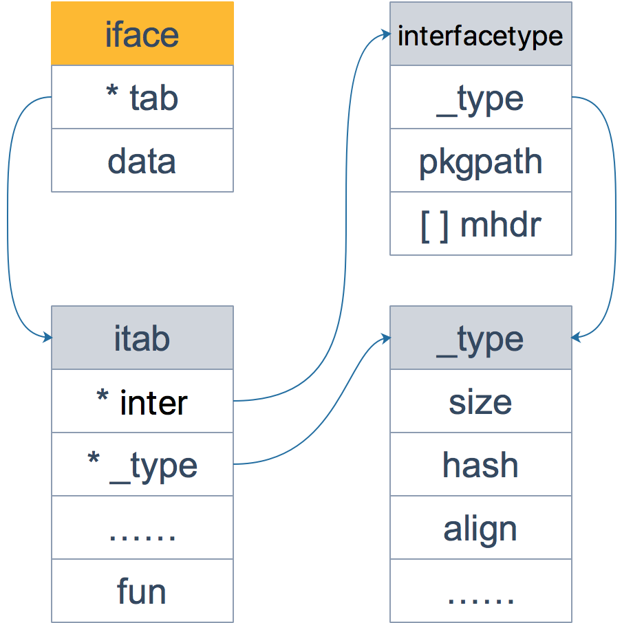

### iface和eface的区别是什么

iface和eface都是Go中描述接口的底层结构体，区别在于iface描述的接口包含方法，而eface则是不包含任何方法的空接口：interface{}

从源码层看一下：
```go
type iface struct{
	tab *itab
	data unsafe.Pointer
}


type itab struct{
	inter *interfacetype
	_type *_type
	link *itab
	hash uint32 // copy of _type.hash . used for type switches.
	bad bool // type does not implement interface
	inhash bool // has this itab been added to hash?
	unused [2]byte
	fun [1]uintptr // variable sized
}
```
iface内部维护两个指针，tab只想一个itab实体，它表示接口的类型以及赋给这个接口的实体类型。data则指向接口具体的值，一般而言是一个指向堆内存的指针。

再来仔细看看itab结构体：_type字段描述了实体的类型，包括内存对齐方式，大小等；inter字段则描述了接口类型。fun字段放置和接口方法对应的具体数据类型的方法地址，实现接口调用方法的动态分派，一半在每次给接口赋值发生转换时会更新此表，或者志杰拿缓存的itab。 

另外，你可能会觉得奇怪，为什么fun数组的大小为1，要是接口定义了多个方法怎么办？  
实际上，这里存储的是第一个方法的函数指针，如果有更多的方法，在它之后的内存空间里继续存储。从汇编角度来看，通过增加地址就能获取到这些函数指针，没什么影响。顺便提一句，这些方法是按照函数名称的字典序进行排列的。  

interfacetype类型，它描述的是接口的类型：
```go
type interfacetype struct {
	typ _type
	pkgpath name
	mhdr []imethod
}
```
可以看到，它包装了_type类型，_type实际上是描述Go语言中各种数据类型的结构体。我们注意到，这里还包含一个mhdr字段，标识接口所定义的函数列表，pkgpath记录定义了接口的包名。

**iface结构体全貌**


接着来看一下eface的源码：
```go
type eface struct{
	_type *_type
	data unsafe.Pointer
}
```
> 相比iface, eface就比较简单了，只维护了一个_type字段，表示空接口所承载的实体类型。data描述了具体的值。

**eface结构体全貌**


我们来看个例子：
```go
package main

import "fmt"

func main(){
	x := 200
	var any interface{} = x 
	fmt.Println(any)


	g := Gopher{"Go"}
	var c coder = g
	fmt.Println(c)
}

type coder interface{
	code()
	debug()
}

type Gopher struct{
	language string
}

func (p Gopher) code(){
	fmt.Printf("I am coding: %s language \n", p.language)
}

func(p Gopher) debug(){
	fmt.Printf("I am debuging %s language \n", p.language)
}
```

执行命令打印汇编语言：
> go tool compile -S ./main.go

可以看到，main函数里调用了两个函数：
```go
func convT2E64(t *_type, elem unsafe.Pointer)(e eface)
func convT2I(tab *itab, elem unsafe.Pointer)(i iface)
```
上面两个函数的参数和iface及eface结构体的字段是可以联系起来的：两个函数都是将参数组装一下，形成最终的接口  
作为补充，我们最后来看下_type结构体  
```go
type _type struct{
	// 类型大小
	size uintptr
	ptrdata uintptr

	// 类型的hash值
	hash uint32

	// 类型的flag，和反射相关
	tflag tflag

	// 内存对齐相关
	align uint8
	fieldalign uint8

	// 类型的编号，有bool，slice，struct等等
	kind uint8
	alg *typeAlg
	//gc相关
	gcdata *byte
	str nameoff
	ptrToThis typeoff
}
```

go语言各种数据类型都是在_type字段的基础上，增加一些额外的字段来进行管理：

```go
type arraytype struct {
	typ _type
	elem *_type
	slice *_type
	len uintptr
}

type chantype struct {
	typ _type
	elem *_type
	dir uintptr
}

type slicetype struct{
	typ _type
	elem *_type
}

type structtype struct {
	typ _type
	pkgPath name
	fields []structfield
}

```
这些数据类型的结构体定义，是反射实现的基础。


