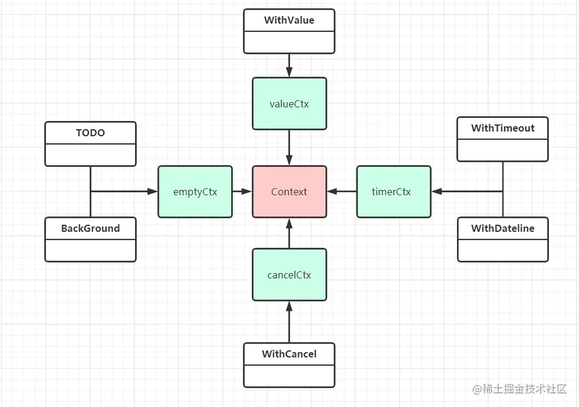

### Context 源码解析

### context
搞服务中，由一个个独立的goroutine去处理一次请求，但在这个goroutine中，可能会开启别的goroutine去执行一些具体的事物，如数据库，rpc等，同时这一组goroutine可能还需要共同访问一些特殊的值，如用户token，请求过期时间等，当一个请求超时后，我们希望与此请求有关的所有goroutine都能快速退出，以回收系统资源。

content包由谷歌开源，在go1.7时加入标准库，使用它可以很容易的把特定值，取消信号，截止日期传递给涉及的所有goroutine

context包的核心是 Context接口，其结构如下
#### 清单1
```go
type Context interface {
	Done() <-struct{}
	Err() error
	Deadline() (deadline time.Time, ok bool)
	Value(key interface{}) interface{}
}
```
- Done返回一个chan，标识一个取消信号，当这个通道被关闭时，函数应该立刻结束工作并返回。
- Err() 返回一个error，标识取消上下文的原因。
- Deadline 会返回上下文取消的时间
- Value 用于从上下文中获取key的值

### 使用

#### 传递取消信号(cancelation signals)
正如使用chan控制并发一样，我们希望传递给goroutine一个信号，一旦接收到这个信号，就立刻停止工作并返回，context包提供了一个WithCancel(), 使用它可以很方便的传递取消信号。
#### 清单2
```go
func UseContext(ctx context.Context, id int) {
	for {
		select {
		case <- ctx.Done():
			fmt.Println("stop", id)
			return
		default:
			run(id)
		}
	}
}


func G2(ctx context.Context){
	nCtx, nStop := context.WithCancel(ctx)
	go G4(nCtx)

	for {
		select {
		case <- ctx.Done():
			fmt.Println("stop 2")
			nStop()
			return
		default:
			run(2)
		}
	}
}

func G3(ctx context.Context){
	UseContext(ctx, 3)
}

fufnc G4(ctx context.Context) {
	UseContext(4)
}

func main(){
	ctx, done := context.WithCancel(context.Background())
	go G2(ctx)
	go G3(ctx)
	time.Sleep(5 * time.Second)
	done()
	time.Sleep(5 * time.Second)
}
```

### 设置截止时间

#### 清单3
```go
func G6(ctx context.Context) {
	for {
		select{
		case <- ctx.Done():
			t, _ := ctx.Deadline()
			fmt.PrintF("[*] %v done : %v \n", t, ctx.Err())
			return
		default:
			fmt.Println("[#] run ...")
		}
	}
}

func main(){
	ctx, _ := context.WithTimeout(context.Background(), time.Second * 2)
	go G6(ctx)

	time.Sleep(10*time.Second)

}

[#] run ...
...
[*] 2023-11-27 20:24:42.0581352 +0800 CST m=+2.008975001 done: context deadline exceeded

```

### 传值

#### 清单4
```go
func G7(ctx context.Context){
	for {
		select{
		case <- ctx.Done():
			fmt.Println("cancel", ctx.Value("key"))
			return
		default:
			fmt.Println("running ", ctx.Value("key"))
			time.Sleep(time.Second)
		}
	}
}

func main(){
	ctx, _ := context.WithTimeout(context.Background（）， time.Second* 2)
	ctx = context2.WithValue(ctx, "key", "value")
	go G7(nCtx)
	time.Sleep(10 * time.Second)
}

```

context包的核心是`context.Context`接口，另外有四个 struct实现了Context接口，分别是EmptyCtx，CancelCtx, timerCtx, valueCtx,其中emptyCtx是一个默认的空结构体，其余三个都是在其基础上添加了各种功能的实现，针对emptyCtx，context包中暴露了两个方法Background()和TODO()去创建一个空的emptyCtx，而针对后面三种具体的struct，context包总共暴露了四个方法去产生对应的struct，分别是： `WithCancel()`,`WithDeadLine()`,`WithTimeout()`,`WithValue()` 对应关系如下：


### TODO和Background
TODO和Backgroupnd方法用来返回一个emptyCtx类型，他们在实现上都一样：

#### 清单5
```go
var(
	backgroupnd = new(emptyCtx)
	todo = new(emptyCtx)
)

func Backgroupnd() Context{
	return background
}

func TODO() Context {
	return todo
}

```
这两个方法都会返回一个非空的上下文 emptyCtx, 他永远不会被取消，用于传递给其他方法去构建更加复杂的上下文对象，一般默认使用 Backgroupnd，只有在不确定时使用TODO(),但实际上他们只是名字不同而已。

下面是emptyCtx的实现，他确实没有做任何事情
#### 清单6
```go
type emptyCtx int

func(*emptyCtx) Deadline()(deadline time.time, ok bool){
	return
}

func(*emptyCtx) Done() <-chan struct{} {
	return nil
}

func (*emptyCtx) Err() error{
	return nil
}

func(*emptyCtx) Value(key interface{}) interface{}{
	return nil
}

```

#### WithCancel

#### 清单7
```go
type cancelCtx struct{
	Context

	mu sync.Mutex // 用于同步
	done chan struct{} // 会在Done中返回
	children map[canceler]struct{} // 子上下文列表，done呗关闭后，会遍历这个map，关闭所有子上下文
	err error // 关闭chan产生的异常，在初始化的时会被赋值使不为空
}

func(c *cancelCtx) Done() <-chan struct{} {
	c.mu.Lock()

	if c.done == nil {
		c.done = make(chan struct{})
	}
	d := c.done
	c.mu.Unlock()
	return d
}

func WithCancel(parent Context) (ctx context, cancel CancelFunc) {
	c := newCancelCtx(parent)
	propagateCancel(parent, &c)
	return &c, func(){ c.cancel(true, CancelFunc) }
}
```
当调用withCancel时， 首先会根据parent拷贝一个新的cancelCtx：

#### 清单8
```go
func newCancelCtx(parent context) cancelCtx{
	return cancelCtx{Context: parent}
}

```
然后会调用`propagateCancel`安排子上下文结束时结束，最后出了cancelCtx的引用外还会返回一个func，该方法里调用了c.cancel(),也就是当我们调用 done()时，调用的其实是c.cancel()

#### cancel
cancel的作用时关闭当前上下文以及子上下文的cancelCtx.done管道
#### 清单9
```go
func(c *cancelCtx) cancel(removeFromParent bool, err error) {
	// 必须要关闭的原因
	if err== nil {
		panic("context : internal error: missing cancel error")
	}

	c.mu.Lock()
	if c.err != nil {
		c.mu.Unlock()
		return // 已经关闭，返回
	}
	c.err = err // 通过err标识已经关闭
	if c.done == nil {
		c.done = closedchan
	}else{
		close(c.done) // 关闭当前done
	}
	// 由于是map，所以关闭顺序是随机的
	for child := range c.children {
		child.cancel(false, err) // 遍历取消所有子上下文
	}
	c.children = nil // 删除上下文
	c.mu.Unlock()

	if removeFromParent {
		removeChild(c.Context, c) // 从父节点上下文删除自己
	}
}

```

#### propagateCancel
该函数的作用是保证上下文结束时子上下文也结束，一方面，在省城子上下文的过程中，如果父亲已经被取消，那child也会被关闭，另一方面，如果执行过程中父上下文一直开启，那就正常把子上下文加入到父上下文的children列表中等执行cancel再关闭。

#### 清单10
```go
func propagateCancel(parent Context, child canceler) {
	done := parent.Done()
	// 如果父Done方法返回空，说明父上下文永远不会被取消
	// 这种情况对应 ctx, done := context.WithCancel(context.Background())
	if done == nil {
		return
	}

	// 如果到这里父上下文已经被取消，就关闭当前上下文
	select {
	case <- done:
		child.cancel(false, parent.Err())
		return
	default:
	}

	// 父上下文没有被取消
	if p, ok := parentCancelCtx(parent); ok {
		p.mu.Lock()
		//父节点已经取消，关闭自己
		if p.err != nil {
			child.cancel(false, p.err)
		}else{
			// 把child加入到parent的children中
			if p.children == nil {
				p.children = make(map[canceler]struct{})
			}
			p.children[child] = struct{}{}
		}
		p.mu.Unlock()
	}else{
		// 父上下文是开发者自定义的类型，开启一个goroutine监听父子上下文知道其中一个关闭
		atomic.AddInt32(&goroutines, +1)
		go func(){
			select {
			case <-parent.Done():
				child.cancel(false, parent.Err())
			case <-child.Done():

			}
		}()
	}

}

```
#### **WithTimeout和WithDeadline**
#### 清单11
```go
// timerCtx是在 cancelCtx的基础上添加了一个定时器和截止时间实现的。

type timerCtx struct{
	cancelCtx 
	timer *time.Timer
	deadline time.Time
}

func(c *timerCtx) Deadline() (deadline time.Time, ok bool) {
	return c.deadline, true
}

func WithDeadline(parent Context, d time.Time) (Context, CancelFunc) {
    // 如果传入的截止时间比父上下文的截止时间晚，也就是说父上下文一定会比子上下文先结束
    // 这种情况下给子上下文设置截止时间是没有任何意义的，所以会直接创建一个 cancelCtx
	if cur, ok := parent.Deadline(); ok && cur.Before(d) {
		return WithCancel(parent)
	}
    // 构建新的 timerCtx
	c := &timerCtx{
		cancelCtx: newCancelCtx(parent),
		deadline:  d,
	}
    // 保证子上下文在父上下文关闭时关闭
	propagateCancel(parent, c)
    // 计算当前距离截止时间 d 还有多长时间
	dur := time.Until(d)
    // 如果已经过了截止时间，关闭子上下文
	if dur <= 0 {
		c.cancel(true, DeadlineExceeded) // deadline has already passed
		return c, func() { c.cancel(false, Canceled) }
	}
	c.mu.Lock()
	defer c.mu.Unlock()
    // c.err == nil 说明当前上下文还没有被关闭
	if c.err == nil {
        // AfterFunc 等待 dur 后会开启一个 goroutine 执行 传入的方法，即 c.cancel
        // 并会返回一个计时器 timer，通过调用 timer 的 Stop 方法可以停止计时取消调用。
		c.timer = time.AfterFunc(dur, func() {
			c.cancel(true, DeadlineExceeded)
		})
	}
	return c, func() { c.cancel(true, Canceled) }
}

```

**timerCtx 的 cancel 方法主要还是调用了 cancelCtx.cancel**

#### 清单12
```go
func (c *timerCtx) cancel(removeFromParent bool, err error) {
    // 调用 cancelCtx.cancel，关闭子上下文
    c.cancelCtx.cancel(false, err)
    // 从父上下文中删除当前上下文
    if removeFromParent {
        removeChild(c.cancelCtx.Context, c)
    }
    c.mu.Lock()
    if c.timer != nil {
        // 停止计时，取消调用
        c.timer.Stop()
        c.timer = nil
    }
    c.mu.Unlock()
}


```
**WithTimeout 直接调用了 WithDeadline**

#### 清单13
```go
func WithTimeout(parent Context, timeout time.Duration) (Context, CancelFunc) {
    return WithDeadline(parent, time.Now().Add(timeout))
}

```


#### **WithValue**
#### 清单14
```go
func WithValue(parent Context, key, val interface{}) Context {
    // key 不能为 nil
	if key == nil {
		panic("nil key")
	}
    // key 必须是可比较的
	if !reflectlite.TypeOf(key).Comparable() {
		panic("key is not comparable")
	}
	return &valueCtx{parent, key, val}
}

type valueCtx struct {
	Context
	key, val interface{}
}

```

### **总结**
rootContext一般通过Background() 或 TODO()创建，他们会创建一个空的emptyCtx, 然后如果想要使用context包的具体功能，可以使用WithCancel(), WithDeadline(),或WithValue() 将父上下文包装成具体的上下文对象(cancelCtx, timerCtx, valueCtx), 前两个方法会返回两个值（ctx.Context, done func()） 调用done可以向goroutine发送一个关闭信号，goroutine中监控ctx.Done()便可以得到这个信号。

cancelCtx 和 timerCtx 会保持一个children(timerCtx实际上继承了cancelCtx)，这是一个map key是canceler，value是 struct{}类型，值并没有什么用，在创建cancelCtx或timerCtx时，会把当前上下文加入到其父节点children中，在父上下文关闭时会遍历children关闭所有的子上下文，并将本上下文从其父上下文的children中删除，由于map遍历的无序性，子上下文关闭的顺序也是随机的。

WithValue()以及valueCtx 的实现稍微与前两个有所不同，一方面valueCtx没有实现自己的Done(),Deadline()方法，所以其功能仅限于传值，另外在WithValue()中并没有调用propagateCancel(),所以valueCtx并不会被房子啊父节点上下文的children中，他自己也没有children，所以使用valueCtx作为父上下文没有意义。

如非必要一半无需使用WithValue()的功能传值，他一半用在传递请求对应用户的认证令牌，或用于进行分布式追踪的请求ID。

参考文章：https://juejin.cn/post/7081870299653734436


