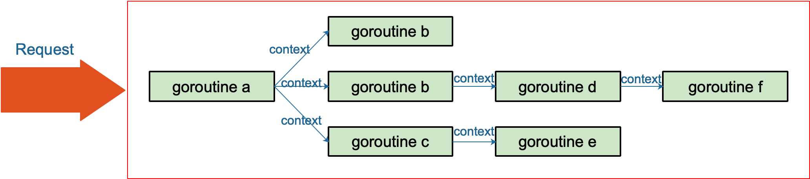

## context 上下文

### 有什么作用
> context 用来解决goroutine之间：退出通知、元数据传递功能。


### 介绍
在Go语言项目中，每个API请求都会启动若干Goroutine同时工作，一个写成处理一个请求。在业务高峰期，某个下游服务的响应变慢，而请求没超时控制或超时时间设置过大，导致下游服务写成堆积，内存占有飙涨（Body流会被存到内存中），导致服务不可用产生P0级别事故。实际上我们需要加上超时控制以及关闭所有不被需要的goroutine，那做到：`退出通知`和`元数据传递` context库是一个很好的选择。下面是请求API时Goroutine示例图。


#### 清单1 
```go
func main(){
	fmt.Println("Hello")
	go fmt.Println("Goodbye")
}

```
清单1中，hello在第二行打印，然后第三行，程序fmt.Println再次调用，但不在主goroutine(main函数)范围内执行此操作。 在调度这个新的Goroutine后，程序立即到达函数末尾main函数终止。如果你运行这个程序，你讲不会看到 Goodbye消息，因为Go规范中有一条规则：
> 程序执行首先初始化主包，然后调用main函数。当该函数调用返回时，程序退出。它不会等其他（非主）goroutine完成。

规范明确规定，当程序从函数返回时，您的程序不会等待任何未完成的goroutines完成main。  
这是一件好事！考虑下让goroutine泄漏或让goroutine运行很长时间是多么容易。如果你的程序等待非主goroutines完成才可以终止，那么它可能会陷入某种僵尸状态并且永远不会终止。  

然而，当你启动一个Goroutine去做一些重要的事情，但该main函数不知道要等待它完成时，这种终止行为就会成为一个问题。此类情况可能导致完整性问题，例如数据库、文件系统损坏或数据丢失。

#### 一个真实的例子
项目中为跟踪某些客户的事件，构建了一个Web服务，记录时间的系统有类似Tracker下面清单2所示类型的方法：

#### 清单2
```go
type Tracker struct{}

func(t *Tracker) Event(data string){
	time.Sleep(time.Second)
	log.Println(data)
}
```
很担心这些跟踪事件增加响应时间造成不必要的延迟，因此希望异步跟踪。 对性能作出假设是不明智的，因此我们的首要任务是通过以直接和同步的方式进行跟踪事件来检测服务的延迟。这种情况下，延迟高的令人无法接受，所以决定采用异步的方法。如果同步方法足够快，那么这个故事就会结束，因为我们会继续处理更重要的事情。

考虑到延迟问题，跟踪事件处理程序可以这样编写

#### 清单3
```go
type App struct{
	track Tracker
}


func(a *App) Handle(w http.ResponseWriter, r *http.Request) {
	// 业务代码...

	// 响应客户端
	w.WriteHeader(http.StatusCreated)

	// BUG：我们没有管理这个 goroutine。
	go a.track.Event("this event")
}

```
清单3中代码的重要部分是最后一行，这是 `go a.track.Event("this event")`新开了一个goroutine。 这达到了异步跟踪事件的预期效果，而不会增加请求的延迟。然而这段代码陷入**不完整工作陷阱，必须重构**。在最后一行创建任何goroutine都不能保证运行或完成。这是一个完整性问题，因为服务器关闭时事件可能会丢失

#### 重构保证
为了避免陷入困境，团队修改了类型Tracker来管理Goroutines本身。改类型使用sync.WaitGroup来记录打开的Goroutine的计数，并提供一个Shutdown方法供main函数调用，该方法会等待所有goroutines完成


#### 清单4
```go
func(a *App) Handle(w http.ResponseWriter, r *http.Request) {
	// 业务代码...

	// 响应客户端
	w.WriteHeader(http.StatusCreated)

	// BUG：我们没有管理这个 goroutine。
	a.track.Event("this event")
}
```
接下来，该Tracker类型被重写以管理Goroutines本身

#### 清单5
```go
type Tracker struct {
	wg sync.WaitGroup
}

func(t *Tracker) Event(data string) {
	t.wg.add(1)

	go func(){
		defer t.wg.Done()

		time.Sleep(time.Millisecond)
		log.Println(data)
	}()
}

func(t *Tracker) Shutdown() {
	t.wg.Wait()
}
```
清单5中，第2行，将一个sync.WaitGroup到Tracker类型定义中。Event内部，`t.wg.Add(1)`被调用。这会增加计数器记录创建的goroutine。一旦创建了该Goroutine，该Event函数就会返回，满足了客户端最小化事件跟踪延迟的要求。goroutine开始工作，完成后会`t.wg.Done()`, 调用Done方法会递减计数器，以便Waitgroup知道该Goroutine已完成。

Add和Done对于跟踪Groutines的数量很有用，但仍然必须只是程序等待它们完成。为了实现这一点，该Tracker类型声明了一个Shutdown放啊，该函数最简单的实现了 call `t.wg.Wait()`, 它会阻塞，知道Goroutine计数器减少到0.最后必须从func main清单6中调用该方法:

#### 清单6
```go
func main(){
	// 开启一个服务
	var a App

	// ... 业务代码

	// 等待事件goroutines结束
	a.track.Shutdown()
}
```
清单6的重要部分也是最后一行，它组织main函数直到`a.track.Shutdown()`完成

### 但也许不需要等太久
该Shutdown方法所示的实现很简单并且可以完成所需工作，它等待了goroutine完成。不幸的是没有时间限制，根据项目环境，不可能无限的等待程序关闭。为了给该方法添加截止日期Shutdown，将其改为：


#### 清单7
```go
func(t *Tracker) Shutdown(ctx context.Context) error{
	ch := make(chan struct{})
	go func(){
		t.wg.Wait()
		close(ch)
	}

	select {
	case <-ch:
		return nil
	case <-ctx.Done():
		return errors.New("timeout")
	}
}
```
现在，清单7中Shutdown方法采用一个context.Context作为输入，Shutdown这就是调用者限制允许等待时间的方式。第2行创建了一个通道，然后在第3行启动一个goroutine，新goroutine的卫衣工作是等待WaitGroup完成，然后关闭通道。最后启动一个select模块，等待上下文被取消或者通道关闭。

接下来，func main函数为：
#### 清单8
```go
const timeout = 5 * time.Second
ctx, cancel := context.WithTimeout(context.Background(), timeout)
defer cancel()

err := a.track.Shutdown(ctx)

```
清单8在main函数中，创建一个具有5秒超时的上下文，将此值传递给设置医院等待`a.track.Shutdown`时间限制

#### 结论

随着Goroutine的引入，该服务器处理程序能够最大限度的减少跟踪事件的Api客户端延迟成本。Go只需要使用关键字在后台运行这项工作就很容易，但该方案存在完整性问题，正确的做到这一点需要努力通过保存所有相关goroutine再让程序关闭之前终止。


