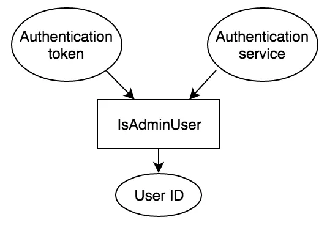

### Go1.7中 context.Value从了解到放弃

这篇文章将讨论Go1.7种的一个新库，上下文库，以及何时或如何正确使用它。开始时需要阅读[一篇介绍行文章](https://go.dev/blog/context), 其中介绍了该库的一般使用方式。您可以在tip.golang.org上阅读[上下文库的文档](https://pkg.go.dev/context@master)。  


#### 如何将Context集成到您的API中  
将Context集成到您的API中时要记住的最重要的事情是它的目的是请求方位。例如，沿着单个数据库查询存在是有意义的，但沿着数据库对象存在是没有意义的。  

目前有两宗方法可以将Context对象集成到API中：  
  - 函数调用的第一个参数。
  - 请求结构上的可选配置。

有关第一个示例中，请参阅包net的[Dialer.DialContext](https://pkg.go.dev/net@master#Dialer.DialContext).该函数执行正常的Dial操作，但根据Context对象取消它。  

```go
func(d *Dialer)DialContext(ctx context.Context, network, address string)(conn, error)
```  

第二种集成Context方式的例子，参见包net/http的Request.WithContext

```go
func(r *Request) WithContext(ctx context.Context) *Request
```  

这将创建一个新的Request对象，该对象根据给定的Context结束。  

#### 上下文应流经的程序  

使用Context的一个很好的心智模型是它应该流经您的程序。想象一下一条河流或流水。这通常意味着您不想将其存储在结构体中之类的位置。你也不想把它留在身边，除非是严格要求的。上下文应该是一个借口，它从函数传递到函数，并根据需要进行增强。理想情况下，每个请求都会创建一个Context对象，并在请求结束时过期。  

不存储上下文的一个例外是，当您需要其放在一个结构中时，该结构纯粹用作通过通道传递的消息。这在下面的示例中显示。  
```go
package main

import (
	"context"
	"fmt"
)

type message struct {
	responseChan chan<- int
	parameter    string
	ctx          context.Context
}

func ProcessMessages(work <-chan message) {
	for job := range work {
		select {
		// If the context is finished, don't bother processing the message
		case <-job.ctx.Done():
			continue
		default:
		}

		hardToCalculate := len(job.parameter)
		select {
		case <-job.ctx.Done():
		case job.responseChan <- hardToCalculate:

		}
	}
}

func newRequest(ctx context.Context, input string, q chan<- message) {
	r := make(chan int)

	select {
	// If the context finishes before we can send msg onto q,
	// exit early
	case <-ctx.Done():
		fmt.Println("Context ended before q could see message")
		return
	case q <- message{
		responseChan: r,
		parameter:    input,
		// We are placing a context in a struct. this is ok since it
		// is only stored as a passed message and we want q to know
		// when it can  discard this message
		ctx: ctx,
	}:

	}
}

func main() {
	q := make(chan message)
	go ProcessMessages(q)
	ctx := context.Background()
	newRequest(ctx, "hi ", q)
	newRequest(ctx, "hello", q)
	close(q)
	
}

```
在此示例中，我们通过将Context放入消息中来打破不存储Context的一般规则。但是，这是对Context的适当使用，因为仍然流经程序，但沿着通道而不是堆栈跟踪。另请注意此处Context在以下四个位置的使用：  
  - 在处理器太满的情况下超时q  
  - 让q知道它是否该处理消息  
  - 超时q将消息发送会newRequest()  
  - 超时newRequest()等待ProcessMessage返回的响应。

#### 所有阻塞/超时见操作都应可取消  

当您剥夺了用户取消长时间运行的操作的能力时，您占用的goroutine时间比用户想要的要长。随着context在Go1.7标准库，它将很容易成为超时或结束早期长期运行操作的标准抽象。如果你在编写一个库，并且你的函数可能会阻塞，那么它是context的一个完美用例。 

在上面的示例中，ProcessMessage是一个不会阻塞的快速操作，因此上下文显然是矫枉过正。但是，如果这是一个更长的操作，那么调用方使用Context允许newRequest在计算时间过长时继续进行。  

### Context.Value和请求返回的值（警告）  

Context中最具争议的部分时Value，它允许将任意值放入Context中。原始博客文章中Context.value的与其用途是请求范围的值。请求作用域是从传入请求中的数据派生的值，并在请求结束时小时。当请求在服务之间反弹时，此数据通常在RPC调用之间维护。让我们先尝试澄清什么是或不是请求范围值。  

明显的请求范围数据可以是谁在发出请求（用户ID）、她们如何发出请求（内部或外部）、他们从哪里发出请求（用户IP）以及这个请求应该有多重要。  

数据库连接不是请求范围的值，因为它对于整个服务器是全局的。另一方面，如果它是一个连接，其中**包含有关当前用户的元数据以自动填充用户ID等字段或执行身份验证**，则可以将其视为请求范围。  

如果记录器位于服务器对象上或是包的单一实例，则该记录器不受请求范围限制。但是，如果它包含**有关谁发送了请求的元数据，并且请求可能启用了调试日志记录**，则它将成为请求范围。  

不幸的是，请求范围的数据可以包含大量信息，因为从某种意义上说，应用程序中所有有趣的数据都来自请求。这为Context.Value中可以包含的内容提供了广泛的定义，这使得它很容易被滥用。我个人对Context.Value中的合适内容有更狭隘的看法，我将尝试在本文的其余部分解释我的立场。  

#### Context.Value模糊了程序的流程  

对Context.Value的正确使用施加了如此多的限制真正原因是它掩盖了函数或库的预期输入和输出。许多人讨厌它，原因与人们讨厌单身人士的原因相同。函数的参数是清晰、自足的文档，记录了使用函数运行所需的内容。这使得该函数易于直观地测试和推理，以及以后的重构。例如，请考虑以下从Context执行身份验证的函数：  
```go
func IsAdminUser(ctx context.Context) bool{
	x := token.GetToken(ctx)
	userobject := auth.AuthenticateToken(x)
	return userobject.isAdmin() || userObject.IsRoot()
}
```  

当用户调用次函数时，他们只看到它需要一个context。但是，要知道用户是否是管理员，需要做的两件事： 身份验证服务（在本鲤中用作单例）和身份验证令牌。您可以将其表示为输入和输出，如下所示：  

  

让我们用一个函数清楚地表示这个流，删除所有单列和上下文。 

```go
func IsAdminUser(token string, authService AuthService) int {
	userObject := authService.AuthenticateToken(token)
	return userObject.isAdmin() ||userObject.isRoot() 
}
```  

此函数定义现在清楚地表示了知道用户是否为管理员所需的内容。这种表示对于函数的用户来说也是显而易见的，并且使用重构和重用函数易于理解。  

#### Context.Value和大型系统的实现  

我非常理解在Context.Value中推送项目的愿望。复杂系统通常具有中间件层和调用堆栈的多个抽象。在调用堆栈顶部计算的值对于调用者来说是乏味的、困难的，而且对于调用者来说非常丑陋，如果必须将它们添加到顶部和底部之间的每个函数调用中，以便传播一些简单的东西，例如用户ID或身份验证令牌。想象一下，如果您不得不在两个不同包中的两次调用之间为数十个函数添加另一个名为“用户ID”的参数，只是为了让包Z知道包A发现了什么？API看起来很丑陋，人们会因为你设计它而大喊大叫。好！仅仅因为你已经把丑陋的东西掩盖在Context.Value中，并不能使你的API或设计变得更好。晦涩难懂使良好API设计的对立面。  

#### Context.Value应该通知，而不是控制  
通知，而不是控制。如果您使用上下文，这是我认为应该指导的主要口头禅。正确值。上下文的内容。价值是给维护者的，而不是给用户的。对于记录在案的或与其的结果，它绝不应该是必须的输入。  

澄清一下，如果您的函数由于可能在上下文中也可能不在上下文中的值而无法正确运行。则您的API过多地掩盖了所需的输入。除了文档之外，还有应用程序的语气行为。例如如果函数的行为与文档记录的一样，但应用程序使用该函数的方式具有实际行为，即需要Context中的某些内容才能正确运行，那么它就更接近于影响程序的控制。  


通知的一个示例是请求ID。通常，他们在日志记录或其它聚合系统中用于将请求组合在一起。请求ID的实际内容永远不会更改if语句的结果，如果缺少请求ID，它不会对函数的返回值做任何修改。  

另一个符合inform定义的例子是记录器。记录器的存在与否永远不会改变程序的流程。此外，在大多数使用中，记录或为记录的内容通常不会被记录或依赖于行为。但是如果API中记录了日志记录的存在或日志的内容，则记录器已从通知转移到控制。  

通知的另一个示例是传入请求的IP地址，如果此IP地址的卫衣用途是使用用户的IP地址修饰日志消息。但是如果库的文档或与其行为是某些IP更重要且不太可能收到限制，则IP地址已从通知变为控制，因为他现在必须的输入，或者至少是更改行为的输入。  

数据库连接是要放置在上下文中的对象的最坏情况示例。因为它显然控制着程序，并且是函数的必要输入。    

关于上下文的golang.org博客文章。上下文可能是如何正确使用上下文的反例。让我们看一下博客中发布的搜索代码。  

```go
func Search(ctx context.Context, query string)(Results, error) {
	// Prepare the google search API request
	// ...
	q := req.URL.Query()
	q.Set("q", query)

	// if ctx is carrying the user IP address, forward it to the server. 
	// Google APIS use the user ip to distinguish server-initiated requests
	// from end-user requests. 

	if userIP, ok := userip.FromContext(ctx); ok {
		q.Set("userip", userIP.String())
	}


}
```  
主要的衡量标准是了解查询中用户IP的存在如何改变请求的结果。**如果IP在日志跟踪系统中被区分，以便人们可以调试目标服务器，那么它纯粹是通知并且没问题**。如果请求中的userIP更改了REST调用的行为，或者倾向于使其不太可能受到限制，则它开始控制Search的可能输出，并且不再适用于Context.Value.  


这篇博文还提到授权令牌是存储在上下文中的东西。这显然违反了CContext.Value中适当内容的规则，**因为它控制函数的行为，并且是程序流必须输入。相反最好使标记成为结构的显式参数或成员**。  

#### context.Value even belong?  

上下文执行两种截然不同的操作：其中一种超时长时间运行的操作，另一种携带请求作用域值。Go中的借口应该是关于描述API想要的行为。它们不应该是碰巧经常同事存在的功能的抓包。不幸的是，当我所关心的只是超时失控请求时，我被迫包含有关向对象添加任意值的行为。  

#### Context.Value的替代品  

人们经常在更广泛的中间件使用Context.Value。在这里，我将展示如何保持这种抽象，同时仍然不需要滥用Context.Value。让我们展示一些实力代码，该代码使用HTTP中间件和Context.Value来传播在中间件开头找到的用户ID。注意Go1.7在http请求对象。另外，我对语法有点松散，但我希望含义清楚。  
```go
package goexperments

import (
	"context"
	"net/http"
)

type HandlerMiddleware interface {
	HandleHTTPC(ctx context.Context, rw http.ResponseWriter, req *http.Request, next http.Handler)
}

var function1 HandlerMiddleware = nil
var function2 HandlerMiddleware = nil

func addUserID(rw http.ResponseWriter, req *http.Request, next http.Handler) {
	ctx := context.WithValue(req.Context(), "userid", req.Header.Get("userid"))
	req = req.WithContext(ctx)
	next.ServeHTTP(rw, req)
}

func userUserID(rw http.ResponseWriter, req *http.Request, next http.Handler) {
	uid := req.Context().Value("userid")
	rw.Write([]byte(uid))
}

func makeChain(chain ...HandlerMiddleware) http.Handler {return nil}

type Server struct {}
func (s *Server) ServeHTTP(rw http.ResponseWriter, req *http.Request) {
	req = req.WithContext(context.Background())
	chain := makeChain(addUserID, function1, function2, useUserID)
	chain.ServeHTTP(rw, req)
}
```  
这是一个示例，说明Context.Value通常在中间件链中用于设置传播用户ID。第一个中间件addUserID更新上下文。然后它调用中间件链中的下一个处理程序。稍后，将是提取并使用上下文中的用户ID值。在大兴应用程序中，您可以想象这两个函数彼此相差距离很远。  

现在让我们展示如何使用相同的抽象来做同样的事情，但不需要滥用Context.Value

```go
package goexperiments

import (
	"context"
	"net/http"
)

type HandlerMiddleware interface {
	HandleHTTPC(ctx context.Context, rw http.ResponseWriter, req *http.Request, next http.Handler)
}

var function1 HandlerMiddleware = nil
var function2 HandlerMiddleware = nil


func makeChain(chain ...HandlerMiddleware) http.Handler {return nil}

type AddUserID struct {
	OnUserID func(userID string) http.Handler
}

func (a *AddUserID) ServeHTTP(rw http.ResponseWriter, req *http.Request) {
	userID := req.Header.Get("userid")
	a.OnUserID(userID).ServeHTTP(rw, req)
}

type UseUserID struct {
	UserID string
}

func (u *UseUserID) ServeHTTP(rw http.ResponseWriter, req *http.Request) {
	rw.Write([]byte(u.UserID))
}

type ServerNoAbuseContext struct{}

func (s *ServerNoAbuseContext) ServeHTTP(rw http.ResponseWriter, req *http.Request) {
	req = req.WithContext(context.Background())
	chainWithAuth := func(userID string) http.Handler {
		return makeChain(function1, function2, &UseUserID{
			UserID: userID,
		})
	}
	chainPartOne := &AddUserID{
		OnUserID: chainWithAuth,
	}
	chainPartOne.ServeHTTP(rw, req)
}
```  


在这个例子中，我们仍然可以使用相同的中间件抽象，并且仍然只有 main 函数知道中间件链，但以类型安全的方式使用 UserID。变量 chainPartOne 是直到我们提取 UserID 时的中间件链。然后，链的这一部分可以直接使用 UserID 创建链的下一部分 chainWithAuth。  

在此示例中，我们可以将 Context 保留为仅结束早期长期运行的函数。我们还清楚地记录了 struct UseUserID 需要 UserID 才能正确运行。这种明确的分离意味着，当人们稍后重构此代码或尝试重用 UseUserID 时，他们知道会发生什么。  


#### 为什么维护者例外  

我承认在 Context.Value 中为维护者划分一个例外有点武断。我个人的推理是想象一个完美设计的系统。在这个系统中，不需要自省应用程序，不需要调试日志，也几乎不需要指标。该系统是完美的，因此不存在维护问题。不幸的是，现实情况是我们确实需要调试系统。将此调试信息放在 Context 对象中是永远不需要维护的完美 API 与希望跨 API 线程调试信息的现实之间的折衷。但是，我不会特别反对那些想要在他们的 API 中明确调试信息的人。  

#### 尽量不要使用上下文。价值  

您可能会遇到比尝试使用上下文更多的麻烦。价值。我感同身受的是，在上下文中添加一些东西是多么容易。稍后在某个遥远的抽象中对它进行值值和检索，但现在的易用性是以后重构时的痛苦所付出的。几乎从来不需要使用它，如果你这样做了，它使以后重构你的代码变得非常困难，因为它变得未知（尤其是编译器）函数需要哪些输入。这是对 Context 的一个非常有争议的补充，很容易给人带来比它的价值更多的麻烦。  


