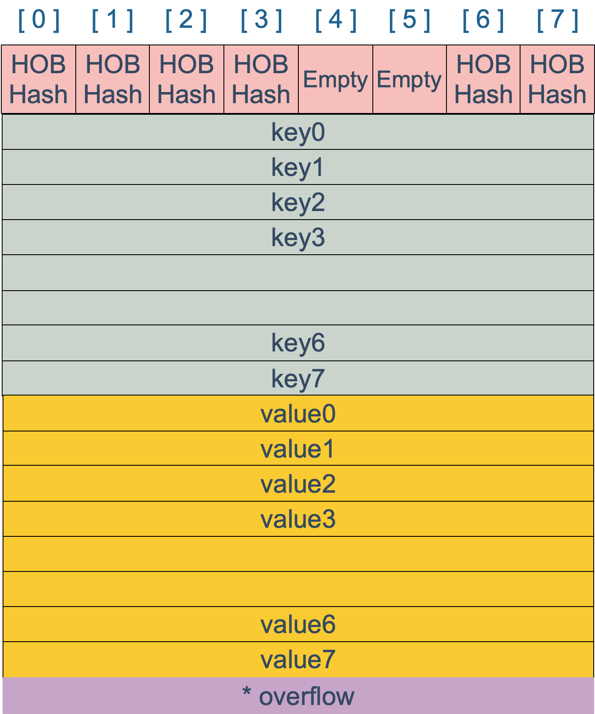

### 什么是map

> map是由`key-value`键值对组成的；`key`只会出现一次

map 最主要的数据结构有两种： 哈希查找表（hash table）, 搜索树（Search tree）

- 哈希查找表。
	哈希查找表用一个哈希函数将key分配到不同的桶（bucket, 也就是数组的不同index）。这样开销主要在哈希函数的计算以及数组的常数访问时间。很多长江下哈希查找表的性能很高。  
	哈希查找表一般会存在`碰撞`的问题也就是说不通的key被哈希到同一个bucket，一般会有两种对应方法：`链表法` 和 `开放地址发`  
		- 链表法将一个bucket实现成一个链表，落在同一个bucket中的key都会插入这个链表。  
		- 开放地址法则是碰撞发生后，通过一定的规律，在数组的后面挑选"空位" 用来放置新的key
- 搜索树法一般采用自平衡搜索书，包括：AVL树，红黑树   
	自平衡搜索书法最差的搜索效率是O(logN), 而哈希查找表最差是O(N).当然哈希查找表的平均查找率是O(1), 如果哈希函数设计的很好，最坏的情况基本不会出现。


#### map的底层如何实现
前面说了map的几种方案，go语言采用的是`哈希查找表`，并使用`链表法`解决哈希冲突

#### map 内存模型(go version go1.21.3)
  
在源码中表示map的结构体是hmap，它是hashmap的缩写
```go 
// runtime/map.go

// A header for a Go map.
type hmap struct {
	// Note: the format of the hmap is also encoded in cmd/compile/internal/reflectdata/reflect.go.
	// Make sure this stays in sync with the compiler's definition.
	// 元素个数，调用len(map)时，返回此值
	count     int // # live cells == size of map.  Must be first (used by len() builtin)
	flags     uint8
	//  buckets 的对数 log_2, B:5 2^5次方
	B         uint8  // log_2 of # of buckets (can hold up to loadFactor * 2^B items)
	// overflow 的bucket近似数
	noverflow uint16 // approximate number of overflow buckets; see incrnoverflow for details
	// 计算 key 哈希的时候会传入哈希函数
	hash0     uint32 // hash seed

	// 指向buckets数组，大小为2^B
	// 如果元素个数为0，就为nil
	buckets    unsafe.Pointer // array of 2^B Buckets. may be nil if count==0.
	// 等量扩容的时候，buckets 长度和 oldbuckets 相等
	// 双倍扩容的时候，buckets 长度会是 oldbuckets 的两倍
	oldbuckets unsafe.Pointer // previous bucket array of half the size, non-nil only when growing

	// 只是扩容进度，小于此地址的 buckets迁移完成
	nevacuate  uintptr        // progress counter for evacuation (buckets less than this have been evacuated)

	extra *mapextra // optional fields
}

```

说明一下，`B` 是buckets数组的长度的对数，也就是说buckets数组的长度就是2^B,bucket里面存储了key和value

- buckets 指针指向的结构体 `bmap` (ps: map-->hmap, hmap.buckets-->bmap)
```go 
type bmap struct {
	tophash [bucketCnt]uint8
}
```
	但这只是表面（src/runtime/hashmap.go）的结构，编译期间会给它加料，动态的创建一个新的结构
```go 
type bmap struct {
	topbits [8]uint8
	keys [8]keytype
	values [8]valuetype
	pad uintptr
	overflow uintptr

}
```


`bmap` 就是我们常说的“桶”， 桶里面会最多装8个key，这些key之所以会落入一个桶，是因为他们经过哈希计算后，哈希结果是“一类”的，在桶内，会根据key计算出来的hash值的高8位来决定key到底落到桶内那个位置（一个桶内最多有8个位置）  
当map的key和value都不是指针，并且size都小于128字节的情况下，会把bmap标记为不含指针，这样可以避免gc时扫描整个hmap。 但是，我们看bmap其实有一个overflow字段，是指针类型，破坏了bmap不含指针的设想，这回会把overflow移动到extra字段来。

```go
type mapextra struct {

	overflow [2]*[]bmap

	nextOverflow *bmap
}
```

bmap 是存放 k-v 的地方，我们把视角拉近，仔细看 bmap 的内部组成。



