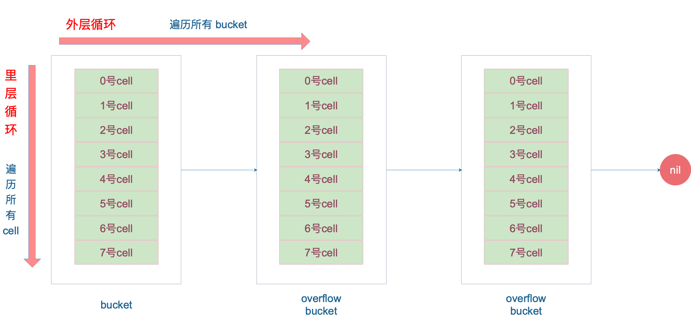

### 什么是map

> map是由`key-value`键值对组成的；`key`只会出现一次

map 最主要的数据结构有两种： 哈希查找表（hash table）, 搜索树（Search tree）

- 哈希查找表。
	哈希查找表用一个哈希函数将key分配到不同的桶（bucket, 也就是数组的不同index）。这样开销主要在哈希函数的计算以及数组的常数访问时间。很多长江下哈希查找表的性能很高。  
	哈希查找表一般会存在`碰撞`的问题也就是说不通的key被哈希到同一个bucket，一般会有两种对应方法：`链表法` 和 `开放地址发`  
		- 链表法将一个bucket实现成一个链表，落在同一个bucket中的key都会插入这个链表。  
		- 开放地址法则是碰撞发生后，通过一定的规律，在数组的后面挑选"空位" 用来放置新的key
- 搜索树法一般采用自平衡搜索书，包括：AVL树，红黑树   
	自平衡搜索书法最差的搜索效率是O(logN), 而哈希查找表最差是O(N).当然哈希查找表的平均查找率是O(1), 如果哈希函数设计的很好，最坏的情况基本不会出现。


#### map的底层如何实现
前面说了map的几种方案，go语言采用的是`哈希查找表`，并使用`链表法`解决哈希冲突

#### map 内存模型
  
在源码中表示map的结构体是hmap，它是hashmap的缩写
```go 
// runtime/map.go (go version go1.21.3)

// A header for a Go map.
type hmap struct {
	// Note: the format of the hmap is also encoded in cmd/compile/internal/reflectdata/reflect.go.
	// Make sure this stays in sync with the compiler's definition.
	// 元素个数，调用len(map)时，返回此值
	count     int // # live cells == size of map.  Must be first (used by len() builtin)
	flags     uint8
	//  buckets 的对数 log_2, B:5 2^5次方
	B         uint8  // log_2 of # of buckets (can hold up to loadFactor * 2^B items)
	// overflow 的bucket近似数
	noverflow uint16 // approximate number of overflow buckets; see incrnoverflow for details
	// 计算 key 哈希的时候会传入哈希函数
	hash0     uint32 // hash seed

	// 指向buckets数组，大小为2^B
	// 如果元素个数为0，就为nil
	buckets    unsafe.Pointer // array of 2^B Buckets. may be nil if count==0.
	// 等量扩容的时候，buckets 长度和 oldbuckets 相等
	// 双倍扩容的时候，buckets 长度会是 oldbuckets 的两倍
	oldbuckets unsafe.Pointer // previous bucket array of half the size, non-nil only when growing

	// 只是扩容进度，小于此地址的 buckets迁移完成
	nevacuate  uintptr        // progress counter for evacuation (buckets less than this have been evacuated)

	extra *mapextra // optional fields
}

```

说明一下，`B` 是buckets数组的长度的对数，也就是说buckets数组的长度就是2^B,bucket里面存储了key和value

- buckets 指针指向的结构体 `bmap` (ps: map-->hmap, hmap.buckets-->bmap)
```go 
type bmap struct {
	tophash [bucketCnt]uint8
}
```
	但这只是表面（src/runtime/hashmap.go）的结构，编译期间会给它加料，动态的创建一个新的结构
```go 
type bmap struct {
	topbits [8]uint8
	keys [8]keytype
	values [8]valuetype
	pad uintptr
	overflow uintptr

}
```


`bmap` 就是我们常说的“桶”， 桶里面会最多装8个key，这些key之所以会落入一个桶，是因为他们经过哈希计算后，哈希结果是“一类”的，在桶内，会根据key计算出来的hash值的高8位来决定key到底落到桶内那个位置（一个桶内最多有8个位置）  
当map的key和value都不是指针，并且size都小于128字节的情况下，会把bmap标记为不含指针，这样可以避免gc时扫描整个hmap。 但是，我们看bmap其实有一个overflow字段，是指针类型，破坏了bmap不含指针的设想，这回会把overflow移动到extra字段来。

```go
type mapextra struct {

	overflow [2]*[]bmap

	nextOverflow *bmap
}
```

bmap 是存放 k-v 的地方，我们把视角拉近，仔细看 bmap 的内部组成。


上图就是bucket内存模型，`Hob Hash` 指的就是top hash。  
注意key和value是各自放在一起，并不是k/v/k/v...这样的形式，为什么不是k/v/k/v呢？
	如果按照 k/v/k/v...这样的模式存储，那在每一个k/v键值对之后都要额外pending 7个字节；而将所有key，value分别绑定到一起，则只需要在最后添加pending。  
	每个bucket设计成最多只能放8个k-v，如果有第9个 k-v 落入当前的bucket，那就需要再构建一个bucket，通过overflow指针连起来。

#### 创建map
从语法上说创建map很简单：
```go

func main() {
	ageMp := make(map[string]int)
	// 指定map长度
	ageMp2 := make(map[string]int, 8)

	// ageMp3 为nil，不能向其添加元素，会直接panic
	var ageMp3 map[string]int

	fmt.Println(ageMp, ageMp2, ageMp3)
}
```
通过汇编语言可以看到，是加上底层调用的是makemap函数，主要做的工作就是初始化hmap结构体的各种字段。
```go
// (go version go1.21.3)
// makemap 为 make(map[k]v,hint) 实现 Go 映射创建。
// 如果编译器确定是map还是第一个bucket
// 可以在堆栈上创建，h 和/或bucket 可以为非零。
// 如果h != nil，则可以直接在h中创建map。
// 如果h.buckets != nil，则指向的bucket可以作为第一个bucket。
func makemap(t *maptype, hint int, h *hmap) *hmap {
	mem, overflow := math.MulUintptr(uintptr(hint), t.Bucket.Size_)
	if overflow || mem > maxAlloc {
		hint = 0
	}

	// initialize Hmap
	if h == nil {
		h = new(hmap)
	}
	h.hash0 = fastrand()

	// 找到将保存所请求的元素数量的大小参数 B。
	// 对于提示 < 0，overLoadFactor 返回 false，因为提示 < bucketCnt。
	B := uint8(0)
	for overLoadFactor(hint, B) {
		B++
	}
	h.B = B

	// 分配初始哈希表
	// 如果 B == 0，buckets 字段稍后会被延迟分配（在 mapassign 中）
	// 如果提示很大，则清零此内存可能需要一段时间。
	if h.B != 0 {
		var nextOverflow *bmap
		h.buckets, nextOverflow = makeBucketArray(t, h.B, nil)
		if nextOverflow != nil {
			h.extra = new(mapextra)
			h.extra.nextOverflow = nextOverflow
		}
	}

	return h
}

```

### **key定位过程**

将key通过哈希函数转成哈希值，共64bit位（64位操作系统），计算到他要落在哪个bucket桶中
  - 用后5个bit位，找到是哪个桶`00110`找到对应的6号bucket
  - 使用高8位bit，`10010111` 对应十进制就是151，在6号bucket中寻找 top hash值为151的key， 找到2号槽位 查找结束。
  - 如果在bucket中没有找到，并且overflow不为空，就去overflow bucket中找，直到bucket所有槽位都找遍

让我们来看下源码，这里我们直接看 `mapaccess1`函数
```go
func mapaccess1(t *maptype, h *hmap, key unsafe.Pointer) unsafe.Pointer {
	// ……
	
	// 如果 h 什么都没有，返回零值
	if h == nil || h.count == 0 {
		return unsafe.Pointer(&zeroVal[0])
	}
	
	// 写和读冲突
	if h.flags&hashWriting != 0 {
		throw("concurrent map read and map write")
	}
	
	// 不同类型 key 使用的 hash 算法在编译期确定
	alg := t.key.alg
	
	// 计算哈希值，并且加入 hash0 引入随机性
	hash := alg.hash(key, uintptr(h.hash0))
	
	// 比如 B=5，那 m 就是31，二进制是全 1
	// 求 bucket num 时，将 hash 与 m 相与，
	// 达到 bucket num 由 hash 的低 8 位决定的效果
	m := uintptr(1)<<h.B - 1
	
	// b 就是 bucket 的地址
	b := (*bmap)(add(h.buckets, (hash&m)*uintptr(t.bucketsize)))
	
	// oldbuckets 不为 nil，说明发生了扩容
	if c := h.oldbuckets; c != nil {
	    // 如果不是同 size 扩容（看后面扩容的内容）
	    // 对应条件 1 的解决方案
		if !h.sameSizeGrow() {
			// 新 bucket 数量是老的 2 倍
			m >>= 1
		}
		
		// 求出 key 在老的 map 中的 bucket 位置
		oldb := (*bmap)(add(c, (hash&m)*uintptr(t.bucketsize)))
		
		// 如果 oldb 没有搬迁到新的 bucket
		// 那就在老的 bucket 中寻找
		if !evacuated(oldb) {
			b = oldb
		}
	}
	
	// 计算出高 8 位的 hash
	// 相当于右移 56 位，只取高8位
	top := uint8(hash >> (sys.PtrSize*8 - 8))
	
	// 增加一个 minTopHash
	if top < minTopHash {
		top += minTopHash
	}
	for {
	    // 遍历 bucket 的 8 个位置
		for i := uintptr(0); i < bucketCnt; i++ {
		    // tophash 不匹配，继续
			if b.tophash[i] != top {
				continue
			}
			// tophash 匹配，定位到 key 的位置
			k := add(unsafe.Pointer(b), dataOffset+i*uintptr(t.keysize))
			// key 是指针
			if t.indirectkey {
			    // 解引用
				k = *((*unsafe.Pointer)(k))
			}
			// 如果 key 相等
			if alg.equal(key, k) {
			    // 定位到 value 的位置
				v := add(unsafe.Pointer(b), dataOffset+bucketCnt*uintptr(t.keysize)+i*uintptr(t.valuesize))
				// value 解引用
				if t.indirectvalue {
					v = *((*unsafe.Pointer)(v))
				}
				return v
			}
		}
		
		// bucket 找完（还没找到），继续到 overflow bucket 里找
		b = b.overflow(t)
		// overflow bucket 也找完了，说明没有目标 key
		// 返回零值
		if b == nil {
			return unsafe.Pointer(&zeroVal[0])
		}
	}
}
```
函数返回h[key]的指针，如果h中没有此key，那就会返回一个key相应类型的零值，不会返回nil

源码中定位key和value的方法以及整个循环
```go
// key 定位公式
k := add(unsafe.Pointer(b), dataOffset+i*uintptr(t.keysize))

// value 定位公式
v := add(unsafe.Pointer(b), dataOffset+bucketCnt*uintptr(t.keysize)+i*uintptr(t.valuesize))
```


<!-- TODO 源代码如何查找这一块逻辑没有搞明白，后续补上 -->

参考文章：
https://golang.design/go-questions/map/principal/


