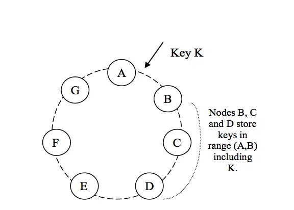
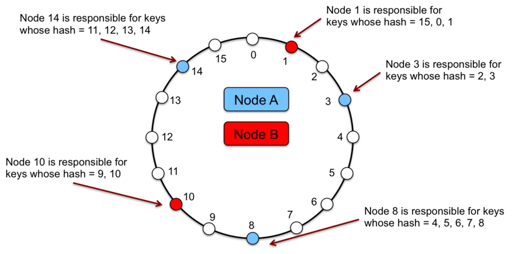
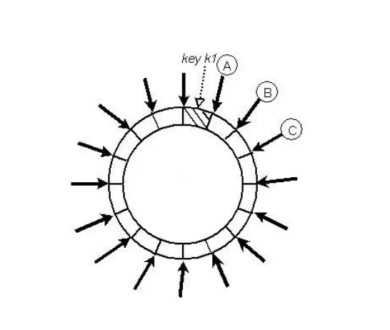
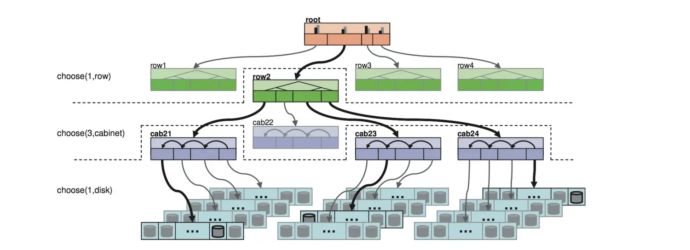
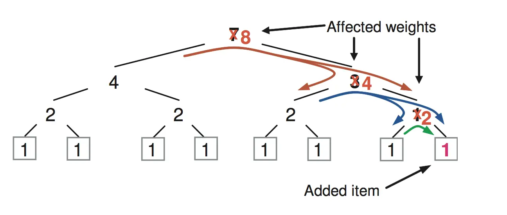

### 浅谈分布式存储系统数据分布方法  
分布式存储系统中面临着的首要问题就是**如何将大量的数据分布在不同的存储节点上**，无论上层接口是KV存储、对象存储、块存储、亦或是列存储，在这个问题上大体是一致的。本文将介绍在分布式存储系统中*做数据分布目标及可选的方案*，并试着总结它们之间的关系及权衡。  

#### 指标  
这里假设目标数据是以key标识的数据块或对象，在一个包含多个存储节点的集群中，数据分布算法需要为每一个给定的key指定一个或多个对应的存储节点负责，数据分布算法有两个基本目标：  
- **均匀性（Uniformity）:**不同存储节点的负载应该均衡；    
- **稳定性（Consistency）:**每次一个key通过数据分布算法得到的分布结果应该保持基本稳定，即使在 有存储节点发生变化的情况下  

可以看出，这两个目标在一定程度上是相互矛盾的，*当有存储节点增加或删除时，为了保持稳定应该尽量减少的进行数据的移动和重新分配，而这样势必会带来负载不均*。*同样追求极致均匀也会导致较多的数据迁移*。所以我们希望在这两个极端之间找到一个点以获得合适的均匀性和稳定性。除了上述两个基本目标外，工程中还需要从下几个方面考虑数据分布算法的优劣：  
- **性能可扩展性**，这个主要考虑的是算法相对于存储节点规模的时间复杂度，为了整个系统的可扩展性，数据分布算法不应该在集群规模扩大后显著增加运行时间。  
- **考虑节点异构**，实际工程中，不同存储节点之间可能会有很大的性能或容量差异，好的数据分布算法应该能很好的应对这种异构，提供加权数据均匀。  
- **隔离故障区域**，为了数据的高可用，数据分布算法应该为每个key找到一组存储节点，这些节点可能提供的是数据的镜像副本，也可能是类似擦除码的副本方式。数据分布算法应该尽量隔离这些副本对故障域，如不同机房、不同机架、不同交换机、不同机器。  

#### 演进  
看完算法的评价指标后，接下来介绍一些可能的方案演进，并分析它们的优劣。这里假设key的值足够分散。  

- Hash  
一个简单直观的想法是直接用hash来计算，简单的以key作哈希后对节点数取模。可以看出，在key足够分散的情况下，均匀性可以获得，但一旦有节点加入或退出，所有的原节点都会收到影响。**稳定就无从谈起**。  

- 一致性Hash  

一致性hash可以很好的解决稳定问题，可以将所有的存储节点排列在收尾相接的Hash环上，每个key在计算hash后会顺时针找到先遇到的一组存储节点存放。而当有节点加入或退出时，仅影响该节点在hash环上顺时针相邻的后续节点，将数据从该节点接收或者给予。但这又带来均衡性的问题，即使可以将存储节点等距排列，也会在**存储节点个数变化时带来数据的不均匀**。而这种可能成倍数的不均匀在实际工程中是不可接受的。  

- **负载上限的一致性Hash**  
一致性Hash有节点变化时不均匀的问题，Google在2017年提出了Consistent Hashing with bounded Loads来控制这种不均匀的程度。简单的说，该算法给Hash环上的每个节点一个负载上限为1+e倍的平均负载，这个e可以自定义，当key在hash环上顺时针找到合适的节点后，会判断这个节点的负载是否已经到达上限，则需要继续找之后的节点进行分配。  

如上图所示，假设每个桶当前上限是2，红色的小球按序号访问，当编号为6的红色小球到达时，发现顺时针首先遇到的B(3,4),C(1,5)都已达到上限，因此最终放置在桶A。这个算法最吸引人的地方在于**当有节点变化时，需要迁移的数据量是1/e^2相关**，而与节点数或数据数均无关，也就是说当集群规模扩大时，数据迁移量并不会随着显著增加。另外，使用者可以通过调整e的值来控制均匀性和稳定性之间的权衡。无论是一致性hash还是带负载限制的一致性hash**都无法解决节点异构的问题**。  

- **带虚拟节点的一致性Hash**  
为了解决负载不均匀和异构的问题，可以在一致性hash的基础上引入虚拟节点，即hash环上的每个节点并不是实际的存储节点，而是一个虚拟节点。实际的存储节点根据其不同的权重，对应一个或多个虚拟节点，所有落到相应虚拟节点上的key都由该存储节点负责。如下图所示，存储节点A负责(1,3], (4, 8],(10,14], 存储节点B负责（14，1】，（8，10]。  

这个算法的问题在于，一个实际存储节点的加入或退出，会影响多个虚拟节点的重新分配，进而影响很多节点参与到数据迁移中来；另外实践中将一个虚拟节点重新分配给新的世纪节点时需要将这部分数据遍历出来发送给新节点。我们需要一个更合适的虚拟节点切分和分配方式，那就是分片。

- **分片**  
分片将哈希环企鹅各位相同大小的分片，然后将这些分片交给不同的节点负责。注意这里跟上面提到的虚拟节点有着很本质的区别，**分片的划片和分片的分配被解耦**，一个节点退出时，其所负责的分片并不需要顺时针合并之后的节点，而是可以更灵活的将整个分片作为一个整体交给任意节点，实践中，一个分片多作为最小的数据迁移和备份单位。  
  

而也正是由于上面提到的**解耦**，相当于将原县的key到节点的映射拆分成两层，需要一个心的极致来进行分片到存储节点的映射，由于分片数相对key空间已经很小且数量确定，可以更精确地初始设置，并引入中心目录服务来根据节点存活修改分片的映射关系，同时将这个映射信息通知给所有的存储节点和客户端。  

  
上图是我们的分布式KV存储[Zepplin](https://github.com/Qihoo360/zeppelin)中的分片方式，key space通过hash到分片，分片及其副本又通过一层映射到最终的存储节点Node Server。  

- **CRUSH算法**  
CRUSH算法本质上也是一种分片的数据分布方式，其试图在以下几个方面进行优化：  
- **分片映射信息量**:避免中心目录服务和存储节点及客户端之间需要交互大量的分片映射信息，而改由存储节点或客户端自己根据少量且稳定的集群节点拓扑和确定的规则自己计算分片映射。  
- **完善的故障域划分**：支持层级的故障域控制，将统一分片的不同副本按照配置划分到不同层级的故障域中。  

客户端或存储节点利用Key、存储节点的拓扑结构和分配算法，独立进行分片位置的计算，得到一组负责对应分片机副本的存储位置。如下图所示是一次定位的过程，最终选择了一个row下的cab21，cab23，cab24三个机柜下的三个存储节点。  

  

当节点变化时，由于节点拓扑的变化，会影响少量分片数据迁移，如下图新节点加入是引起数据迁移，通过良好分配算法，可以得到很好的负载均衡和稳定性，CRUSH提供了Uniform、List、Tree、Straw四种分配算法。  

  

#### 应用
常见的存储系统大多采用类似于分片的数据分布和定位方式：  
- Dynamo及Cassandra采用分片的方式并通过Gossip协议在对等节点间相同；
- Redis Cluster将key space划分为slots，同样利用Gossip通信；
- Zeppelin将数据分片为Partition，通过Meta集群提供中心目录服务；  
- BigTable将数据企鹅各位Tablet，类似于可变的分片，Tablet Server可以进行分片的切割，最终分片信息记录在Chubby中；  
- Ceph采用CRUSH方式，由中心集群Monitor维护并提供集群拓扑的变化；  

#### 参考
- [原文](https://www.jianshu.com/p/5fa447c60327)
- [Dynamo: Amazon’s Highly Available Key-value Store](https://www.allthingsdistributed.com/files/amazon-dynamo-sosp2007.pdf)
- [Replication Under Scalable Hashing: A Family of Algorithms for Scalable Decentralized Data Distribution](https://www.ssrc.ucsc.edu/Papers/honicky-ipdps04.pdf)
- [Consistent Hashing with Bounded Loads](https://www.ssrc.ucsc.edu/Papers/honicky-ipdps04.pdf)
- [CRUSH: Controlled, Scalable, Decentralized Placement of Replicated Data]()
- [Distributed Lookup Services](https://people.cs.rutgers.edu/~pxk/417/notes/23-lookup.html)
- [Bigtable: A Distributed Storage System for Structured Data](https://static.googleusercontent.com/media/research.google.com/en//archive/bigtable-osdi06.pdf)
- [Dynamo论文介绍](https://catkang.github.io/2016/05/27/dynamo.html)
- [Redis Cluster 实现](https://catkang.github.io/2016/05/08/redis-cluster-source.html)
- [Zeppelin](https://github.com/Qihoo360/zeppelin)

