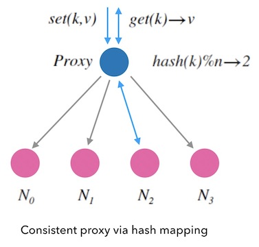

### 一致性哈希算法（一）- 问题的提出  

一致性哈希研发是一种特殊的哈希算法，当目标槽位数量发生变化时，它会尽力降低的重新映射的数量。传统的哈希表设计中，添加或者删除一个槽位，会造成全量的重新映射，一致性哈希则追求的是增量式重新映射。一致性哈希最早由Karger在1997年提出，多用于分布式系统中的扩缩容问题、分布式哈希表的设计等等。  

本系列共分为四部分：  
- **一致性哈希算法（一）-问题的提出**
- **一致性哈希算法(二)-哈希环法**
- **一致性哈希算法(三)-跳跃一致性哈希法**
- **一致性哈希算法(四)- maglev一致性还希法**

本文是第一部分，将从一个KVDB的设计谈起，解答\[为什么需要一致性哈希\]的问题。  

#### 如何代理一个简单的kvdb？  

假如我们有一个简单的kvdb(key-value-database),它支持两个简单的操作：  
  - set(k, v)表示把键为k的值更新为v。  
  - get(k)标识查询键为k的值v。  

由于单节点系统的服务能力有限，因此我们要考虑多节点的架构方案。一种简单的架构方案是：  
前面做一个代理服务，把请求分割到不同的后端节点上，这是常说的**sharding模式**  

下面的图1.1是这个kvdb的架构图，蓝色的节点是一个代理服务器，负责为到来的读写请求分配一个后端节点。后面紫色的节点都是存储节点。  

  

可以看到左边的S1总会给同一个k分配不变的后端节点，而右边的S2则不然，它先给set(k,v)分配了N3，又为后续的get(k)分配了N0，导致get读取失败，所以S2是无法正确地工作的。我们S1的代理方式是有一致性的，S2的则没有。  

我们将寻找一种有一致性的代理方案：**对同一个key的所有读写请求都必须一致地分配同一个后端节点。**同时，分配的负载应该尽量均衡。  

换句话讲，**我们需要寻找一种映射函数，把随机到来的字符串key，一致地应道到n个槽中**。此外，我们也希望，**这个映射要做到尽量平均**。  

#### 简单的哈希映射-Mod-n哈希  

哈希表是一种常用的基本数据结构。例如下图，它把随机到来的字符串k输入到哈希函数hash中，然后映射到一张连续内存表上。  
  

一般的，常见的哈希函数（如：md5,sha1）都是映射到uint32这样很大的空间的，所以哈希表一般对哈希函数的结果取余数来映射到槽位，即hash(k)%n。 因为hash函数本身保证了映射的分布平均和一致性，所以求余后的结果也符合我们的要求。如下面图，我们可以用类似哈希表的方式来作为kvdb的节点分配规则。  

  

我们先把这种映射方式叫做Mod-N哈希法。  

还记得哈希表的扩容吗？当哈希表中插入元素越来越多的时候，哈希表就需要扩容。这时候不得不重新申请一块新的连续内存，把所有的元素拷贝过去并进行重新映射(rehash)。  

哈希表的扩容和重新映射都是**全量**进行的。如果kvdb也模仿这种方式进行扩容，就需要全量迁移数据，显然太麻烦了，我们要寻找**增量**扩容的方式。  

  

#### Mod-N哈希的扩容问题  

下面，我们看下前面提到的Mod-N哈希法的情况下，新加一个节点或删除一个故障节点会发生什么。  

下图，当新加一个节点N4时，我们看到原本分配到N2点K再扩容后会分配到N1.对于一个kvdb来说，这意味着我们需要再扩容后把k从N2迁移到N1才能继续提供服务。否则的话，扩容后的读请求映射到新的节点N1，而导致读不到数据

  

上图指出了，**新增一个节点会导致新颖和和老映射的不一致**。  

对于删除一个节点的情况，也是类似的，同样会导致心映射和老映射的不一致。从下面图3.2中可以看到，原本映射到N2的K在缩容后映射到N0，也是不一致的： 

  

这种情况并不是特例，而是会导致大面积的映射不一致。下图是4个节点和5个节点的情况下的哈希映射的对比图，图中数字表示hash(k)的值，红色标记的数字则代表两种情况下的没有映射到同一个节点的值。可以确定的是：**节点数变更后会导致大面积的映射不一致**。 

  

其实从数学上也可以简单推出来，只有当hash(k)的结果对4和5的余数相等时才可能一致，比如投中的 0,1,2,3,20,21,22,23,...其他情况都会不一致。  

这样，我们对要寻找的映射函数的一致性要求更高了，**不仅要对相同的k的多次映射结果一致，还要尽可能较少n变化带来的不一致性映射的变化。构造这种映射的算法，就是一致性哈希算法**。  

#### 一致性哈希算法  

我们希望构造一种函数f(k, n)->m把字符串映射到n个槽上：  
  - 它的输入是随机到来的字符串k和槽的个数n
  - 输出是映射到的槽的标号m, m\<n

这个函数需要有这样的性质：  
  - 映射均匀： 对随机到来的输入k，函数返回任意一个m的概率应该是1/n。
  - 一致性：
  	- 相同的k,n输入，一定会有相同的输出。 
  	- 当槽的数目增减时，映射结果和之前不一致的字符串的数量要尽量少。  
  更严格的、维基百科定义是：当添加一个槽时，只需要对k/n个字符串进行重新映射。 
这个算法的关键特征在于，**不要导致全局重新映射，而是要做增量的重新映射**。 

接下来介绍三种一致性哈希算法：  
- 哈希环法
- 跳跃一致性哈希法  
- Maglev一致性哈希法  

参考链接：
- [原始链接](https://writings.sh/post/consistent-hashing-algorithms-part-1-the-problem-and-the-concept)
- [参考链接](https://writings.sh/post/consistent-hashing-algorithms-part-1-the-problem-and-the-concept)

