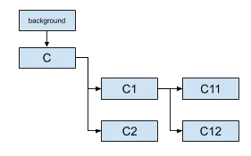
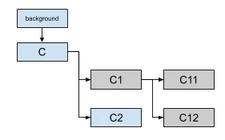
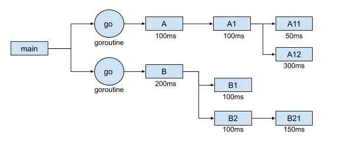
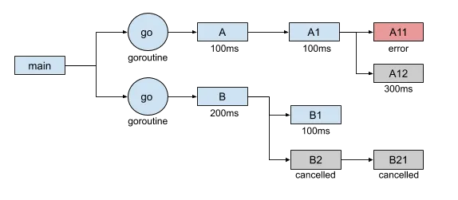

### Go上下文多传播和取消  

context该包在1.7中引入，为我们提供了一种处理应用程序中上下文多方法。当设计取消任务活定义超时时，这些上下文可以提供帮助。通过上下文传播请求范围的值也很有用，但在本文中，我们将重点关注**取消功能**  


#### 默认上下文  
Go`context`包基于现有上下文构建上下文。名为TODO和backgroupnd的包中存在两个默认上下文：  

```go
var (
   background = new(emptyCtx)
   todo       = new(emptyCtx)
)

func Background() Context {
   return background
}

func TODO() Context {
   return todo
}
```  

正如我们所看到的，它们都是空的上下文。此上下文是一个简单的上下文，永远不会取消，并且不具有任何价值。  

您可以使用背景上下文作为主上下文，它将被派生以创建新的上下文。基于此，您不应直接在包中使用此上下文；他应该在您的主要功能中使用。如果您正在使用`net/http`包构建服务器，则请求将提供主上下文：  
```go 
net/http/request.go
func (r *Request) Context() context.Context {
   if r.ctx != nil {
      return r.ctx
   }
   return context.Background()
}
```  

如果您在自己的包中工作并且没有任何可用的上下文，在这种情况下，您应该使用TODO上下文。一般来说，或者如果对必须要使用的上下文有任何疑问，则可以使用TODO上下文。现在我们知道了主要上下文，让我们看看如何构建派生的上下文。  

#### 上下文树  

派生上下文时，会在`context`内部结构中跟踪的派生上下文和父上下文之间创建一个链接：
```go
type cancelCtx struct {
	Context 
	mu sync.Mutex
	done chan struct{}
	children map[canceler]struct{}
	err error
}
```  

该字段`children`跟踪从此上下文创建的所有子项，同时`Context`指向从中创建当前子项的上下文。  

以下是创建一些上下文的子上下文的实例：  
  

每个上下文都是互相链接的，如果我们取消主“C”上下文，所有的子项也会被取消。Go循环对子项进行逐个取消：  
```go
context/context.go 

func(c *cancelCtx)cancel(removeFromParent bool, err error){
	[...]
	for child := range c.children {
		child.cancel(false, err)
	}
	[...]
}
```  

**取消会下降，并且永远不会通知家长**。如果我们取消C1，它只会通知C11和C12:  

  

这种取消传播是我们能够定义更高级的案例，这些案例可以帮助我们根据主要上下文处理多个/繁重的工作。  

#### 取消传播  

让我们锯割简单的例子，通过2个goroutine（A和B）取消过程，他们将并行工作，如果由于通用上下文而发生错误，则取消另一个程序的工作：  
  

如果没有发生任何错误，每个过程都会正常工作。我在每个作业上都添加了一个跟踪，这将是我们能够看到一棵小树：  
```bash
A - 100ms
B - 200ms
    -> A1 - 100ms
        -> A11 - 50ms
    -> B1 - 100ms
        -> A12 - 300ms
    -> B2 - 100ms
        -> B21 - 150ms
```

每项工作都执行得很好。现在，让我们尝试模拟 A11 中的错误：
```bash
A - 100ms
    -> A1 - 100ms
B - 200ms
        -> A11 - error
        -> A12 - cancelled
    -> B1 - 100ms
    -> B2 - cancelled
    -> B21 - cancelled
```  

正如我们所看到的，当B2和B21被取消时，A12会中断，以避免进行不必要的工作：  

  

我们在这里可以看到，上下文对于多个goroutine是安全的。事实上，这要归功于我们之前在结构中看到的互斥锁，它保证了对上下文的并发安全访问。  

#### 上下文泄漏案例  

正如我们在内部结构中看到的，当前上下文在属性中保留指向其父级的链接，而父级在属性中context children保留当前上下文。对cancel函数的调用会将子级和父级与当前上下文分离：  

```go
func (c *cancelCtx) cancel(removeFromParent bool, err error) {
   [...]
   c.children = nil

   if removeFromParent {
      removeChild(c.Context, c)
   }
}
```  

如果未调用cancel函数，则主上下文将始终保留指向所创建上下文的链接，从而导致可能的内存泄漏。  

检测它的一种简单方法就是运行 go vet命令，该命令将警告您可能存在内存泄漏  


```bash
the cancel function returned by context.WithCancel should be called, not discarded, to avoid a context leak
```  

#### 结论  

context 包还有另外两个利用cancel函数的函数：withTimeout和withDeadline。它们都将在定义的超时/截止时间后自动触发取消函数。  

该软件包还提供了最后一种方法withValue，它允许我们在上下文中存储我们想要的任何对键/值。此功能存在争议，因为它不提供明确的类型控制，并可能导致不良的变成习惯。如果您想了解更多关于最后一种方法的信息，我建议您与毒Jack Lindamood拟写的关于上下文的良好实践的[文章](https://medium.com/@cep21/how-to-correctly-use-context-context-in-go-1-7-8f2c0fafdf39)。

- 原文地址:https://medium.com/a-journey-with-go/go-context-and-cancellation-by-propagation-7a808bbc889c

