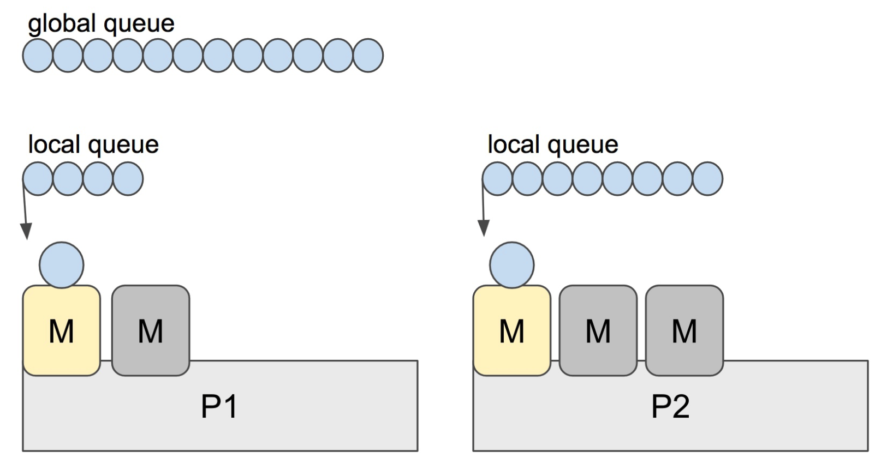

### GMP是什么

#### 介绍
Go语言并发哲学是CSP思想：**不要通过共享内存来通信，而要通过通信来共享内存**。
Go并发不仅依靠chan通道通信来共享内存，而且依靠比线程更灵活的Goroutine来降低并发消耗，那我们一起来了解下Go是如何并发的需要什么。

- G: **代表一个goroutine，包含goroutine栈等一些字段**，如存放IP寄存器，以便轮到本goroutine执行时，cpu知道要从那一条指令处开始执行
- M: **machine的首字母，标识内核线程，包含正在运行的goroutine等字段**。G需要调度到M上才能运行，M是真正工作的人。
- P：**是processor的首字母，中文为处理器，为M的执行提供“上下文”，保存M执行G时的一些资源**它维护一个处于Runnable状态等g队列，m需要获得p才能运行g

当然还有一个核心的结构体：sched调度器，总揽全局。

- **M:N模型？**
我们都知道，Go runtime负责goroutine的生老病死，从创建到销毁，都是一手包办的。runtime会在程序启动的时候，创建M个线程（CPU执行调度的单位），之后创建的N个goroutine都会依附在这M个线程上执行。这就是M:N模型

在同一时刻，一个线程上只能跑一个goroutine。当goroutine发生阻塞（例如向一个channel发送数据被阻塞）是，runtime会把当前goroutine调度走，让其他goroutine来执行。目的就是不让一个线程闲着，榨干cpu的每一滴油水。

- 工作窃取
go scheduler的指责就是将所有处于runnable的goroutines均匀分布到绑定P的M上运行。
当一个P队列发现自己的LRQ已经没有G时，会从其他P“偷”一些G来运行。Go从1.1开始实现

Go Scheduler使用M：N模型，在任一时刻M个goroutines(G) 要分配到N个内核线程（M），这些M跑在个数最多为GOMAXPROCS的逻辑处理器(P)上.每个M必须依附于一个P，每个P在同一时刻只能运行一个M。如果P上的M阻塞了，那它就需要其他的M来运行P LRQ里的goroutines

一起看下图，当P2上的一个G执行结束后，它就会去LRQ获取下一个G来执行。如果LRQ已经空了，就是说本地队列已经没有需要执行的G，并且这是GRQ也没有G了。这是P2会随机选择一个P(P1), P2会从P1的LRQ“偷”过来一半G

**这样做的好处是，有更多的P可以一起工作，加速执行完所有的G**

接下来去了解各组件具体功能：

### 调度器组件详解
- [调度器](./schedule.md)
- [goroutine与线程](./goroutine.md)

<!-- TODO  -->
- [M是如何工作的](./machine.md)
- [队列processor](./processor.md)

参考文章：https://golang.design/go-questions/sched/gpm/