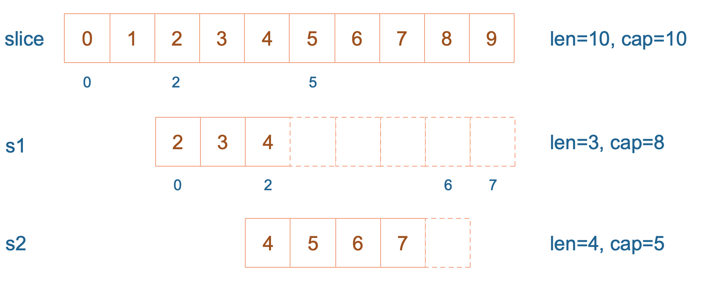

### 数组与切片

- 数组的长度是类型的一部分，声明后不可更改。(ps: `[3]int`和`[4]int`是同类型嘛？)
- slice切片是一个拥有相同元素类型的可变长度的序列。它是基于数组类型做的一层封装。非常灵活支持自动扩容。

我们在编码的过程中有没有遇到一些不可思议的事，下面让我们看一个例子：
```go
func SliceTest() {
	slice := []int{0, 1, 2, 3, 4, 5, 6, 7, 8, 9}
	s1 := slice[2:5] // 从下标2开始，到下标5结束，不包含5
	// 从s1的下标2开始，到下标6结束，不包含6， 容量到下标7
	//  slice[4:8:9] 与s2有什么区别
	s2 := s1[2:6:7]

	s2 = append(s2, 100)
	s2 = append(s2, 200)

	s1[2] = 20
	fmt.Println("SliceTest start.....")

	fmt.Println(s1) // [2 3 20]
	fmt.Println(s2) // [4 5 6 7 100 200]
	fmt.Println(slice) // [0 1 2 3 20 5 6 7 100 9]
	fmt.Println("SliceTest end.....")
}

```
让我们来分析下上面的代码  
`s1`从`slice`索引2(闭区间)开始到索引5（开区间，元素真正索引到4），长度为3，容量(cap)默认到数组结尾为8  
`s2`从`s1`的索引2闭区间到索引6（开区间，元素真正取到5），容量所引到7，为5
  


#### 课后总结
- 数组与切片有什么区别呢？
- 函数的参数为切片，在函数内修改后，对函数外的切片变量有影响嘛？
- 同上参数为数组呢？
