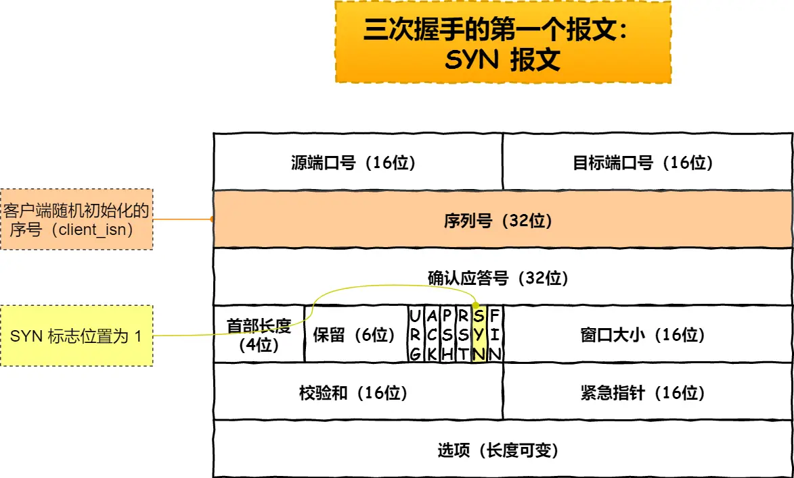
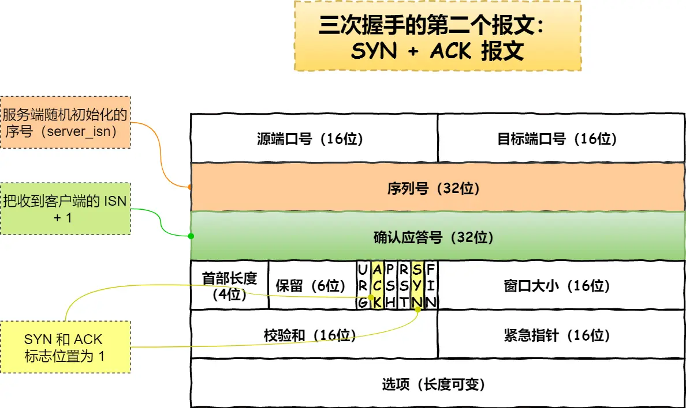

### TCP相关
### TCP连接建立

- #### TCP三次握手过程是怎样的？
	- 分析：概念题，有可能被问到三次握手的过程具体的点
	
	- 答案：
		- 第一次握手(SYN)： 客户端向服务器发送一个包含SYN（同步序列号）标志的数据包，标识客户端请求建立连接  
		- 第二次握手(SYN+ACK)：服务器收到客户端的SYN后，返回一个同事包含SYN和ACK（确认）标志的数据包，标识收到客户端的请求，并同意建立连接
		- 第三次握手（ACK）：客户端收到服务器的（SYN+ACk）后，向服务器端发送一个确认包，标识连接建立成功。

- #### TCP四次挥手关闭连接是怎样的？
- 分析：天下没有不散的宴席，对于 TCP 连接也是这样， TCP 断开连接是通过四次挥手方式。

- 答案：
	- 第一步：客户端打算关闭连接，此时会发送一个 TCP 首部 FIN 标志位被置为 1 的报文，也即 FIN 报文，之后客户端进入 FIN_WAIT_1 状态。
	- 第二步：服务端收到该报文后，就向客户端发送 ACK 应答报文，接着服务端进入 CLOSE_WAIT 状态。 
		- 客户端收到服务端的 ACK 应答报文后，之后进入 FIN_WAIT_2 状态。
	- 第三步：等待服务端处理完数据后，也向客户端发送 FIN 报文，之后服务端进入 LAST_ACK 状态。
		- 客户端收到服务端的 FIN 报文后，回一个 ACK 应答报文，之后进入 TIME_WAIT 状态
	- 第四步：服务端收到了 ACK 应答报文后，就进入了 CLOSE 状态，至此服务端已经完成连接的关闭。
		- 客户端在经过 2MSL 一段时间后，自动进入 CLOSE 状态，至此客户端也完成连接的关闭。

- ### 扩展：
- #### TCP连接建立过程详解：
	- 一开始，客户端和服务端都处于close状态。先是服务端主动监听某个端口，处于LISTEN状态
	
	- 客户端会随机出实话序号(client_isn), 将此序号置于TCP首部序号字段中，同时把SYN标志位置为1，标识SYN报文。接着把第一个SYN报文发送给服务端，标识向服务端发起连接，该报文不包含应用层数据，之后客户端处于SYN-SENT状态
	
	- 服务端收到SYN报文后，首先服务端也随机出实话自己的序号(server_isn), 将此序号填入TCP首部的序号字段中，其次把TCP首部的确认应答号字段填入client_isn+1,接着把SYN和ACK标志位置为1.最后把该报文发给客户端，该报文也不包含应用层数据，之后服务端处于SYN- RCVD状态
	
	- 客户端收到服务端报文后，还要向服务端回应最后一个应答报文，首先该应答报文 TCP 首部 ACK 标志位置为 1 ，其次「确认应答号」字段填入 server_isn + 1 ，最后把报文发送给服务端，这次报文可以携带客户到服务端的数据，之后客户端处于 ESTABLISHED 状态。
	- 服务端收到客户端的应答报文后，也进入 ESTABLISHED 状态。

	从上面的过程可以发现第三次握手是可以携带数据的，前两次握手是不可以懈怠数据的，这也是面试长文问题。一旦完成三次握手，双方都处于 ESTABLISHED状态，此时连接就已建立完成，客户端和服务端就可以相互发送数据了。

#### 如何在LINUX系统中查看TCP状态？
- TCP 的连接状态查看，在 Linux 可以通过 netstat -napt 命令查看。

#### 为什么是三次握手？不是两次、四次？
- 分析： 相信大家比较常见的回答：“因为三次握手才能保证双方具有接受和发送的能力”，这回答没问题，但是有点片面，并没说主要原因。
	前面我们知道为什么是TCP连接：
		- 用于保证可靠性和历程控制维护的某些状态信息，这些信息的组合，包括Socket、序列号和窗口大小称为连接。
	- 接下来分析三次握手的原因：
		- 三次握手才可以阻止重复历史连接的出实话（首要原因是为了防止旧的重复连接初始化造成混乱）
		- 三次握手才可以同步双方的厨师序列号
		- 三次握手才可以避免资源浪费

### **TCP是面向连接的协议，他们是如何建立或关闭连接的呢？**
- 答案： 
	- 建立TCP连接：三次握手
		- 第一次握手(SYN)： 客户端向服务器发送一个包含SYN（同步序列号）标志的数据包，标识客户端请求建立连接  
		- 第二次握手(SYN+ACK)：服务器收到客户端的SYN后，返回一个同事包含SYN和ACK（确认）标志的数据包，标识收到客户端的请求，并同意建立连接
		- 第三次握手（ACK）：客户端收到服务器的（SYN+ACk）后，向服务器端发送一个确认包，标识连接建立成功。
	- TCP连接关闭： 四次握手
		- 第一次握手（FIN）： 客户端想要关闭连接，发送一个包含FIN（结束）标志的数据包，标识客户端不再发送数据。
		- 第二次握手（ACK）： 服务器收到客户端的FIN之后，发送一个确认包，表示已经收到了客户端的关闭请求。
		- 第三次握手（FIN）： 服务器想要关闭连接，发送一个包含FIN标志的数据包，标识服务器不再发送数据
		- 第四次握手（ACK）：客户端收到服务器端的FIN后，发送一个确认包，标识以收到了服务器的关闭请求。

	四次握手是在双方都完成数据的发送和接收后的连接关闭过程，而三次握手是在连接建立过程中进行的。

- #### 为什么挥手需要四次？		
- 分析：再来回顾下四次挥手双方发 FIN 包的过程，就能理解为什么需要四次了。
- 答案：
	- 关闭连接时，客户端向服务端发送 FIN 时，仅仅表示客户端不再发送数据了但是还能接收数据。
	- 服务端收到客户端的 FIN 报文时，先回一个 ACK 应答报文，而服务端可能还有数据需要处理和发送，等服务端不再发送数据时，才发送 FIN 报文给客户端来表示同意现在关闭连接。

	从上面过程可知，服务端通常需要等待完成数据的发送和处理，所以服务端的 ACK 和 FIN 一般都会分开发送，因此是需要四次挥手。
	（请谨慎回答，但是在特定情况下，[四次挥手是可以变成三次挥手的](https://xiaolincoding.com/network/3_tcp/tcp_three_fin.html)）

参考文章：https://www.xiaolincoding.com/network/3_tcp/tcp_interview.html#tcp-基本认识