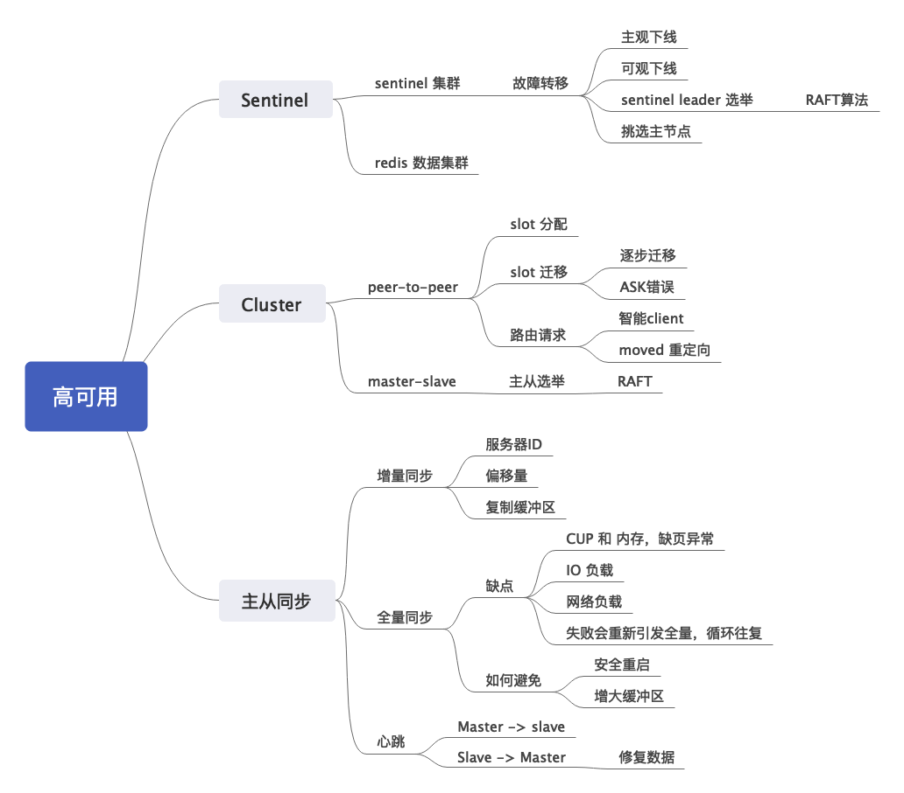

### Redis高可用
- 分析Reis高可用分成两个点，Redis Cluster和Redis Sentinel。 这里要区别两种模式解决的痛点
	- Redis Sentinel 是纯粹的高可用方案，采用的是主从复制；
	- Redis Cluster不是的是对等（peer-to-peer）节点，解决了高可用问题，同时也解决了**单机瓶颈**。
	
	这里面有一个很容易误解的点，就是Redis Cluster里面的每个节点，都可以是一个**主从集群**，在高端操作下，Redis Cluster就是有多个主从集群构成的

	所以RedisCluster解决高可用是要从两个角度来回答的，一个是对等节点，一个世杰点的主从集群。另外一个考点在于Cluster的槽分配和迁移。迁移理解了，就理解了扩容和缩容。

	Redis Sentinel 模式要注意有两个集群，一个是存放Redis数据的集群，一个是监控这个数据集群的哨兵集群。于是就需要理解烧饼集群之间是如何监控的，如何就某件事达成协议，以及烧饼自身的容错。

- 答案：Redis 高可用有两种模式，Sentinel 和 Cluster。
	- Sentinel 本质上是主从模式，与一般的主从模式不同的是，主节点的选举，不是从节点完成的，而是通过 Sentinel 来监控整个集群模式，发起主从选举。因此本质上 Redis Sentinel 有两个集群，一个是 Redis 数据集群，一个是哨兵集群。
	- Redis Cluster 集成了对等模式和主从模式。Redis Cluster 由多个节点组成，每个节点都可以是一个主从集群。Redis 将 key 映射为 16384个槽（slot），均匀分配在所有节点上。（这里有两个点，先不说，一个是怎样的均匀才是均匀，一个是客户端怎么查询，坐等面试官问）

	两种模式下的主从同步都有全量同步和增量同步两种（引导面试官询问两种同步模式细节），一般情况下，我们应该尽量避免全量同步（钓鱼，面试官接着就会问为什么，或者全量同步有啥缺点，或者如何避免）

	简单提及一下如何选择） 一般而言，如果数据量和复杂并不大的时候，想要保证高可用，就采用 Redis Sentinel；如果负载很大，或者说触及了 Redis 单机瓶颈，那么应该采用 Redis Cluster 模式。

### 扩展点
- 分析：
	- 考察一般的数据同步模式。这里要回答出亮点，就要回到全量同步和增量同步（PSYNC）
	- 而实际上从服务器发起的 PSYNC 既可能触发全量同步，也可能触发增量同步，所以我们不用 PSYNC 术语，以免搞混
	- 为了方便记忆，我们记住核心点，就是如果同步的起始点命令，**还在主服务器的缓冲队列上，那就是增量同步，如果不在，那就是全量同步**

- 答案：分成两种，全量同步和增量同步
	- 全量同步（主生成 RDB 和 缓冲命令， 发给从，从加载 RDB，执行缓冲命令，重写 AOF ）：
		- 从服务器发起同步，主服务器开启 BG SAVE，生成 BG SAVE 过程中的写命令也会被放入一个缓冲队列；
		- 主节点生成 RDB 文件之后，将 RDB 发给从服务器；
		- 从服务器接收文件，**清空本地数据**，再入 RDB 文件；（这个过程会忽略已经过期的 key，参考过期部分的讨论）
		- 主节点将缓冲队列命令发送给从节点，从节点执行这些命令；
		- 从节点重写 AOF；
	这时候已经同步完毕，之后主节点会源源不断把命令同步给从节点。

	- 先分析这种全量同步面临的问题，而后引出增量同步：
		- 从上面的步骤可以看出来，全量同步非常重，资源消耗很大，而且，大多数情况下，从服务器上是存在大部分数据的，只是短暂失去了连接
		- 如果这个时候又发起全量同步，那么很容易陷入到无休止的全量同步之中。
	- 因此 Redis 引入了增量同步。增量同步的依赖于三个东西：
		- 服务器ID：用于标识 Redis 服务器ID；
		- 复制偏移量：主服务器用于标记它已经发出去多少；从服务用于标记它已经接收多少（从服务器的比较关键）；
		- 复制缓冲区：主服务器维护的一个 **1M 的FIFO队列**，近期执行的写命令保存在这里；

	从服务器将自己的复制偏移量发给主服务器，如果主服务器发现，该偏移量还在复制缓冲区，那么就执行增量复制，将偏移量后面的命令同步给从服务器；否则执行全量同步；

	（其实就是，从服务器记录了一下自己同步到哪里，然后找主服务器同步，主服务器一看，这个数据还在缓冲区，ok，可以增量同步

- 关键点：
	- 全量同步：主生成 RDB 和 缓冲命令， 发给从，从加载 RDB，执行缓冲命令，重写 AOF 
	- 增量同步：服务器ID，复制偏移量，复制缓冲区：主服务器1M 的FIFO队列，

#### **Redis 服务器重启可能引发什么问题？**
- 分析：
	考察同步。前面提到过服务器ID，这个ID准确说是服务器运行时ID，它在重启后会变化。而结合主从同步的问题，我们会发现，服务器运行时ID变化会触发全量同步。
- 答案：服务器重启，分成主服务器重启和从服务器重启。
	- 对于从服务器来说，因为重启会使它丢失了上一次同步的主服务器的ID，所以只能发起全量同步；
	- 对于主服务器重启来说，因为服务器ID发生变化，所有的从服务器都需要执行全量同步；
	- 亮点（一种不会变更服务器ID的重启方式）：  针对这种情况，Redis引入了一种安全重启机制，这种机制下重启不会变更服务器ID，可以避免全量同步

- 关键点：服务器ID变化

#### **Redis 主从之间网络不稳定可能引发什么问题？**
- 分析：
	考察同步。大多数和主从有关的问题，几乎都是围绕全量同步来做文章的。网络连接不稳，导致主从同步失败。亮点在于，要结合 Redis 的**超时机制**来回答。
- 答案：主从之间网络不稳定可能引起三种情况：
	- 短暂网络抖动，那么从服务器可以通过 ACK 机制重新补充丢失的数据（参考后面的心跳机制）
	- 超时，但是从服务器发过来的偏移量还在缓冲区，增量复制；
	- 超时，偏移量不在缓冲区，全量复制；

- 关键点：为了方便记忆，把时间轴想象成三部分：未超时，超时但是复制缓冲还在，超时没救了

#### **全量同步有什么缺点**
- 分析：考察全量同步。核心在于领悟全量同步的**开销**，要从非常具体的 CPU，内存，磁盘IO，网络传输，以及潜在可能失败导致无休止的全量同步几个角度回答，最后点出因为这么多缺点，所以需要引入增量同步。
- 答案：全量同步是利用 BG SAVE 来完成的：
	- 从 CPU 和 内存的角度来说，会发起fork系统调用，在单机内存很大的时候，这会引起很大的延迟，并且因为**COW**的原因，引发大量的缺页中断；
	-  BG SAVE 的文件写入到磁盘，会增大磁盘负载；
	- BG SAVE 在网络中传输，会导致短时间内网络负载飙升；
	- 更重要的是，因为全量同步非常复杂，这段时间可能从服务器再次和主服务器失去连接。等下次重连的时候，又触发一遍全量同步，**循环**往复；

- 关键点：COW 

#### **如何避免全量同步**
- 分析：前面已经分析过了，这里再总结一下。先从怎么触发全量同步开始聊起，然后得出避免的方法，逻辑分明。
- 答案：引发全量同步的几个原因有：
	- 主服务器宕机重连
	- 主服务器没有安全启动
	- 主从同步超时，导致缓冲区溢出（就是偏移量对应的数据不再缓冲区了）
	- 从服务器重启

- 关键点：宕机重联，未安全重启，同步超时

#### **Redis 的心跳机制是怎样的？**
- 分析：Redis 的心跳机制，关键点在于，它是一个类似于**TCP 协议的 ACK 机制**。所以我们结合 TCP 的 ACK 机制来回答。
- 答案：Redis 的心跳机制，是两个方向的
	- 一个是主服务器向从服务器发送心跳，用于检测网络和从服务器存活；
	- 另外一个是从服务器像主服务器发送 REPLCONF ACK，这个 ACK 会带上自身的复制偏移量。因此，如果服务器发现从服务器的偏移量比较落后，可以将丢失的数据重新补上

	（开始结合 TCP 来讨论）这就是类似于 TCP 的 ACK 机制。ACK 会告诉发送端下一次期望的数据报，而后发送端进行重发。

	（进一步装逼，不熟悉滑动窗口协议的请忽略）不过 TCP 引入了滑动窗口协议，因此可以简单处理失序报文，但是 Redis 的同步，是要求严格的顺序的，并且从服务器并不具备处理失序命令的能力。

- 关键点： TCP 的ACK机制， REPLCONF

#### **Sentinel 是如何监控主从集群的？**
- 分析：考察 Sentinel 模式的基本特点。核心就是主观下线 -> 客观下线 -> 主节点故障转移。
- 答案：Sentinel 本身有三个定时任务（重要）
	- 获取主从结构信息，所以能够做到主从结构动态更新；
	- 获取其它 Sentinel 节点的看法；
	- 对主从节点的心跳检测；

	- 主观下线：首先 Sentinel 获取了主从结构的信息，而后向所有的节点发送心跳检测，如果这个时候发现某个节点没有回复，就把它标记为主观下线；
	- 客观下线：如果这个节点是主节点，那么 Sentinel 就询问别的 Sentinel 节点主节点信息。如果大多数都 Sentinel 都认为主节点已经下线了，就认为主节点已经客观下线。

	当主节点已经客观下线，就要步入故障转移阶段。故障转移分成两个步骤，一个是 Sentinel 要选举一个 leader，另外一个步骤是 Sentinel leader 挑一个主节点。

	Sentinel leader 选举是使用 raft 算法的，（这里犯不着描述具体步骤，等后面他如果有兴趣，就会问你细节。大部分情况下是没有的，因为 RAFT 算法很复杂） 选举出 leader 之后，leader 从健康从节点之中依据 <优先级， 偏移量， 服务器ID> 进行排序，挑出一个节点作为主节点

	找出主节点之后，Sentinel 要命令其它从节点连接新的主节点，同时保持对老的主节点的关注，在它恢复过来之后把它标记为从节点，命令它去同步新的主节点。

	因为可能存在多个从节点，因此我们需要控制同时进行控制转移的从节点的数量，也就是**paralle-syncs参数**。该参数如果设置过小，会导致故障转移时间很长；但是如果该参数设置过大，会导致多数从节点不可用。

- 关键点：三个定时任务（获取主从、哨兵节点、心跳检测）

#### **为什么会发生脑裂？有什么危害？如何解决？**
- 分析：考察脑裂。脑裂不是只有 Redis 才有的，而是所有的主从模式都会有类似的问题。比如说 Zookeeper，所以可以结合 zookeeper 来说
- 答案：首先点明）大部分主从模式都会遇到脑裂问题
	- 它的根源在于，当我们把一个主节点标记位从节点之后，它自己认为自己还是主节点
	- 如果这个时候客户端还是连上了这个主节点，那么就会导致在错误的主节点上执行了写命令，导致数据不一致
	zookeeper 也有类似的问题。彻底解决这个问题其实不太可能（确实不太可能，分布式环境下），只能尽量缓解。在 Redis 里面有一个参数，控制主节点至少要有多少个从节点才会接受写请求，把这个值设置比较大，能够缓解问题。

	（吹牛逼了，这一段我也不是很有把握肯定对，但是没关系，吹出来就是加分，毕竟你深入思考了）上面的参数是无法根绝这个问题的。因为事情就可能那么凑巧，恰巧整个集群一分为二，然后两边各有一个主节点，然后都认为自己是主节点，而且从节点数也达标。这时候，如果将参数设置为超过一半，那么就可以避免这个问题。

	脑裂也是现在制约主从模式的一个很大的问题，因此最近涌现出来了很多的对等集群。

- 关键点：

#### **Redis 为什么不直接使用普通的 Master-Slave 模式，而是要引入 Sentinel ?**
- 分析：
	这个问题也有一点强行解释的意味。这个问题源于这么一种朴素的认知，就是其实从服务器完全可以自己发起选举，选出一个 leader 来，也就是主节点。Sentinel 却是引入了哨兵，由哨兵选出哨兵 leader，由哨兵 leader 选出一个主节点。但是在 Cluster 里面，主节点是直接由从节点选举出来的。强行解释，没啥好说的。
- 答案：
	- 可能是出于性能考虑。Sentinel 可以单独部署，那么 Sentinel 在选举 leader，挑选主节点的时候，并不会影响到 Redis 数据集群的性能。

