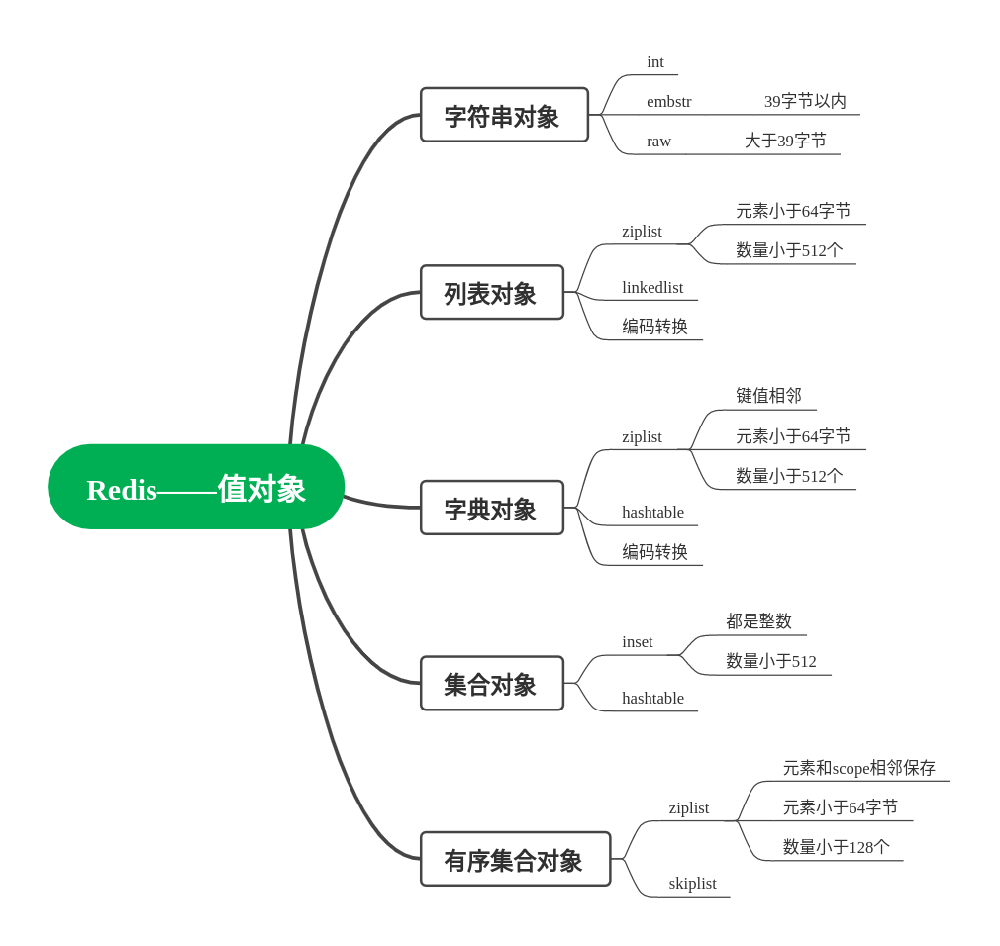

### Redis数据结构

- 分析： 
	这是Redis必考题，考察Redis数据结构有两大类问法，一种是直接问你某种数据结构的特征，一种是问你某个场景下应该使用什么数据结构。 本质上，两者考察的都是同一个东西，即你是否了解某种数据结构。在复习这个模块的时候，要从表象和底层实现两个角度去学习，熟记于心。你要注意区分，你要回答的是Redis值对象的数据结构（表象），还是底层实现。大多数情况下，你应该从表象出发，即值对象的角度出发，而后讨论每一种值对象可能的底层实现。如果记不住全部的底层实现，可以讨论重点的几个。

- 答案（总体回答“值对象，有什么实现-某种实现特点”）：
	从使用的角度来说，Redis有5种数据结构
	- 字符串对象，即我们设置的值是一个简单的数字或者字符串
	- 列表对象，即值是一个列表，存储多个元素。从底层实现来说，有ziplist和linkedlist两种实现
	- 字典对象，即值本身是一个字典，从底层实现来说有ziplist和hashtable两种实现
	- 集合，即是一个对象集合。底层实现有intset和hashtable两种实现
	- 有序集合对象，即值是一个有序的集合。底层有ziplist和skiplist两种实现

- 分析，
	注意回答道这一步就差不多了。接下来面试官想要继续讨论这些问题，它就会问底层实现了。讨论底层实现的时候要注意把精力放在横向比较上。因为一个很明显的问题，就是上面的不同对象类型，都有多种底层实现。另外一点是，很多时候考察为什么redis为什么那么搞笑，除了一般的理由，还可以说Redis设计了非常多的数据结构，并且选择合适的数据结构，来减少缓存加快效率

### 扩展点

#### **Redis使用字符串有什么特点？**
- 分析： 考察底层数据结构特点
- 答案：
	Redis使用的字符串叫做SDS，SDS特点是：
		- 直接存储字符串长度，可以常量时间获得长度
		- SDS采用预分配懒回收策略，减少内存分配次数。

- 类似问题：
	- SDS有什么特点
	- SDS和C字符串比起来有什么优点
	- Redis为什么不直接使用C字符串

- 如何引导：
	可以考虑在前面回答字符串对象的时候主动谈起

#### **Redis的hashtable是如何实现的**
- 分析：
	- 考察底层数据结构hashtable的实现。刷两点的机会，在于回答出来**扩容**，即Rehash的过程。注意Redis的渐进式扩容是很有特色的。要结合各自语言的hashtable实现来做交叉对比。例如对于Golang来说，Redis的Rehash过程和map的底层实现里面是接近的，可以一并来说。
	- 然后再一次点出，采用渐进式Rehash的优缺点，即采用渐进式Rehash时总开销会增大，但是这种开销平均到每次访问数据中，是一种取舍。
	- 在回答完毕之后，为了万无一失，可以再一次提起，就是说字典除了可以用hashtable是心啊，也可以用ziplist实现

- 答案：
	- Redis采用MurmurHash（么么哈希），该算法效率高，随机性好，可以减少冲突的可能。
	- Redis的哈希表是采用拉链法来解决冲突，在冲突的时候，会将元素加在表头，以加快速度。
	- Redis的扩容比较有特色，采用的是渐进式rehash。 即Redis实际上维护了新旧两张表，迁移发生的时候，Redis并不是志杰吧数据迁移到新表，而是在后续增删改查的时候逐步迁移过去。
	- Go语言的map实现理念很接近，Go种map的扩容也是渐进式的，也是访问数据过程中逐步迁移完成
	- 所以，查找某个key的时候，大概是先去原表里找，找不到再去新表找。如果在原表找到了，就执行迁移逻辑。
	- （亮点2：结合Redis Cluster的重新分配来做横向比较，不熟悉重新分片不建议使用，或者你可以拼一把，就是可能面试官也不太了解重新分片，所以不会问细节）。 这种渐进式的思想在Redis里面还体现在重新分片上，Redis的重新分片也是一边迁移数据，同时对外提供服务。在找一个key的时候，也是先找源节点，找到了同时迁移，找不到就说明迁移到了目标节点。
	- 总体而言，渐进式rehash可以带来平滑的响应时间，但也会带来总体开销比一次性开销大的缺点
- 分析： 
	这个话题是很能体现你对数据结构的理解。特别是点出rehash的过程优缺点，在数据库索引哪里，我说过，工程学上，我们会倾向于选择可预测性，rehash也是这种思想的体现。即渐进式rehash不会说出现因为哈希表扩容导致响应时间猛增的问题。
- 关键点： 拉链法、Murmurhash2（么么哈希），渐进式rehash

- 

#### **Redis 里面的 ziplist 是如何实现的？有什么用？**
- 分析：
	考察底层数据结构。ziplist在 Redis 里面是一个很重要的结构，要紧紧围绕ziplist **节省内存，结构紧凑，搜索快速的特点来回答**。要想答出特色来，要先回答ziplist的基本特点，要把重点放在ziplist增删改数据时候的行为，关键点在于两个，一个是**数据移动**，一个是**连锁更新**。
- 答案：
	- ziplist是一个很特殊的列表，它的内存类似数组那样是连续，但是每个元素的大小却不相同
	- ziplist通常用于单个数据小（64字节一下），并且数据量不多的情况（512个以内）
	- 在 Redis 里面，ziplist用于组成有序集合，字典和列表三种值对象
	- （亮点一：元素移动）ziplist能够在**O(1)的时间内完成对头尾**的操作（因为ziplist记录了首尾节点），但是**一般的增删改查，都是O(N)的**。这是因为ziplist是一个连续内存的结构，找到位置i，需要从头部开始遍历，而在增删的时候需要将位置i之后的元素移动（增往后移动，删往前移动）。
	- （亮点二：连锁更新）因为ziplist的节点存储了前一个节点的长度prelen，所以，当前一个节点发生变更的时候，就需要更新长度prelen
	这就是所谓的连锁更新，它使得一个增删改操作，最坏的时候是O(N^2)。这也是为什么ziplist只适合放置小数据，少数据的原因。（从这里也可以解释为什么前面那些编码，都是限制数据小于64字节，并且数量少于512）
- 关键点：内存连续，数据移动，连锁更新

#### **Redis 的整数集合(intset)是什么？有什么特色**
- 分析：考察底层数据结构，核心就在于理解intset的**升级不降级**的特性。
- 答案：
	- intset是一个数组结构，用于存储整数类型，里面的元素是唯一的
	- 它可以存放16、32、64位的整数。如果元素位数变大，那么就会触发升级过程（例如原本存储的元素都是16位整数，现在插入一个32位的整数，那么 Redis 需要按照32位重新计算内存大小，并且分配内存，迁移原本的数据，而后将新数据插入）
	- 有一点需要注意的是，Redis并不支持降级
	
参考文章：https://github.com/flycash/interview-baguwen/blob/main/redis/data_structure.md
