### Redis高可用：redis Cluster

Redis Cluster是Redis官方提供的Redis集群功能  


#### 为什么要实现Redis Cluster  
- 主从复制不能实现高可用
- 随着业务发展，用户数量增多，并发越来越多，业务需要更高的QPS，而主从复制中单机的QPS可能无法满足业务需求。
- 数据量大考虑，现有服务器内存不能满足业务数据的需要时，单纯向服务器添加内存不能达到要求，此时需要考虑分布式需求,把数据分布到不同服务器上  
- 网络流量需求：业务的流量已经超过服务器的网卡的上限值，可以考虑使用分布式来进行分流。 
- 离线计算，需要中间环节缓冲等别的需求  

#### 数据分布  
- 为什么要做数据分布  
全量数据，单机Redis节点无法满足要求，按照分区规则把数据分到若干个子集当中  

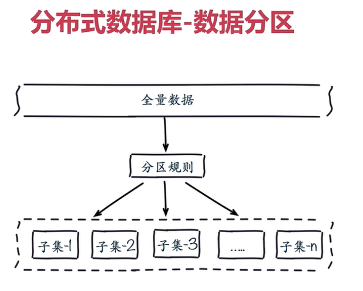  

- 常用数据分布方式之顺序分布
比如：1到100个数字，要保存在3个节点上，按照顺序分布，把数据平均分配到三个节点上。  
1到33号数据保存到节点1上，34到66号数据保存到节点2上，67到100号数据保存到节点3上。  

  

- *常用的数据分布方式之哈希分布*  
例如1到100个数，对每个数字进行哈希运算，然后对**每个数的哈希结果除以节点数取余**。这样可以保证数据被打散，同时保证数据分布的比较均匀。  

  

哈希分布方式分为三个分区方式：  

- 节点取余分区  
比如有100个数据，对每个数据进行hash运算后，根据节点数进行取余运算，根据余数不同保存在不同的节点上。  

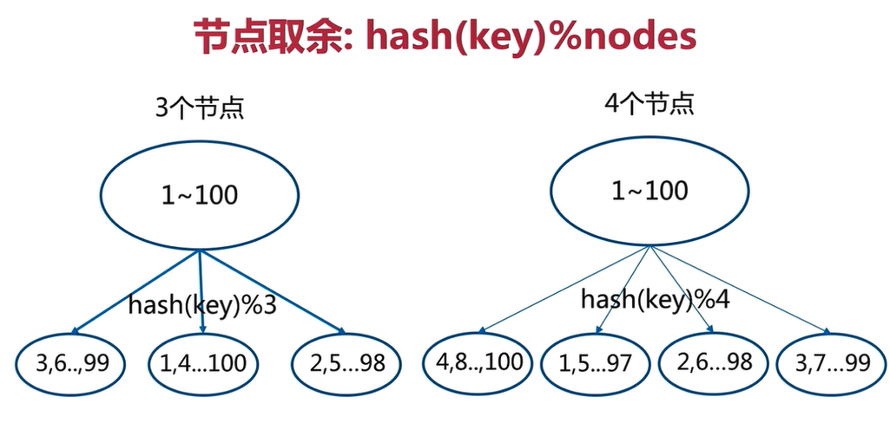  

节点取余方式是非常简单的一种分区方式

节点取余分区方式有一个问题：**即当增加或减少节点时，原来节点中的80%的数据会进行迁移操作，对所有数据重新进行分布**  

> 节点取余分区方式建议使用多倍扩容的方式，例如原来有3个节点保存数据，扩容一倍节点即6个节点，这样只需要歉意50%的数据。  
> 数据迁移之后，第一次无法从缓存中读取数据，必须先从数据库中读取数据，然后写入缓存中，然后才能从缓存中读取迁移之后的数据。  

  

*节点取余的优点*：  
  - 客户端分片
  - 配置简单：对数据进行哈希，然后取余。 

*节点取余的缺点*：  
  - 数据节点伸缩时，导致数据迁移。 
  - 迁移数量和添加节点数据有关，建议翻倍扩容。 

- **一致性哈希分区**  
> 原理： 将所有数据当作一个token环，token环中的数据范围是0到2的32次方。然后为每一个数据节点分配一个token范围值，这个节点就负责保存这个范围内的数据。  

  

对每个key进行hash运算，被哈希后的结果在那个token的方位内，则按照顺时针找最近的节点，这个key将会被保存在这个节点上。  

  
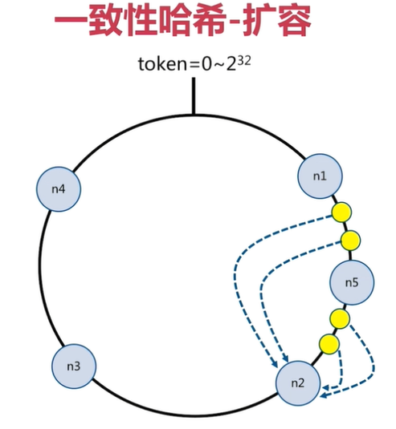  

在上面途中，有4个key被hash之后的值在n1节点和n2节点之间，按照顺时针规则，这4个key都会被保存在n2节点上。  
如果在n1和n2节点之间添加n5节点，当下次有key被hash之后的值在n1和n5之间，zhexiekey就会被保存到n5节点上。 
在上面的示例中，添加n5节点之后，数据迁移会在n1节点和n2节点之间进行，n3节点和n4节点不受影响，数据迁移范围被缩小很多。  

同理，如果有1000个节点，此时添加一个节点，受影响的节点范围最多只有千分之二。  
一致性哈希一般用在节点比较多的时候。  

- **一致性哈希优缺点总结**
	- 优点：
		- 采用客户端分片方式： 哈希+顺时针（优化取余）
		- 节点伸缩时，只影响临近节点，但还是有数据迁移。 

	- 缺点：
		- 翻倍伸缩，保证最小迁移数据和负载平衡  

- **虚拟槽点分区**  
虚拟槽分区是Redis Cluster采用的分区方式  
预设虚拟槽，每个槽相当于一个数字，有一定范围。每个槽映射一个数据子集，一般比节点数大。 
> Redis Cluster中预设虚拟槽的范围为0到16383  

  

步骤： 
  - 把16384槽按照节点数量进行平均分配，由节点进行管理  
  - 对每个key按照CRC16规则进行hash运算  
  - 把hash结果对16383进行取余
  - 把余数发送给Redis节点  
  - 节点收到数据，验证是否在自己的槽编号范围  
  	- 如果在范围内，则把数据保存到数据槽中，然后返回执行结果
  	- 如果不在范围内，则会把数据发送给正确的节点，由正确节点来把数据保存在对应槽位并返回结果。 

> 需要注意的是： **Redis Cluster的节点之间会共享消息，，每个节点都会知道哪个节点负责哪个范围内的数据槽**  

虚拟槽分布方式中，由于每个节点管理一部分数据槽，数据保存到数据槽中。  
当节点扩容或缩容时，对数据槽进行重新分配迁移即可，数据不会丢失。  
使用服务端管理节点，槽，数据，例如：Redis Cluster  
可以对数据打散，又可以保证数据分布均匀  

- **顺序分布与哈希分布的对比**  

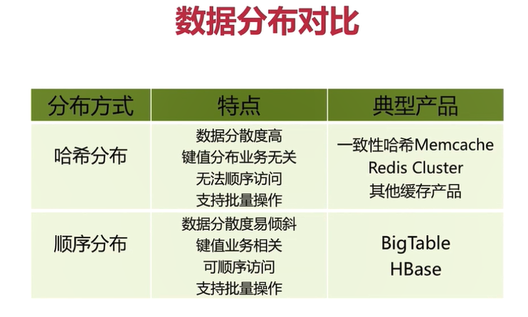  


#### Redis Cluster基本架构  
- 节点  
	Redis Cluster是分布式架构：即Redis Cluster中有多个节点，每个节点都负责进行数据读写操作。
	每个节点之间会进行通信。 

- meet操作
节点之间会相互通信。 
meet操作是节点之间完成相互通信的基础，meet操作有一定的频率和规则（Gossip协议）。 

  

- **分配槽**  
把16384个槽平均分配给节点进行管理，每个节点只能对自己负责的槽进行读写操作。  
由于每个节点之间都彼此通信，每个节点都知道另外节点负责管理的槽范围。 

  

客户端访问任意节点时，对数据key按照CRC16规则进行hash运算，运算结果对16383进行取余操作，如果余数在当前访问节点范围内，直接返回硬硬的数据。否则会告诉客户端去哪个节点获取数据，由客户端去正确的节点获取数据。  


  


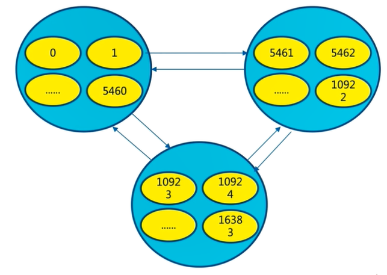  

- *复制*  
保证高可用，每个主节点都有一个从节点，当主节点故障，Cluster会按照规则实现主备的高可用性。 
对于节点来说，有一个配置项：cluster-enabled,即是否以集群模式启动。 

- **客户端路由**  
- moved重定向
	- 每个节点通过通信都会共享Redis Cluster中槽和集群中对应节点的关系
	- 客户端向Redis Cluster的任意节点发送命令，接收命令的节点会根据CRC16规则进行hash运算与16383取余，计算自己的槽和对应节点  
	- 当保存数据的槽被分配给当前节点，则去槽中执行命令，并发命令执行结果返回给客户端
	- 当保存数据的槽不是当前节点范围内，则像客户端返回moved重定向异常
	- 客户端接收到节点返回结果，当收到moved异常，则从moved异常中获取目标节点信息
	- 客户端向目标节点发送命令，获取命令执行结果

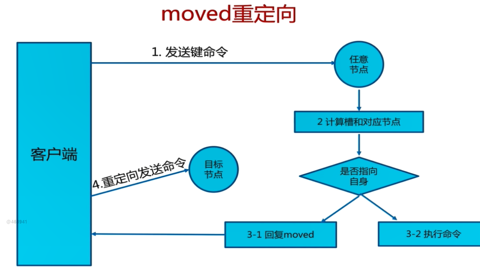  

需要注意的是：客户端不会自动找到目标节点执行命令。  
槽命中：直接返回。  

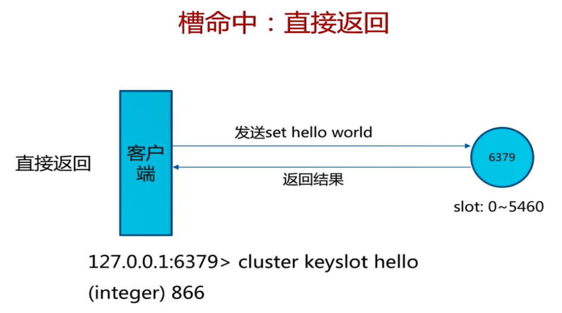  

```bash
redis-cli -p 9002 cluster keyslot hello
(integer) 866
```  

槽不命中：moved异常  

```bash
redis-cli -p 9002 cluster keyslot php
(integer) 9244
```  


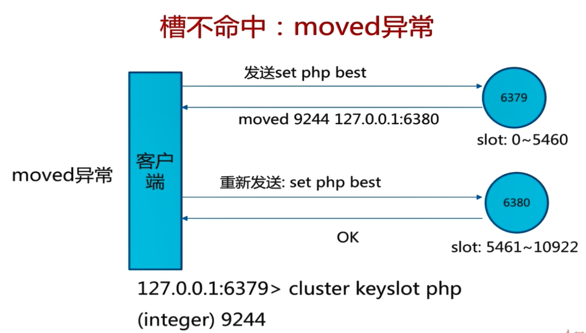  


- *ask 重定向*  

  

在对集群进行扩容和缩容时，需要对槽机槽中数据进行迁移。  
当客户端向某个节点发送命令，节点像客户端返回moved异常，告诉客户端数据对应的槽点节点信息。  
如果此时正在进行集群扩展或缩容操作，当客户端向正确的节点发送命令时，槽机槽中数据已被迁移到别的节点，就会返回ask，这就是ask重定向机制。  

  

- 步骤：  
	- 客户端向目标节点发送命令，目标节点中的槽位已迁移到别的节点，此时目标节点会返回ask专项客户端。  
	- 客户端向新的节点发送asking命令给新节点，然后再次向新节点发送命令
	- 新节点执行命令，把命令执行结果返回给客户端。  

moved异常与ask异常等相同点和不同点
  - 相同点：  
  	- 两者都是客户端重定向
  - 不同点：
  	- moved异常：槽已经确定迁移，即槽已经不在当前节点
  	- ask异常：槽还在迁移中。  


- **smart智能客户端**  
使用智能客户端等首要目标：追求性能。  
从集群中选一个可运行节点，使用cluster slots初始化槽和节点映射。  

将cluster slots的结果映射在本地，为每个节点创建JedisPool，相当于每个redis节点都设置一个JedisPool，然后就可以进行数据读写操作。  

读写数据时的注意事项：  
  - 每个JedisPool中缓存了slot和节点node的关系。  
  - key和slot的关系：对key按照CRC16规则进行hash后与`16383`取余得到的结果就是槽。  
  - JedisCluster启动时，已经知道key，slot和node之间的关系，可以找到目标节点。  
  - JedisCluster对目标节点发送命令，目标节点直接响应给JedisCluster
  - 如果JedisCluster与目标建立连接出错，则JedisCluster会知道连接的节点是一个错误的节点。  
  - 此时JedisCluster会随机节点发送命令，随机节点返回moved异常给JedisCluster。  
  - JedisCluster会重新出实话slot与node节点的缓存关系，然后向新的目标节点发送命令，目标命令执行冰箱JedisCluster相应
  - 如果命令发送次数超过5次，则抛出异常“Too many cluster redirection!”  

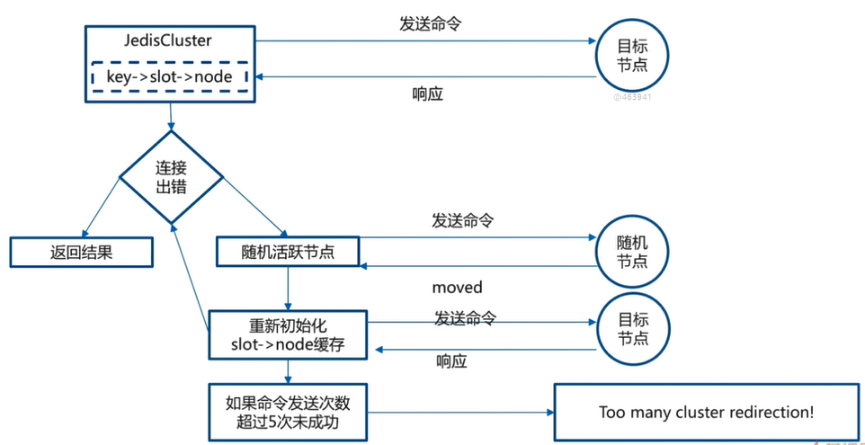  

- **多节点命令实现**  

	- Redis Cluster不支持scan命令扫描所有节点
	- 多节点命令就是在所有节点上都执行一条命令。
	- 批量操作优化

- 串行mget  
定义for循环，遍历所有的key，分别去所有的Redis节点中获取值并进行汇总，简单，但是效率不高，需要n次网络时间。  

  


- 串行IO  
对串行mget进行优化，在可断本地做内聚，对每个key进行CRC16 hash，然后与16383取余，就可以知道哪个key对应的是哪个槽。  
本地已经缓存了槽与节点映射关系，然后对key按节点进行分组，成立子集，然后使用pipline把命令发送到对应的node，需要nodes次网络时间，大大减少了网络时间开销。  

  

- 并行IO  
并行IO是对串行IO的一个优化，把key分组之后，根据节点数量启动对应的线程数量，根据多线程模式并行向node节点请求数据，只需要1次网络时间。  

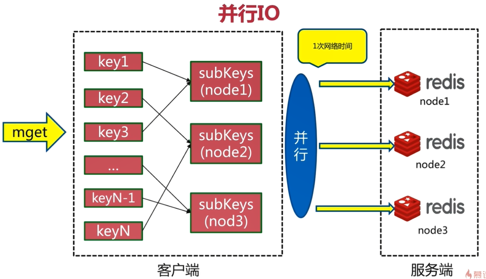  

- hash_tag  
将key进行hash_tag的包装，然后把tag用大括号括起来，保证所有的key只向一个node请求数据，这样执行类似mget命令只需要去一个节点获取数据即可，效率更高。  

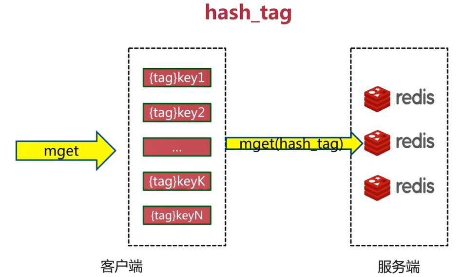  

- 四种优化方案优缺点分析。  

  

- 故障发现  
Redis cluster通过ping/pong消息实现故障发现： 许需要sentinel  

ping/pong不仅能传递节点与槽的对应消息，也能传递其他状态，比如：节点主从状态，节点故障等  

故障发现就是通过这种模式来实现，分为主观下线和客观下线  

- 主观下线  
某个节点认为另一个节点不可用，“偏见”，只代表一个节点对另一个节点的判断，不代表所有节点的认知  

主观下线流程：  
  - 节点A定期发送瓶消息给节点B
  - 如果发送成功，代表节点B正常运行，节点B会相应PONG消息给节点A，节点A更新与节点B的最后通信时间。  
  - 如果发送是比啊，则节点A与节点B之间的通信异常规则判断连接，在下一个任务周期时，仍然会与节点B发送ping消息  
  - 如果节点A发现与节点B最后通信时间超过node-timeout，则把节点B标识为pfail状态  

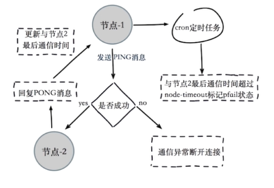  

- 客观下线  
当半数以上持有槽点主节点都标记某节点主观下线时，可以保证判断的公平性。  
集群模式下，只有主节点(master)才有读写权限和集群槽点维护权限，从节点(slave)只有复制的权限  
客观下线流程：  
  - 某个节点收到其他节点发送的瓶消息，如果收到ping消息中包含了其他pfail节点，这个节点将会主观下线的消息内容添加到自身的故障列表中，鼓掌列表中包含了当前节点收到的每一个节点的状态信息。  
  - 当节点把主观下线的消息内容添加到自身的鼓掌列表后，会尝试对故障节点进行客观下线操作。  

> 故障列表的周期为：集群的node-timeout\*2,保证以前的故障消息不会对周期内的故障消息造成影响，保证客观下线的公平性和有效性。  

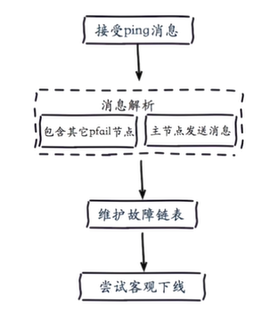  

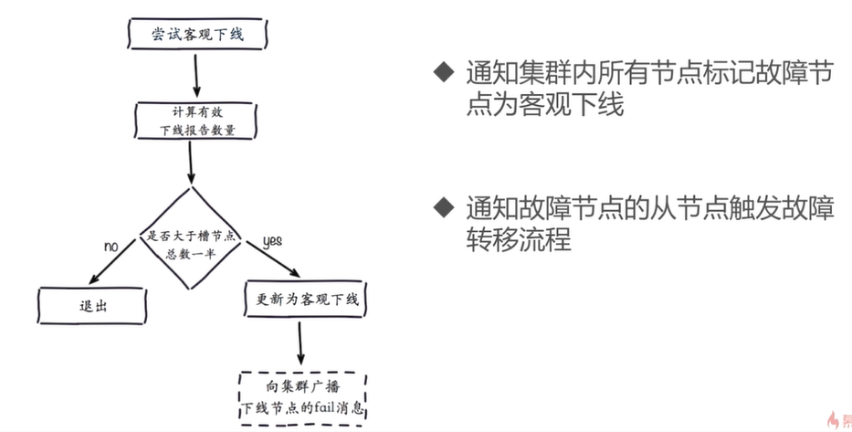  

- 故障恢复  
资格检查：  
  - 对从节点的资格进行检查，只有能通过检查的从节点才可以开始进行故障恢复。  
  - 每个从节点检查与故障主节点的断线时间。 
  - 超过cluster-node-timeout * cluster-slave-validity-factor数字，则取消资格  
  - cluster-node-timeout默认为15妙，cluster-slave-validity-factor默认值是10
  - 如果两个参数都适用默认值，则每个节点检查与故障主节点的短线时间，如果超过150秒，则这个节点就没有成为替换主节点的可能性。  

**准备选举时间**  
> 使偏移量最大的从节点具备优先级成为主节点的条件

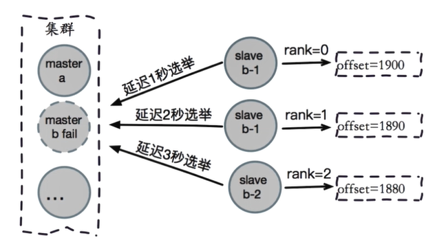  

**选举投票**  
> 对选举出来的多个从节点进行投票，选出新的主节点  

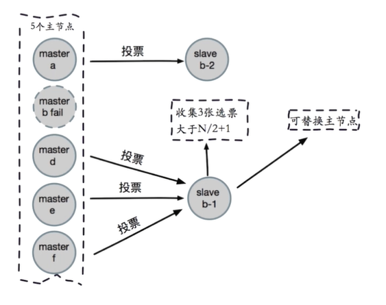  

**替换主节点**  

  - 当前从节点取消复制变成离节点(slaveof no one)  
  - 执行cluster del slot 撤销故障主节点负责的槽，并执行cluster add slot把自己这些槽分配给自己。  
  - 想集群广播自己的pong消息，表明已经替换了故障从节点。  

故障转移演练：  
  - 对某一个主节点进行kill -9 {pid} 来模拟宕机情况

*Redis Cluster的缺点*：  
  - 当节点数量很多时，性能不会很高。  
  - 解决方式：
  	- 使用智能客户端
  	- 智能客户端知道由哪个节点负责管理哪个槽，而且当节点与槽映射关系发生改变时，客户端也会知道这个改变，这是个非常高效的方式。  

#### 搭建Redis cluster  
搭建Redis Cluster有两种安装方式：  
  - [原生命令安装](https://www.cnblogs.com/renpingsheng/p/9813959.html)
  - [官方工具安装](https://www.cnblogs.com/renpingsheng/p/9833740.html)

#### 开发运维常见问题

- *集群完整性*  
cluster-require-full-coverage默认为yes，即是否集群中的所有节点都是在线状态，切16384个槽都处于服务状态时，集群才会提供服务。  
集群中16384个槽全部处于服务状态，保证集群完整性。  
当某个节点故障或者正在故障转移时获取数据会提示error：CLUSTERDOWN the cluster is down  
> 建议把cluster-require-full-coverage设置为no。  

- *宽带消耗*  
	- Redis Cluster节点之间会定期交换GOssip消息，以及一些心跳检测  
	- 官方建议*Redis Cluster节点数量不要超过1000个*，当集群中节点数量过多时，会产生不容忽视的宽带消耗。  
	- 消息发送频率：节点发现与其他节点最后通信时间超过cluster-node-timeout/2时，会直接发送瓶消息。  
	- 消息数据量： slots槽数组(2kb空间)和整个集群1/10的状态数据（10个节点状态数据约为1kb）
	- 节点部署的机器规模：集群分布的机器越多且每台机器划分的节点数量越均匀，则集群内整体的可用宽带越高。  
	- 宽带优化：
		- 避免使用“大”集群：避免多个业务使用一个集群，大业务可以多集群
		- cluster-node-timeout：宽带和故障转移速度的均衡。  
		- 尽量均匀分配到多机器上，保证高可用和宽带。

- pub/sub广播
在任意一个cluster节点执行publish，则发布的消息会在集群中传播，集群中的其他节点都会订阅到消息，这样节点的带宽的开销会很大  

publish在集群每个节点广播，加重带宽  

解决办法：需要使用Pub/Sub时，为了保证高可用，*可以单独开启一套Redis Sentinel*。 

- 集群倾斜  
对于分布式数据库来说，存在倾斜问题是比较常见的

集群倾斜也就是各个节点使用的内存不一致  

- 数据倾斜原因  
	- 节点和槽分配不均，如果使用redis-trib.rb工具构建集群，则出现这种情况的机会不多  
	```bash
	redis-trib.rb info ip:port查看节点，槽，键值分布
	redis-trib.rb rebalance ip:port进行均衡(谨慎使用)
	```  
	- 不同槽对应键值数量差异比较大  
	```bash
	CRC16算法正常情况下比较均匀可能存在hash_tag
	cluster countkeysinslot {slot}获取槽对应键值个数
	```  
	- 包含bigkey：例如大字符串，几百万的元素的hash，set等  
	```bash
	在从节点：redis-cli --bigkeys
	优化：优化数据结构
	```  
	- 内存相关配置不一致
	```bash
	hash-max-ziplist-value：满足一定条件情况下，hash可以使用ziplist
	set-max-intset-entries：满足一定条件情况下，set可以使用intset
	在一个集群内有若干个节点，当其中一些节点配置上面两项优化，另外一部分节点没有配置上面两项优化
	当集群中保存hash或者set时，就会造成节点数据不均匀
	优化：定期检查配置一致性
	```  
	- 请求倾斜：热点key
	```bash
	重要的key或者bigkey
	Redis Cluster某个节点有一个非常重要的key，就会存在热点问题
	```  
- 集群倾斜优化：
```bash
避免bigkey
热键不要用hash_tag
当一致性不高时，可以用本地缓存+ MQ(消息队列)
```  
- 集群读写分离
只读连接：集群模式下，从节点不接受任何读写请求

当向从节点执行读请求时，重定向到负责槽的主节点

readonly命令可以读：连接级别命令，当连接断开之后，需要再次执行readonly命令
读写分离：
```bash
同样的问题：复制延迟，读取过期数据，从节点故障
修改客户端：cluster slaves {nodeId}
```  
- 数据迁移  
官方迁移工具：redis-trib.rb和import  

只能从单机迁移到集群  

不支持在线迁移：source需要停写  

不支持断点续传  

单线程迁移：影响深度  

在线迁移：  
```bash
唯品会：redis-migrate-tool
豌豆荚：redis-port
```  

- 集群VS单机
集群限制：  
```text
key批量操作支持有限：例如mget,mset必须在一个slot
key事务和Lua支持有限：操作的key必须在一个节点
key是数据分区的最小粒度：不支持bigkey分区
不支持多个数据库：集群模式下只有一个db0
复制只支持一层：不支持树形复制结构
Redis Cluster满足容量和性能的扩展性，很多业务'不需要'
大多数时客户端性能会'降低'
命令无法跨节点使用：mget,keys,scan,flush,sinter等
Lua和事务无法跨节点使用
客户端维护更复杂：SDK和应用本身消耗(例如更多的连接池)
```  

> 很多场景Redis Sentinel已经够用了  

#### Redis Cluster总结：

```text
1.Redis Cluster数据分区规则采用虚拟槽方式(16384个槽)，每个节点负责一部分槽和相关数据，实现数据和请求的负载均衡
2.搭建Redis Cluster划分四个步骤：准备节点，meet操作，分配槽，复制数据。
3.Redis官方推荐使用redis-trib.rb工具快速搭建Redis Cluster
4.集群伸缩通过在节点之间移动槽和相关数据实现
    扩容时根据槽迁移计划把槽从源节点迁移到新节点
    收缩时如果下线的节点有负责的槽需要迁移到其他节点，再通过cluster forget命令让集群内所有节点忘记被下线节点
5.使用smart客户端操作集群过到通信效率最大化，客户端内部负责计算维护键，槽以及节点的映射，用于快速定位到目标节点
6.集群自动故障转移过程分为故障发现和节点恢复。节点下线分为主观下线和客观下线，当超过半数节点认为故障节点为主观下线时，标记这个节点为客观下线状态。从节点负责对客观下线的主节点触发故障恢复流程，保证集群的可用性
7.开发运维常见问题包括：超大规模集群带席消耗，pub/sub广播问题，集群倾斜问题，单机和集群对比等
```  
