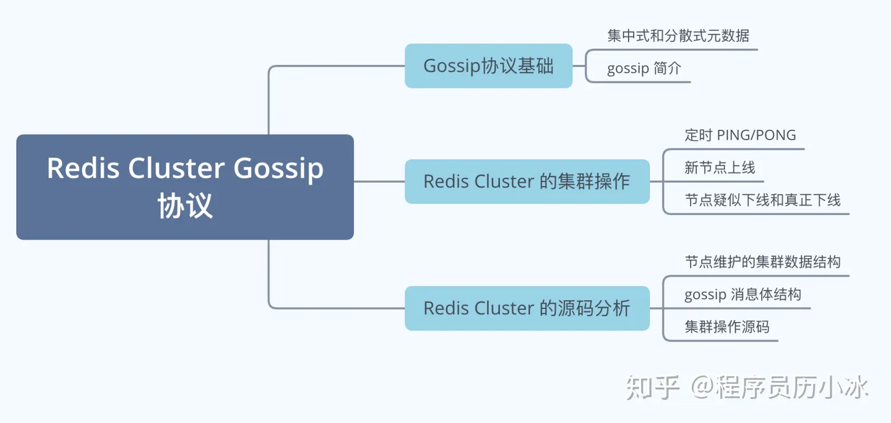

### Redis Cluster Gossip协议

今天来讲一下Redis Cluster的Gossip协议和集群操作，文章思维导图如下所示：  

#### 集群模式和Gossip简介  
**对于数据存储领域，当数据量或者请求量到达一定程度后，就必然会引入分布式**。比如Redis，虽然其单机性能十分优秀，但是遇到下列原因时，也不得不引入集群。  
- 单机无法保证高可用，需要引入多实例来提供高可用性  
- 单机能够提供高达8W左右的QPS，再高的QPS则需要引入多实例  
- 单机能够支持的数据量有限，处理更多的数据需要引入多实例  
- 单机所处理的网络流量已经超过服务器网卡的上限值，需要引入多实例来分流  

有集群，集群往往需要维护一定的元数据，比如实例的ip地址，缓存分片的slots信息等，所以需要一套分布式机制来维护元数据的一致性。这类机制一般有两个模式：分散式和集中式  

分散式机制将元数据存储在部分或者所有节点上，不同节点之间进行不断的通信来维护元数据的变更和一致性。Redis Cluster， Consul等都是该模式。  

  

而集中式是将集群元数据集中存储在外部节点或者中间件上，比如zookeeper。旧版本的kafka和storm等都是使用该模式。

  

两种模式个有优劣，具体如下表所示：  
| 模式 | 优点 | 缺点 |
|--------|--------|--------|
| 集中式 | 数据更新及时，时效好，元数据的更新和读取，时效性非常好，一旦元数据出现变更，立即就更新到集中式的外部节点中，其他节点读取的时候立即可以感知到 | 较大数据更新压力，更新压力全部集中在外部节点，作为单节点影响整个系统 |
| 分散式 | 数据更新压力分散，元数据的更新比较分散，不是集中某一个节点，更新请求比较分散，而且有不同的节点处理，有一定的延时，降低了并发压力 | 数据更新延迟，可能导致集群的感知有一定的滞后 |  

**【分散式】**的元数据模式有多种可选的算法进行元数据的同步，比如说`Paxos`、`Raft`和`Gossip`。`Paxos`和`Raft`等都需要全部节点或者大多数节点（超过一半）正常运行，整个集群才能稳定运行，而`Gossip`则不需要半数以上的节点运行。  

Gossip协议，顾名思义，就像流言蜚语一样，利用一种随机、带有传染性的方式，将信息传播到整个网络中，并在一定时间内，使得系统内的所有节点数据一致。对你来说，掌握这个协议不仅能很好地理解这种最常用的，实现最终一致性的算法，也能在后续工作中得心应手地实现数据的最终一致性。  

  

Gossip协议又称epidemic协议（epidemic protocol），是基于流行病传播方式的节点或者进程之间信息交换的协议，在P2P网络和分布式系统中应用广泛，他的方法论也特别简单：  
> 在一个处于游街网络的集群里，如果每个界定都随机与其他节点交换特定信息，经过足够长的时间后，集群各节点对该身份信息的认知终将收敛到一致。  

这里的“特定信息”一般就是指集群状态、各节点的状态以及其他元数据等。Gossip协议是完全符合BASE原则，可以用在任何要求最终一致性的领域，比如分布式存储和注册中心。另外他可以很方便地实现*弹性集群*，允许节点随时上下线，提供快捷的失败检测和动态负载均衡等。  

此外，Gossip协议最大的好处是，及时集群节点的数量增加，每个节点的负载也不会增加很多，几乎是恒定的。这就允许Redis cluster或者Consul集群管理的节点规模能横向扩展到数千个。  

#### Redis Cluster的Gossip通信机制。

Redis Cluster是在3.0版本引入集群功能。为了让集群中的每个实例都知道其他所有实例的状态信息，Redis集群规定各个势力之间按照Gossip协议来通信传递信息。  

  

